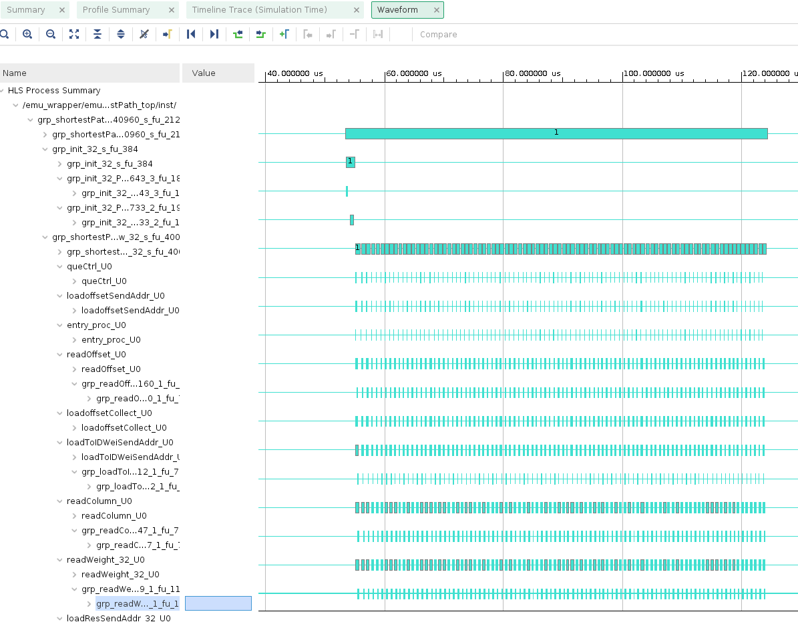

# Graph Application using Vitis Accelerated Libraries

This lab walks you through the steps to create a Vitis design with one kernel **Single Source ShortestPath** leveraging Vitis Graph Library available in the [Vitis Accelerated Libraries](https://xilinx.github.io/Vitis_Libraries/).

## Objectives

After completing this lab, you will be able to:

* Use Vitis from command line and GUI
* Modify source files to target Amazon AWS FPGA board
* Compile kernels to Xilinx objects (`*.xo`)
* Build FPGA binary file from `*.xo` files
* Compile host code to object files (`*.o`)
* Build executable host code, which includes linking `*.o` files with dynamic libraries

## Steps

### Clone Vitis Accelerated Libraries repository

Clone the open source Vitis Accelerated Libraries repository in your home directory, if it is not already done

```sh
git clone https://github.com/Xilinx/Vitis_Libraries.git ~/Vitis_Libraries
```

### Modify some source files and set environment variables

1. Navigate to the root directory of the example, `shortest_path_unweighted_pred`available as part of the repository

   ```sh
   cd ~/Vitis_Libraries/graph/L2/tests/shortest_path_unweighted_pred
   ```

1. Since the source files are targeting Alveo U50 card which has HBM, whereas Amazon AWS FPGA card does not. The Amazon AWS FPGA card is not an Alveo card. Some modifications will have to be done

   * Modify Makefile to target AWS FPGA platform 

      ```
      Replace line 46 with DEVICE ?= xilinx_aws-vu9p-f1_shell-v04261818_201920_2
      Comment out lines 57, 58, 59
      Comment out lines 110,111, 112
      Comment out lines 124 and 126
      ```

   * Update conn_u50.cfg file to target DDR[0] bank and use SLR1 instead of DDR[1] and SLR2. Replace the content with

      `[connectivity]
       sp=shortestPath_top.m_axi_gmem0:DDR[0]
       sp=shortestPath_top.m_axi_gmem1:DDR[0]
       sp=shortestPath_top.m_axi_gmem2:DDR[0]
       sp=shortestPath_top.m_axi_gmem3:DDR[0]
       sp=shortestPath_top.m_axi_gmem4:DDR[0]
       sp=shortestPath_top.m_axi_gmem5:DDR[0]
       slr=shortestPath_top:SLR1
       nk=shortestPath_top:1:shortestPath_top`

    * Update utils.mk file to enable profile and

      `On line 22 change PROFILE := no to PROFILE := yes  
       In line 34 insert -g flag so the line  will read like VPP_LDFLAGS += -g --profile_kernel data:all:all:all`

    * Update host/main.cpp so it uses BANK0 instead of BANK1

      `Change BANK0 to BANK1 in lines 221 through 228 so they will read like
       mext_o[0] = {XCL_MEM_DDR_BANK1, offset512, 0};
       mext_o[1] = {XCL_MEM_DDR_BANK1, column512, 0};
       mext_o[2] = {XCL_MEM_DDR_BANK1, weight512, 0};
       mext_o[3] = {XCL_MEM_DDR_BANK1, info, 0};
       mext_o[4] = {XCL_MEM_DDR_BANK1, config, 0};
       mext_o[5] = {XCL_MEM_DDR_BANK1, ddrQue, 0};
       mext_o[6] = {XCL_MEM_DDR_BANK1, result, 0};
       mext_o[7] = {XCL_MEM_DDR_BANK1, pred, 0};`

    * Create xrt.ini in the project home directory having the following content. 

      `[Debug]
	   opencl_summary=true
	   power_profile=false
	   opencl_trace=true
	   lop_trace=false
	   xrt_trace=false
	   data_transfer_trace=coarse
	   stall_trace=off
	   app_debug=true
	   [Emulation]
	   debug_mode=gui`


1. Set environmental variables

	 We need to define `PLATFORM_REPO_PATH` to point to the AWS platform. We also need to define a path to the Graph library's L2 directory 


   ```
    export PLATFORM_REPO_PATHS=/home/ec2-user/aws-fpga/Vitis/aws_platform/   
    export VITIS_LIBS=~/Vitis_Libraries/graph/L2/include
   ```

### Makefile flow

### Software emulation verification

1. Compile kernels for the Emulation-SW using Makefile

    Execute `make build TARGET=sw_emu`
    The kernel will be compiled and device binary file (shortestPath_top.xclbin) will be build under the `build_dir.sw_emu.xilinx__aws-vu9p-f1_shell-v04261818_201920_2`

1. Compile the host application for the Emulation-SW using Makefile and run the application

    Execute `make run TARGET=sw_emu`
    The host application (host.exe) will be compiled under the `build_dir.sw_emu.xilinx__aws-vu9p-f1_shell-v04261818_201920_2`. The application will then be run producing the result similar to:

    ```
     ---------------------Shortest Path----------------
     id: 92 max out: 13
     Found Platform
     Platform Name: Xilinx
     Info: Context created
     Info: Command queue created
     Found Device=xilinx_aws-vu9p-f1_shell-v04261818_201920_2
     INFO: Importing build_dir.sw_emu.xilinx_aws-vu9p-f1_shell-v04261818_201920_2/shortestPath_top.xclbin
     Loading: 'build_dir.sw_emu.xilinx_aws-vu9p-f1_shell-v04261818_201920_2/shortestPath_top.xclbin'
     Info: Program created
     Info: Kernel created
     kernel has been created
     kernel start------
     kernel call success
     kernel call finish
     kernel end------
     ============================================================
     Info: Test passed
    ```    

    Notice that the application uses three parameters: -o, -c, -g requiring offset, indicesweights, and golden data respectively. These files are provided in the `data` directory under the project directory

    Notice that `xclbin.run_summary` file is generated based on the settings in xrt.ini 

1. Start the vitis_analyzer by executing `vitis_analyzer xclbin.run_summary`

    Vitis Analyzer shows **Summary**, **Run Guidance**, **Profile Summary** and `Timeline Trace` tabs on the left-hand side. Click **Profile Summary**

1. Click on the `Profile Summary` on the left and then click **Kernels & Compute Units** on the right to see kernel and compute units execution times

    

1. Click **Host Data Transfer** on the right to see read and write buffer sizes, buffer addresses, and the related execution parameters

    

1. Select the `Timeline Trace` panel on the left

    Observe the various events at different time intervals  

    

1. When finished, close the analyzer by clicking `File > Exit` and clicking **OK**


### Hardware emulation verification

1. Compile kernels for the Emulation-HW using Makefile

    Execute `make build TARGET=hw_emu`
    The kernel will be compiled and device binary file (shortestPath_top.xclbin) will be build under the `build_dir.hw_emu.xilinx__aws-vu9p-f1_shell-v04261818_201920_2`

1. Compile the host application for the Emulation-HW using Makefile and run the application

    Execute `make run TARGET=hw_emu`
    The host application (host.exe) will be compiled under the `build_dir.hw_emu.xilinx__aws-vu9p-f1_shell-v04261818_201920_2`. The application will then be run. Notice that Vivado simulator is opened and simulation waveforms are generated, and the application producing the result similar to:

    ```
     ---------------------Shortest Path----------------
     id: 92 max out: 13
     Found Platform
     Platform Name: Xilinx
     Info: Context created
     Info: Command queue created
     Found Device=xilinx_aws-vu9p-f1_shell-v04261818_201920_2
     INFO: Importing build_dir.hw_emu.xilinx_aws-vu9p-f1_shell-v04261818_201920_2/shortestPath_top.xclbin
     Loading: 'build_dir.hw_emu.xilinx_aws-vu9p-f1_shell-v04261818_201920_2/shortestPath_top.xclbin'
     INFO: [HW-EMU 01] Hardware emulation runs simulation underneath. Using a large data set will result in long simulation times. It is recommended that a small dataset is used for faster execution. The flow uses approximate models for Global memories and interconnect and hence the performance data generated is approximate.
     configuring penguin scheduler mode
     scheduler config ert(0), dataflow(1), slots(16), cudma(1), cuisr(0), cdma(0), cus(1)
     Info: Program created
     Info: Kernel created
     kernel has been created
     kernel start------
     kernel end------
     ============================================================
     Info: Test passed
     INFO::[ Vitis-EM 22 ] [Time elapsed: 1 minute(s) 36 seconds, Emulation time: 0.260477 ms]
     Data transfer between kernel(s) and global memory(s)
     shortestPath_top:m_axi_gmem0-DDR[0]          RD = 1.500 KB               WR = 0.000 KB        
     shortestPath_top:m_axi_gmem1-DDR[0]          RD = 6.625 KB               WR = 0.000 KB        
     shortestPath_top:m_axi_gmem2-DDR[0]          RD = 0.000 KB               WR = 0.000 KB        
     shortestPath_top:m_axi_gmem3-DDR[0]          RD = 0.500 KB               WR = 5.812 KB        
     shortestPath_top:m_axi_gmem4-DDR[0]          RD = 20.625 KB              WR = 9.875 KB        
     shortestPath_top:m_axi_gmem5-DDR[0]          RD = 0.000 KB               WR = 9.812 KB        

     INFO: [HW-EMU 06-0] Waiting for the simulator process to exit
     INFO: [HW-EMU 06-1] All the simulator processes exited successfully
    ```    

1. Click on the Full zoom button in the simulator window. Select the area of interest by left clicking on the start of the area of interest and dragging mouse to the end of the area of interest

    Observe the kernel executes between 52 us to 122 us and data exchange activities on various memory banks

    

1. Close the simulator output by selecting **File > Exit** in the Vivado window

1. Start the vitis_analyzer by executing `vitis_analyzer xclbin.run_summary`

    Vitis Analyzer shows **Summary**, **System Diagram**, **Run Guidance**, **Profile Summary**, **Waveform** and **Timeline Trace** tabs on the left-hand side

1. Click **System Diagram** and observe that all parameters are targeting DDR[0] bank

    

1. Click on the `Profile Summary` on the left and then click **Kernels & Compute Units** on the right to see kernel and compute units execution times

    

1. Click **Kernel Data Transfer** on the right to see read and write buffer sizes, buffer addresses, and the related execution parameters

    

1. Click **Host Data Transfer** on the right to see read and write buffer sizes, buffer addresses, and the related execution parameters

    

1. Click **Kernel Internals** on the right to see read and write buffer sizes, buffer addresses, and the related execution parameters

    

1. Select the `Waveform` panel on the left

    Observe this shows activities similar to what was observed in the Vivado simulator output  

    

1. Select the `Timeline Trace` panel on the left

    Observe the various events at different time intervals  

    

1. When finished, close the analyzer by clicking `File > Exit` and clicking **OK**

### Hardware verification in a non-training session

Note that this step will take about about two hours to generate xclbin and registering it with AWS to generate awsxclbin. **You will execute following steps ONLY if you are not in a training session**

1. Compile kernels, using Makefile, for the hardware verification
    
    Execute `make build TARGET=hw`
    The kernel will be compiled and device binary file (shortestPath_top.xclbin) will be build under the `build_dir.hw.xilinx__aws-vu9p-f1_shell-v04261818_201920_2`

1. Once the hardware system is built producing xclbin, you create an AFI by following the steps listed in [create an AFI](Creating_AFI.md) from the `build_dir.hw.xilinx__aws-vu9p-f1_shell-v04261818_201920_2` directory

1. After the AFI is available, build the host application by executing `make host TARGET=hw` from the project directory which will create `host.exe` file in the `build_dir.hw.xilinx__aws-vu9p-f1_shell-v04261818_201920_2` directory

1. Copy the xrt.ini file from the project directory into the `build_dir.hw.xilinx__aws-vu9p-f1_shell-v04261818_201920_2` directory

1. Run the application by executing the following command from the `build_dir.hw.xilinx__aws-vu9p-f1_shell-v04261818_201920_2` directory

    ./host.exe -xclbin ./shortestPath_top.awsxclbin -o ~/Vitis_Libraries/graph/L2/tests/shortest_path_unweighted_pred/data/data-csr-offset.mtx -c ~/Vitis_Libraries/graph/L2/tests/shortest_path_unweighted_pred/data/data-csr-indicesweights.mtx -g ~/Vitis_Libraries/graph/L2/tests/shortest_path_unweighted_pred/data/data-golden.sssp.mtx     


### Hardware verification in a training session

Since compilation for hardware target will take a long time, the FPGA binary is provided in the solution directory

1. Go to the solution directory

   ```sh
   cd ~/xup_compute_acceleration/solutions/graph_lab/
   ```

    The solution directory has the awsxclbin, host.exe, and data directory containng required files needed by the host.exe program

1. Run the kernels on hardware 
    
   ```sh
   ./host.exe -xclbin ./shortestPath_top.awsxclbin -o ./data/data-csr-offset.mtx -c ./data/data-csr-indicesweights.mtx -g ./data/data-golden.sssp.mtx
   ```

1. The host application will execute, programming the FPGA and running the host code and displaying result as shown below. Also `xclbin.run_summary` file will be generated, which can be analyzed using **vitis_analyzer**


    ```sh
     ---------------------Shortest Path----------------
     id: 92 max out: 13
     Found Platform
     Platform Name: Xilinx
     Info: Context created
     Info: Command queue created
     Found Device=xilinx_aws-vu9p-f1_shell-v04261818_201920_2
     INFO: Importing build_dir.hw_emu.xilinx_aws-vu9p-f1_shell-v04261818_201920_2/shortestPath_top.xclbin
     Loading: 'build_dir.hw_emu.xilinx_aws-vu9p-f1_shell-v04261818_201920_2/shortestPath_top.xclbin'
     INFO: [HW-EMU 01] Hardware emulation runs simulation underneath. Using a large data set will result in long simulation times. It is recommended that a small dataset is used for faster execution. The flow uses approximate models for Global memories and interconnect and hence the performance data generated is approximate.
     configuring penguin scheduler mode
     scheduler config ert(0), dataflow(1), slots(16), cudma(1), cuisr(0), cdma(0), cus(1)
     Info: Program created
     Info: Kernel created
     kernel has been created
     kernel start------
     kernel end------
     ============================================================
     Info: Test passed
     INFO::[ Vitis-EM 22 ] [Time elapsed: 1 minute(s) 36 seconds, Emulation time: 0.260477 ms]
     Data transfer between kernel(s) and global memory(s)
     shortestPath_top:m_axi_gmem0-DDR[0]          RD = 1.500 KB               WR = 0.000 KB        
     shortestPath_top:m_axi_gmem1-DDR[0]          RD = 6.625 KB               WR = 0.000 KB        
     shortestPath_top:m_axi_gmem2-DDR[0]          RD = 0.000 KB               WR = 0.000 KB        
     shortestPath_top:m_axi_gmem3-DDR[0]          RD = 0.500 KB               WR = 5.812 KB        
     shortestPath_top:m_axi_gmem4-DDR[0]          RD = 20.625 KB              WR = 9.875 KB        
     shortestPath_top:m_axi_gmem5-DDR[0]          RD = 0.000 KB               WR = 9.812 KB        

     INFO: [HW-EMU 06-0] Waiting for the simulator process to exit
     INFO: [HW-EMU 06-1] All the simulator processes exited successfully

    ```    

### Analyze the run output

1. Start the vitis_analyzer by executing `vitis_analyzer xclbin.run_summary`

    Vitis Analyzer shows **Summary**, **System Diagram**, **Run Guidance**, **Profile Summary** and **Timeline Trace** tabs on the left-hand side. Click **Profile Summary**

1. Click on the `Profile Summary` on the left and then click **Kernels & Compute Units** on the right to see kernel and compute units execution times

    

1. Click **Kernel Data Transfer** on the right to see read and write buffer sizes, buffer addresses, and the related execution parameters

    

1. Click **Host Data Transfer** on the right to see read and write buffer sizes, buffer addresses, and the related execution parameters

    

1. Click **API calls** on the right to see various API calls and their duration

    

1. Select the `Timeline Trace` panel on the left

    Observe the various events at different time intervals  

    

1. When finished, close the analyzer by clicking `File > Exit` and clicking **OK**


### GUI flow (Do we need it? - to be completed if needed)

1. Explore *Profile Summary* and *Application Timeline*

   ```sh
   vitis_analyzer xclbin.run_summary
   ```

1. Close Vitis Analyzer


## Conclusion

In this lab, you used Makefile provided by the repository from the command line to create an FPGA binary file with one kernel and compile the host application. You performed software and hardware emulations and analyzed the output images. You then run the provided solution in hardware and analyze the output.

---------------------------------------
<p align="center">Copyright&copy; 2021 Xilinx</p>