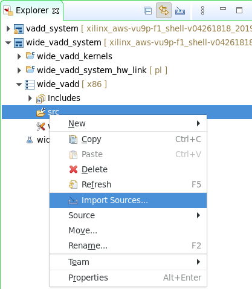
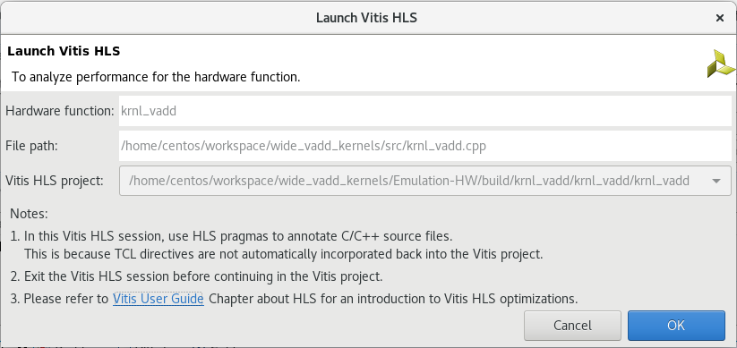
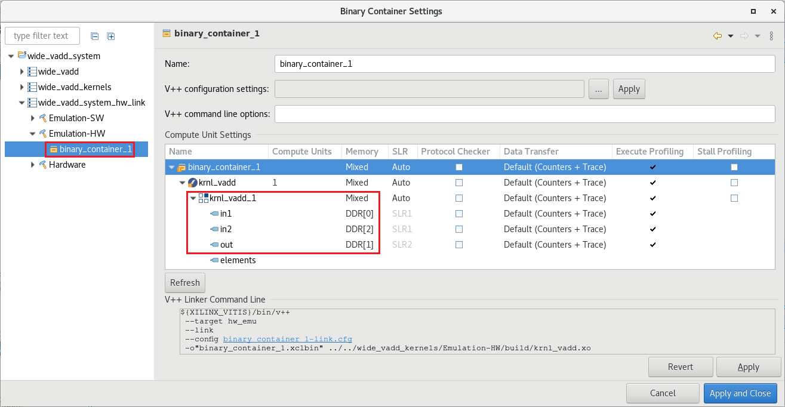

# Improving Performance Lab

## Introduction

In Introduction to Vitis [Part 1](Vitis_intro-1.md) and [Part 2](Vitis_intro-2.md), you learned how to create a Vitis project using the GUI and went through the entire design flow. At the end of the lab, you saw the limited transfer bandwidth due to 32-bit data operations. This bandwidth can be improved, and in turn system performance can be improved, by transferring wider data and performing multiple operations in parallel (vectorization).  This is one of the common optimization methods to improve kernel performance.

## Objectives

After completing this lab, you will learn to:

- Guide the tool to automatically widen the kernel interfaces
- Run Hardware Emulation to see an improvement in bandwidth and runtime
- Perform profile and application timeline analysis in hardware emulation
- Assign AXI4-MM adapters to specific memory banks

## Steps

### Create a Vitis Project

1. Launch Vitis or continue with your previous session

   You can use the same workspace you used in the previous lab

1. Create a new application project and click **Next**

1. Select `xilinx_aws-vu9p-f1_shell-v04261818_201920_2` and click **Next**

1. Name the project **wide_vadd** and click **Next**

1. Select `Empty Application` as the template and click **Finish**

1. Right-click on the **wide\_vadd\_system > wide\_vadd > src** folder in the *Explorer* view and select `Import Sources...`

   

   We are going to reuse the host and kernel code from the vadd lab

1. Import all `*.cpp` and `*.hpp` files except `vadd_krnl.cpp` from `~/xup_compute_acceleration/sources/vadd_lab/`

1. Similarly, expand **wide\_vadd\_system > wide\_vadd\_kernels** folder in the Explorer view, and import `vadd_krnl.cpp` in the corresponding  **src** folder

1. In the Explorer view, expand the **wide\_vadd\_system > wide\_vadd\_kernels** folder, and double-click on the `wide_vadd_kernels.prj`

1. Click on  in the *Hardware Functions* view and add **krnl_vadd** function as a *Hardware Function* (kernel)

   

### Analyze the kernel code

DDR controllers have a 512-bit wide interface internally. If we parallelize the dataflow in the accelerator, we will be able to read/write 16x 32-bit elements per clock tick instead of one. Thus increasing the effective bandwidth.

1. Double-click on kernel file `krnl_vadd.cpp` to view its content

   Look at lines 40-43 the input vector and output vector are `int` (32-bit wide). With small changes in the code and a few directives, we can guide the compiler to widen the the input and output bus to match the memory controller bus, 512-bit wide for this platform.

   ```C
   void krnl_vadd(const int* in1, // Read-Only Vector 1
                  const int* in2, // Read-Only Vector 2
                  int* out,       // Output Result
                  int elements    // Number of elements
   ```

2. The vector add computation is straightforward

   ```C
   for (int i = 0; i < elements; i++) {
      out[i] = in1[i] + in2[i];
   }
   ```

   You will also notice this directive `#pragma HLS LOOP_TRIPCOUNT avg=4096 max=4096 min=4096`. As the loop bound is unknown at synthesis, this directive helps the tool to use estimate bounds in the report. This directive has no effect in the synthesized hardware.

### Build and run in hardware emulation mode

1. Set *Active build configuration:* to **Emulation-HW**

1. Build in Emulation-HW mode by selecting `wide_vadd_system` in the *Explorer* view and clicking on the build () button

   This will take about 10 minutes

1. After build completes, in the Assistant view select **wide\_vadd\_system** and click on the Run () button then select *Launch HW Emulator*

### Analyze the generated design

1. In the *Assistant* view, double-clicking on `wide_vadd_system > wide_vadd > Emulation-HW > SystemDebugger_wide_vadd_system_wide_vadd > Run Summary (xclbin)`

1. Select **System Diagram** and click on the **Kernels** tab on the bottom

   Notice that all ports (in1, in2, and out) are using one memory bank. The `Port Data Width` parameter is 32-bit for all arguments

   

1. Select **Platform Diagram** in the left panel

   Observe that there are four DDR4 memory banks and three PLRAM banks. In this design, `DDR[1]` is used for all operands, which is located in SLR2 (AWS F1)

   Check memory bank allocation for Alveo U200 and how it relates to AWS-F1 [here](https://github.com/aws/aws-fpga/blob/master/Vitis/docs/Alveo_to_AWS_F1_Migration.md#off-chip-ddr-memory)

   

1. Click on **Timeline Trace**

1. Scroll and zoom to find the data transfers. The three operands share the same AXI4-MM adapter, both inputs compete in read channel (resource contention). On the other hand, the write channel is independent but it is still mapped to the same memory bank.

   

1. The **Profile Summary** reports that the kernel takes 0.035 ms to execute

   | Operation                       | Naive    |
   |---------------------------------|----------|
   | Kernel Execution - enqueue task | 0.035 ms |
   | Compute Unit execution time     | 0.032 ms |

1. Close Vitis Analyzer

### Maximize memory bandwidth and vectorize computation

The host code is executing a 4,096 element vector addition on the vadd kernel. Let us apply optimization techniques to improve the execution time. In this section, we will only consider the latency in clock cycles. Latency in this context means how many cycles it takes for the kernel to be able to process the next 4,096 elements. The 4,096 elements number is only for evaluation purposes and is specified with the `LOOP_TRIPCOUNT` directive.

1. On the Assistant view, right click on `wide_vadd_system > wide_vadd_kernels > Emulation-HW > krnl_vadd[C/C++]` and then click Open HLS Project

   

   Notice that the Vitis HLS project can only be open once the kernel is synthesized

1. Click `OK` when prompted to Launch Vitis HLS

   

1. In the **Synthesis Summary** analyze the **Performance & Resource Estimates**

   

   The most internal loop *vadd1* has a latency of 8,265 cycles.

   Notice that the II violation is because the tool is unable to schedule both read operations on the bus request due to limited memory ports (Resource Limitation).

   The suggestion is to consider using a memory core with more ports or partitioning the array.

1. In the Explore view expand Source and double-click on the `krnl_vadd.cpp` file to open it

   

1. In the `krnl_vadd.cpp` file, uncomment lines 45, 46 and 47, and save the file

   This will assign one AXI4-MM adapter to each argument

1. Synthesize the kernel by clicking the C synthesis button ()

1. Click OK on the default C Synthesis - Active Solution window

1. In the **Synthesis Summary** analyze the **Performance & Resource Estimates**

   

   The most internal loop *vadd1* has a latency of 4,098 cycles. More than 2x faster by just assigning exclusive resources to each argument.

1. Analyze the HW Interfaces

   

   The tool is able to map 32-bit wide operands from software to 32-bit wide operands in hardware. However, we are under utilizing the bus as the memory controller has a 512-bit width bus. Therefore there is an opportunity to fit 16 operands in a 512-bit vector.

1. In the `krnl_vadd.cpp` file, comment line 51 and uncomment line 52 then save the file and synthesize ()

   This change in the bounds specifies to the tool that elements is a multiple of 16. Given this guidance the tool is able to fit 16 operands in a 512-bit vector. If the loop bound is known at synthesis and if the operands bitwidth is multiple of it, the compiler will perform this optimization automatically.

   

   Notice that even though we are reading more operands in parallel the latency has not changed.

1. In the `krnl_vadd.cpp` file, uncomment line 54 then save the file and synthesize ()

   The `UNROLL` directive transforms the loop and create *N* instances of the same operation, thus applying vectorization. In this case, we are unrolling by 16, the same number of operands we can fit in a 512-bit vector.

1. In the **Synthesis Summary** analyze the **Performance & Resource Estimates**

   

   The most internal loop *vadd1* has a latency of 258 cycles. Almost 16x faster than without vectorization.

   Note that the kernel uses 90 BRAMs, we can reduce this number by mapping two arguments to the same AXI4-MM adapter.

1. In the `krnl_vadd.cpp` file modify line 47 to map out to `bundle=gmem0` and synthesize ()

   Read and write are independent channels in an AXI4-MM interface, therefore this change will not have an impact on the Latency.

   Now the kernel uses 60 BRAMs, 33% less than before.

1. Close Vitis HLS

1. In Vitis, rebuild the project by selecting `wide_vadd_system` in the *Explorer* view and clicking on the build () button

1. After build completes, in the Assistant view select **wide\_vadd\_system** and click on the Run () button and then select `SystemDebugger_wide_vadd_system (System Project Debug)`

1. In the *Assistant* view, double-clicking on `wide_vadd_system > wide_vadd > Emulation-HW > SystemDebugger_wide_vadd_system_wide_vadd > Run Summary (xclbin)`

1. Click on **Timeline Trace**

   

   Note that now in1 and in2 are in independent read channels, however access do not overlap. This is due to resource contention as they both access the same memory bank. On the other hand, the write operation overlaps with some of the read operations.

1. Click on **Profile Summary** and get the Kernel execution time

   | Operation                       | Naive    | Optimized Kernel |
   |---------------------------------|----------|------------------|
   | Kernel Execution - enqueue task | 0.035 ms | 0.006 ms         |
   | Compute Unit execution time     | 0.032 ms | 0.003 ms         |

### Optimize the system - Use multiple Memory banks

In the previous section, only one memory bank is used. As we have three operands (two read and one write) it may be possible to improve performance by using more memory banks, allowing simultaneous data access and maximizing the bandwidth available for each of the kernel ports. In an AWS-F1 accelerator card, there are four DDR4 memory banks available let us leverage them to reduce resource contention.

To connect a kernel to multiple memory banks, you need to assign each kernel's port to a memory bank. Note that DDR controllers may be physically located in different SLRs (Super Logic Regions) on the FPGA. A kernel with routing that crosses SLR regions can be more difficult to build and meet timing. This should be taken into account in a real design, where multiple memory banks are located in different SLRs.

1. In the *Assistant* view, right click on `wide_vadd_system > wide_vadd_system_hw_link > Emulation-HW` and then click Settings

   

1. In the Binary Container Settings windows, expand `wide_vadd_system_hw_link > Emulation-HW` and click **binary_container_1**

1. Assign the arguments of the `krnl_vadd` to the following memory banks

   - in1 to DDR[0]
   - in2 to DDR[2]
   - out to DDR[1]

   

   The SLR column is automatically populated after a memory bank is selected

1. Click **Apply and Close**

1. Rebuild the project by selecting `wide_vadd_system` in the *Explorer* view and clicking on the build () button

1. After build completes, in the Assistant view select **wide\_vadd\_system** and click on the Run () button and then select `SystemDebugger_wide_vadd_system (System Project Debug)`

1. In the *Assistant* view, double-clicking on `wide_vadd_system > wide_vadd > Emulation-HW > SystemDebugger_wide_vadd_system_wide_vadd > Run Summary (xclbin)`

1. Click on **Timeline Trace**

   

   Note that now each argument is mapped to a different memory bank and there is overlap in the read operations.

1. Click on **Profile Summary** and get the Kernel execution time

   | Operation                       | Naive    | Optimized Kernel | Optimized Kernel + 3 memory Banks |
   |---------------------------------|----------|------------------|-----------------------------------|
   | Kernel Execution - enqueue task | 0.035 ms | 0.006 ms         | 0.007 ms                          |
   | Compute Unit execution time     | 0.032 ms | 0.003 ms         | 0.002 ms                          |

   This time the kernel execution is slighter slower even though the compute unit is faster. This is because the host code is communicating with three different memory banks.

1. Open **System Diagram**

   

   Notice all ports (in1, in2, and out) are using different memory banks

1. Close Vitis Analyzer

This configuration may be problematic in terms of achieving higher frequency as the kernel is accessing memory banks from different SLRs.

As an exercise for the reader, assign `out` to DDR[0] (or DDR[2]) and analyze the results. This configuration will utilize memory banks that are in the same SLR. Hint, results below.

| Operation                       | Naive    | Optimized Kernel | Optimized Kernel + 3 memory Banks | Optimized Kernel + 2 memory Banks |
|---------------------------------|----------|------------------|-----------------------------------|-----------------------------------|
| Kernel Execution - enqueue task | 0.035 ms | 0.006 ms         | 0.007 ms                          | 0.007 ms                          |
| Compute Unit execution time     | 0.032 ms | 0.003 ms         | 0.002 ms                          | 0.002 ms                          |

## Conclusion

From a simple vadd application, we explored steps to optimize kernel and system performance by:
- Using Vitis HLS directives to use multiple AXI4-MM adapters, widen the kernel buses and unrolling the computation loop.
- Assign dedicated memory controller for the arguments
- Use Vitis Analyzer to review the result

The kernel was highly optimized as well as the system. However, the data movement is dominant. To truly achieve acceleration the application has to have a high compute intensity.

The compute intensity ratio is defined as:

<b> compute intensity = <sup>compute operations</sup> &frasl; <sub>memory accesses</sub> </b>

The bigger this number is, the more opportunities to achieve acceleration.

---------------------------------------
<p align="center">Copyright&copy; 2021 Xilinx</p>