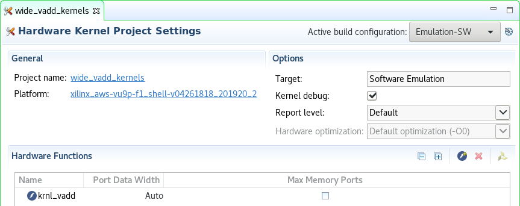
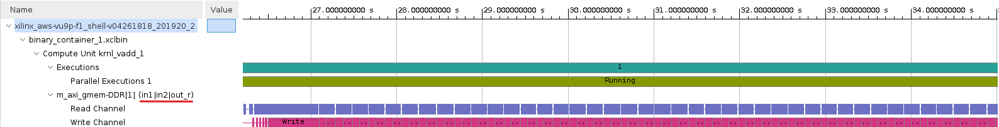
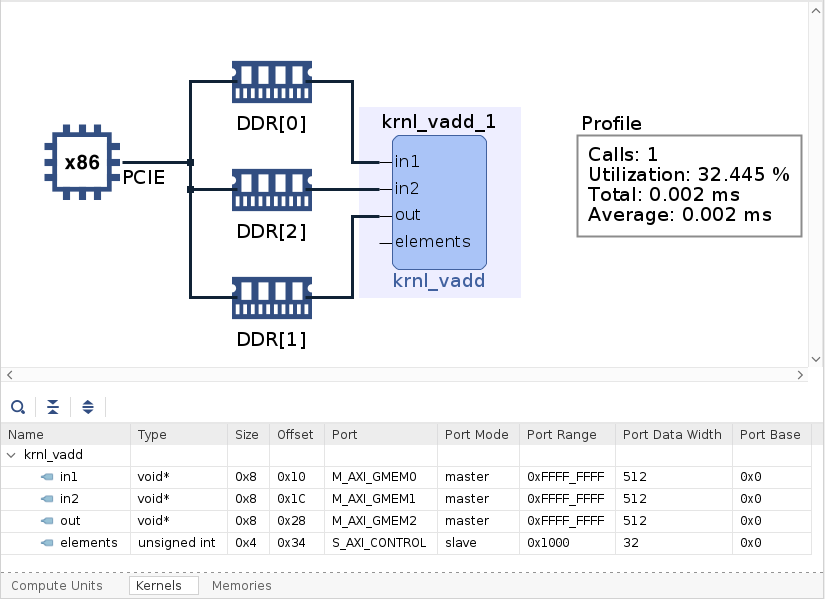

# Improving Performance Lab

## Introduction

In Introduction to Vitis [Part 1](Vitis_intro-1.md) and [Part 2](Vitis_intro-2.md), you learned how to create a project using GUI mode and went through entire design flow. At the end of the lab, you saw the limited transfer bandwidth due to 32-bit data operations. This bandwidth can be improved, and in turn system performance can be improved, by transferring wider data, and performing multiple operations in parallel.  This is one of the common optimization methods to improve the kernel's bandwidth.

## Objectives

After completing this lab, you will learn to:

- Create a project using Empty Application template in the Vitis GUI flow
- Import provided source files
- Run Hardware Emulation to see increased bandwidth
- Build the system and test it in hardware
- Perform profile and application timeline analysis in hardware emulation

## Steps

### Create a Vitis Project

1. Make sure Vitis environment and and AWS tools are set

    If you have opened a new terminal window then source AWS tools, if needed

1. Launch Vitis GUI

    Continue with the workspace you have used in previous lab  

1. Create a new application project giving **wide_vadd** as the project name, and click **Next >**

    You should see `xilinx_aws-vu9p-f1_shell-v04261818_201920_2` as one of the platforms if you are continuing with previous lab, otherwise add it from `~/aws-fpga/Vitis/aws_platform/`

1. Select `Empty Application` as the template and click **Finish**

    The project is created

1. Right-click on the **wide\_vadd\_system > wide\_vadd > src** folder in the *Explorer* view and select `Import Sources...`

    


1. Import all `*.cpp` and `*.hpp` files except `wide_vadd_krnl.cpp` from `~/xup_compute_acceleration/sources/improving_performance_lab/`

1. Similarly, expand **wide\_vadd\_system > wide\_vadd\_kernels** folder in the Explorer view, and import `wide_vadd_krnl.cpp` in the corresponding  **src** folder

1. Expand the **wide\_vadd\_system > wide\_vadd\_kernels** folder in the Explorer view, and double-click on the `wide_vadd_kernels.prj`

1. Click on  in the *Hardware Functions* view and add **wide\_vadd** function as a *Hardware Function* (kernel)

    

### Analyze the kernel code

DDR controllers have a 512-bit wide interface internally. If we parallelize the dataflow in the accelerator, we will be able to process 16 array elements per clock tick instead of one. Hence, we should be able to get an instant 16x computation speed-up by just vectorizing the input

1. Double-click on `wide_vadd_krnl.cpp` to view its content

   Look at lines 62-67 and note wider (512-bit) kernel interface. `uint512_dt` is used in stead of `unsigned int` for input, output and internal variables for data   storage. Notice `uint512_dt` is defined as an arbitrary precision data type `ap_uint<512>` in line 46

   ```C
   void wide_vadd(
     const uint512_dt *in1, // Read-Only Vector 1
     const uint512_dt *in2, // Read-Only Vector 2
     uint512_dt       *out, // Output Result
     int size               // Size in integer
   )
   ```

1. Scroll down further and look at lines 78-80 where local memories are defined of the same data type and width (512-bit)

   ```C
   uint512_dt v1_local[BUFFER_SIZE]; // Local memory to store vector1
   uint512_dt v2_local[BUFFER_SIZE];
   uint512_dt result_local[BUFFER_SIZE]; // Local Memory to store result
   ```

### Setup Hardware Emulation

1. Set *Active build configuration:* to **Emulation-HW**

1. Notice the host code uses a 1,024 times smaller vector to run software and hardware emulations (`wide_vadd.cpp` line 60) to save emulation time

1. Set dedicated location of kernel and memory interface
  - Right click on `wide_vadd_system > wide_vadd_system_hw_link > Emulation-HW > binary_container_1` in *Assistant* view, select `Settings`
  - Adjust memory and SLR settings according to the screen shot below
  - Click *Refresh* if you do not see the ports
  - Verify that the  `Counter + Trace` in the Data Transfer column are selected
  - Click Apply and Close

	

### Build and run in hardware emulation mode

1. Build in Emulation-HW mode by selecting `wide_vadd_system` in the *Explorer* view and clicking on the build () button

    This will take about 10 minutes

1. After build completes, select **wide\_vadd\_system** in the Assistant view and click on the Run () button

    Notice the kernel wait time is about 8 seconds.

   ```
   -- Parallelizing the Data Path --

   Loading ../binary_container_1.xclbin to program the board

   INFO: [HW-EM 01] Hardware emulation runs simulation underneath....
   Running kernel test XRT-allocated buffers and wide data path:


   OCL-mapped contiguous buffer example complete successfully!

   --------------- Key execution times ---------------
   OpenCL Initialization              : 23746.418 ms
   Allocate contiguous OpenCL buffers :   13.958 ms
   Set kernel arguments               :    0.025 ms
   Map buffers to user space pointers :    0.374 ms
   Populating buffer inputs           :    0.400 ms
   Software VADD run                  :    0.212 ms
   Memory object migration enqueue    :    3.235 ms
   OCL Enqueue task                   :    2.314 ms
   Wait for kernel to complete        : 8000.792 ms
   Read back computation results      :    1.297 ms
   INFO::[ Vitis-EM 22 ] [Time elapsed: 0 minute(s) 40 seconds, Emulation time: 0.162641 ms]
   Data transfer between kernel(s) and global memory(s)
   wide_vadd_1:m_axi_gmem-DDR[1]          RD = 128.000 KB             WR = 0.000 KB        
   wide_vadd_1:m_axi_gmem1-DDR[1]          RD = 128.000 KB             WR = 0.000 KB        
   wide_vadd_1:m_axi_gmem2-DDR[1]          RD = 0.000 KB               WR = 128.000 KB
   ```

1. Check generated kernel interface

    - Open Run Summary with Vitis Analyzer by double-clicking on `wide_vadd_system > wide_vadd > Emulation-HW > SystemDebugger_wide_vadd_system_wide_vadd > Run Summary (xclbin)` in the *Assistant* view
    - Select **System Diagram**. Notice that all ports (in1, in2, and out) are using one bank
    - Click **Kernels** tab
    - Check the `Port Data Width` parameter. All input and output ports are 512 bits wide whereas size (scalar) port is 32 bits wide

	

    - Select **Platform Diagram** in the left panel

    Observe that there are four DDR4 memory banks and three PLRAM banks. In this design, `DDR[1]` is used for all operands, which is located in SLR2(AWS)

    Check memory bank allocation for Alveo U200 and how it relates to AWS-F1 [here](https://github.com/aws/aws-fpga/blob/master/Vitis/docs/Alveo_to_AWS_F1_Migration.md#off-chip-ddr-memory)

	

1. Click on **Timeline Trace**

1. Zoom into area where data transfer on various ports of the kernel is taking place and observe the sequential data transfer between two input operands and a result since only one memory controller is being used

	

1. Close Vitis Analyzer

### Use multiple memory banks

There are four DDR4 memory banks available on the accelerator card. In the previous section, we used only one bank. As we have three operands (two read and one write) it may be possible to improve performance if more memory banks are used simultaneously, maximizing the bandwidth available for each of the interfaces. So it is possible to use the topology shown in following Figure.


This will provide the ability to perform high-bandwidth transactions simultaneously with different external memory banks. Remember, long bursts are generally better for performance than many small reads and writes, but you cannot fundamentally perform two operations on the memory at the same time.

To connect a kernel to multiple memory banks, you need to: Assign the kernel's interface to a memory controller and Assign the kernel to an SLR region.

Please note that since the DDR controllers are constrained to different SLR (Super Logic Region), the routing between two SLR may have some challenges in timing closure when the design is compiled for bitstream. This technique is valuable in the cases where one SLR has two DDR controllers.

1. Assign memory banks as shown in figure below

    - Right click `wide_vadd_system > wide_vadd_system_hw_link > Emulation-HW > binary_container_1` in *Assistant* view, select `Settings`
    - Adjust memory and SLR settings as shown in the snap shot
    - Click Apply and Close

	

1. Build Emulation-HW

    This will take about 10 minutes. After build completes, open Run Configurations window

1. Click **Run**  

    Notice that the kernel wait time has reduced from about 13 seconds (single memory bank) to 10 seconds (three memory banks) indicating performance improvement


   ```
   -- Parallelizing the Data Path --

   Loading ../binary_container_1.xclbin to program the board

   INFO: [HW-EM 01] Hardware emulation runs simulation underneath....
   Running kernel test XRT-allocated buffers and wide data path:


   OCL-mapped contiguous buffer example complete successfully!

   --------------- Key execution times ---------------
   OpenCL Initialization              : 23538.045 ms
   Allocate contiguous OpenCL buffers :    6.350 ms
   Set kernel arguments               :    9.937 ms
   Map buffers to user space pointers :    0.283 ms
   Populating buffer inputs           :    0.276 ms
   Software VADD run                  :    0.163 ms
   Memory object migration enqueue    :    3.612 ms
   OCL Enqueue task                   :    2.114 ms
   Wait for kernel to complete        : 7000.736 ms
   Read back computation results      :    1.389 ms
   INFO::[ Vitis-EM 22 ] [Time elapsed: 0 minute(s) 32 seconds, Emulation time: 0.0747283 ms]
   Data transfer between kernel(s) and global memory(s)
   wide_vadd_1:m_axi_gmem-DDR[0]          RD = 128.000 KB             WR = 0.000 KB        
   wide_vadd_1:m_axi_gmem1-DDR[2]          RD = 128.000 KB             WR = 0.000 KB        
   wide_vadd_1:m_axi_gmem2-DDR[1]          RD = 0.000 KB               WR = 128.000 KB  
   ```

1. Check generated kernel interface

    - Open Run Summary with Vitis Analyzer by double-clicking on `wide_vadd_system > wide_vadd > Emulation-HW > SystemDebugger_wide_vadd_system_wide_vadd > Run Summary (xclbin)` in the *Assistant* view
    - Select System Diagram
    - Click **Kernels** tab

    Notice all ports (in1, in2, and out) are using different memory banks

    

1. Click on **Timeline Trace**

1. Zoom into area where data transfer on various ports of the kernel is taking place and observe that data fetching is taking place in parallel and result is written overlapping the fetching data, increasing the bandwidth

	

1. Close Vitis Analyzer

## Conclusion

From a simple vadd application, we explored several steps to increase system performance:
- Expand kernel interface width
- Assign dedicated memory controller
- Use Vitis Analyzer to view the result

---------------------------------------
<p align="center">Copyright&copy; 2021 Xilinx</p>