# Optimization Lab

## Introduction

In this lab you will create a Vitis project, analyze the design and optimize the host code and kernel code to improve the system performance.

## Objectives

After completing this lab, you will be able to:

- Analyze the design and read project reports
- Optimize the kernel code to improve throughput
- Optimize the host code to improve the data transfer rate
- Verify the functionality of the design in hardware

### Create a Vitis Project

1. Start Vitis and select the default workspace (or continue with the workspace from the previous lab)

1. Create a new application project

     Use `Create Application Project` from Welcome page, or use `File > New > Application Project` to create a new application

1. Select your target platform and click **Next >**

    You should see `xilinx_aws-vu9p-f1_shell-v04261818_201920_2` as one of the platforms if you are continuing with previous lab, otherwise add it from `~/aws-fpga/Vitis/aws_platform`

1. In the *Application Project Details* page enter **optimization\_lab** in the *Application project name:* field and click **Next >**

1. Select **Empty Application** template and click **Finish**

### Import the source files into the project

1. In the *Explorer* view, expand the `optimization_lab_system > optimization_lab` folder if necessary, right-click on the **src** folder, and select **Import Sources...**

1. Browse to the source directory at `~/xup_compute_acceleration/sources/optimization_lab` and click **OK**

1. Select **idct.cpp** and click **finish**

1. Similarly, import **krnl\_idct.cpp** file under `optimization_lab_system > optimization_lab_kernels > src`

### Add a function as a hardware kernel

1. Double-click on **optimization\_lab\_system > optimization\_lab\_kernels > optimization\_lab\_kernels.prj** to open the *Hardware Kernel Project Settings* viewer

1. Click the *Add Hardware Function* button icon () in the **Hardware Functions** window to see functions available for implementation in hardware

1. Select **krnl\_idct** function and click **OK**

1. Notice the *krnl\_idct* function is added

### Analyze the source files

1. From the *Explorer* view, open the **optimization\_lab\_system > optimization\_lab\_kernels > src > krnl\_idct.cpp** file

1. The **Outline** panel should be visible. It displays an outline of the code of the source file that is currently in scope. If you cannot see it, go to **Window > Show View...** then select **General > Outline**

    The outline view can be used to navigate the source file. For example, function names are displayed in the outline view, and clicking on a function will jump to the line of code where the function is defined

    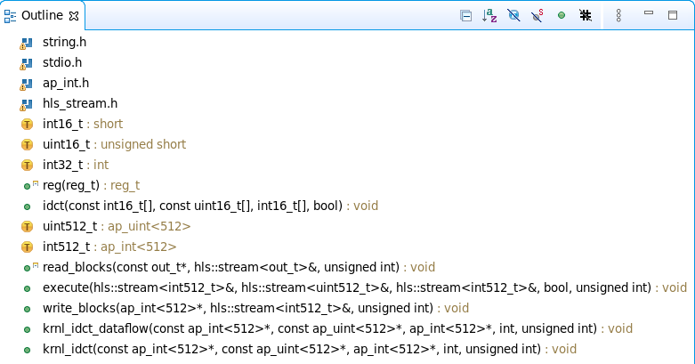

1. In the *Outline* viewer, click on **idct** to look up the function

    The `idct()` function is the core algorithm in the kernel. It is a computationally intensive function that can be highly parallelized on the FPGA, providing significant acceleration over a CPU-based implementation

1. Review the code

    - **krnl\_idct** : Top-level function for the hardware kernel. Interface properties for the kernel are specified in this function
    - **krnl\_idct\_dataflow** : Called by the **krnl\_idct** function and encapsulates the main functions of the kernel
    - **read\_blocks** : Reads data from global memory data sent by the host application and streams to the *execute* function
    - **execute** : For each 8x8 block received, calls the **idct** function to perform the actual IDCT computation
    - **write\_blocks** : Receives results from the **execute** function and writes them back to global memory for the host application

1. Open the **idct.cpp** file.  Again, use the *Outline* viewer to quickly look up and inspect the important functions of the host application:  
    - **main** : Initializes the test vectors, sets-up OpenCL resources, runs the reference model, runs the hardware kernel, releases the OpenCL resources, and compares the results of the reference IDCT model with the hardware implementation
    - **runFPGA** : Takes in a vector of inputs and for each 8x8 block calls the hardware accelerated IDCT using the **write**, **run**, **read** and **finish** helper functions. These function use OpenCL API calls to communicate with the FPGA
    - **runCPU** : Takes in a vector of inputs and, for each 8x8 block, calls **idctSoft** , a reference implementation of the IDCT
    - **idctSoft** : Software implementation of the IDCT algorithm, used to check the results from the FPGA
    - **oclDct** : This class is used to encapsulate the OpenCL runtime calls to interact with the kernel in the FPGA
    - **aligned\_allocator** , **smalloc** , **load\_file\_to\_memory** : These are small helper functions used during test vector generation and OpenCL setup  

1. Look at the code around line number 497 of the **idct.cpp** file. Press *Ctrl*+l (lower case L) and enter 497 to jump to this line
    This section of code is where the OpenCL environment is setup in the host application. This is typical of most Vitis applications, and will look very familiar to developers with prior OpenCL experience. This body of code can often be reused as-is from project to project

    To setup the OpenCL environment, the following API calls are made:
    - **clGetPlatformIDs** : This function queries the system to identify any available OpenCL platforms. It is called twice as it first extracts the number of platforms before extracting the actual supported platforms
    - **clGetPlatformInfo** : Gets specific information about the OpenCL platform, such as vendor name and platform name
    - **clGetDeviceIDs** : Obtains list of devices available on a platform
    - **clCreateContext** : Creates an OpenCL context, which manages the runtime objects
    - **clGetDeviceInfo** : Gets information about an OpenCL device like the device name
    - **clCreateProgramWithBinary** : Creates a program object for a context, and loads specified binary data into the program object. The actual program is obtained before this call through `load_file_to_memory()` function
    - **clCreateKernel** : Creates a kernel object
    - **clCreateCommandQueue** : Creates a command-queue on a specific device  


Note: all objects are accessed through a **clCreate...** function call, and they should be released before terminating the program by calling a corresponding **clRelease...**  This avoids memory leakage and clears locks on the device.

### Perform HW Emulation      

- Make sure you change the target by clicking on the drop-down button of _Active build configuration_ and select **Emulation-HW**

#### Configure the System Port in the Vitis GUI

In the *idct.cpp* file, locate lines 286-297. Note that two memory buffers, *mInBuffer* and *mOutBuffer* are being used. The memory buffers will be located in external DRAM. The kernel will have one or more ports connected to the memory bank(s). By default, the compiler will connect all ports to DDR[0].

1. In the *Assistant* view, right click on *optimization\_lab\_system > optimization\_lab\_system\_hw\_link > Emulation-HW > binary\_container_1* and click **Settings...**

1. Under *Compute Unit Settings* expand *krnl\_idct* and *krnl\_idct\_1*

1. Configure the kernel as shown in the image below

	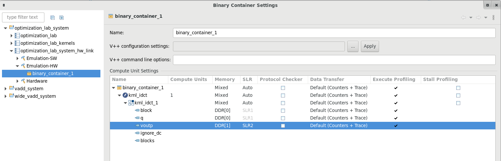

1. Click **Apply and Close**

#### Run Hardware Emulation

1. Select *optimization\_lab\_system* in the *Assistant* view and build the project ()

    Wait for the build to complete which will generate `binary_container_1.xclbin` file in the Emulation-HW directory

1. Select **Run > Run Configurations…** to open the configurations window

1. Double-click on the **System Project Debug** to create new configuration

1. In the *Main* tab, click to select **Use waveform for kernel debugging** and **Launch live waveform**

    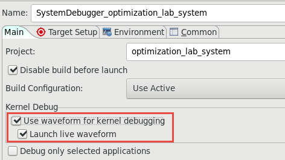

1. Click **Apply** and then **Run** to run the application  

   The Console tab shows that the test was completed successfully along with the data transfer rate  

   ```
   FPGA number of 64*int16_t blocks per transfer: 256
   DEVICE: xilinx_aws-vu9p-f1_shell-v04261818_201920_2
   Loading Bitstream: ../binary_container_1.xclbin
   INFO: Loaded file
   INFO: [HW-EM 01] Hardware emulation runs simulation underneath....
   Create Kernel: krnl_idct
   Create Compute Unit
   Setup complete
   Running CPU version
   Running FPGA version
   INFO::[ Vitis-EM 22 ] [Time elapsed: 0 minute(s) 51 seconds, Emulation time: 0.171543 ms]
   Data transfer between kernel(s) and global memory(s)
   krnl_idct_1:m_axi_gmem0-DDR[0]          RD = 128.000 KB             WR = 0.000 KB        
   krnl_idct_1:m_axi_gmem1-DDR[0]          RD = 0.500 KB               WR = 0.000 KB        
   krnl_idct_1:m_axi_gmem2-DDR[1]          RD = 0.000 KB               WR = 128.000 KB      

   INFO: [HW-EM 06-0] Waiting for the simulator process to exit
   INFO: [HW-EM 06-1] All the simulator processes exited successfully
   Runs complete validating results
   TEST PASSED
   RUN COMPLETE
   ```

	Notice that Vivado was started and the simulation waveform window is updated. It will run for about 165 us

1. Click on the Zoom Fit () button and scroll down the waveform window to see activities taking place in the kernel  

	Notice the gaps between *write* and the next *read* and execution of the kernel.

	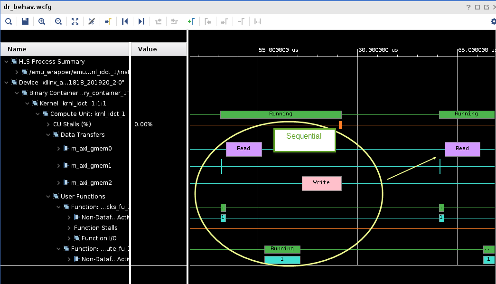

1. Close Vivado when you are ready by selecting **File > Exit** and clicking **OK**. We will not examine the transactions in detail.

#### Understand the HLS Report, profile summary, and Application Timeline

1. In the *Assistant* view, expand *optimization\_lab\_system > optimization\_lab > Emulation-HW > SystemDebugger\_optimization\_lab\_system\_optimization\_lab* and double-click on **Run Summary (xclbin)**

1. *Vitis Analyzer* window will open showing *binary_container_1.xclbin (Hardware Emulation)*

1. Click on *Profile Summary* report and review it

1. Click on the **Kernels & Compute Units** tab in the Profile Summary report

1. Review the Kernel **Total Time (ms)**  

    This number will serve as a baseline (reference point) to compare against after optimization. This baseline may be different depending on the target platform

    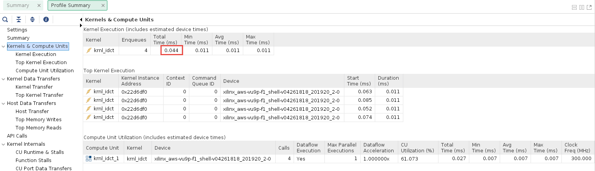

1. Exit out of Vitis Analyzer. In the *Assistant* view, expand *optimization\_lab\_system > optimization\_lab\_system\_hw\_link > Emulation-HW > binary\_container\_1* and double-click on **Link Summary (binary\_container\_1)**

1. *Vitis Analyzer* window will update and now it also includes *krnl\_idct (Hardware Emulation)*

1. Click on **HLS Synthesis** and review it

    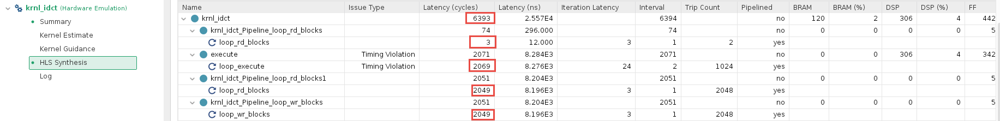

1. The `krnl_idct` has a latency of ~6,400 (cycles)

    The numbers may vary slightly depending on the target hardware you selected.
    The numbers will serve as a baseline for comparison against optimized versions of the kernel

1. The report also shows the three main functions that are part of the `krnl_idct` kernel

    - Note that these 4 sub-functions, three of which *execute*, *loop\_rd\_blocks* and *loop\_wr\_blocks* have roughly the same latency and that their sum total is equivalent to the total Interval reported in the Summary table
    - This indicates that the three sub-functions are executing sequentially, hinting at an optimization opportunity

1. Close all the reports by selecting **File > Exit**

### Analyze the kernel code and apply the DATAFLOW directive

1. Open the **optimization\_lab\_system > optimization\_lab\_kernels > src > krnl\_idct.cpp** file in the Explorer view

1. Using the *Outline* viewer, navigate to the **krnl\_idct\_dataflow** function  

    Observe that the three functions are communicating using **hls::streams** objects. These objects model a FIFO-based communication scheme. This is the recommended coding style which should be used whenever possible to exhibit streaming behavior and allow **DATAFLOW** optimization

1. Enable the DATAFLOW optimization by uncommenting the **#pragma HLS DATAFLOW** present in the krnl\_idct\_dataflow function (line 319)

    The DATAFLOW optimization allows each of the subsequent functions to execute as independent processes. This results in overlapping and pipelined execution of the read, execute and write functions instead of sequential execution. The FIFO channels between the different processes do not need to buffer the complete dataset anymore but can directly stream the data to the next block.

1. Save the file

### Build the project in Hardware Emulation configuration and analyze the HLS report

1. Make sure the active configuration is **Emulation-HW**

1. Select the **optimization\_lab\_system** in the Explorer view and click on the Build button () to build the project

1. In the *Assistant* view, expand *optimization\_lab\_system > optimization\_lab\_kernels > Emulation-HW > krnl\_dict* and double-click on **Compile Summary (krnl\_idct)**

1. Click on **HLS Synthesis** and review it

    Note that that latency now is ~2,000 (cycles)

	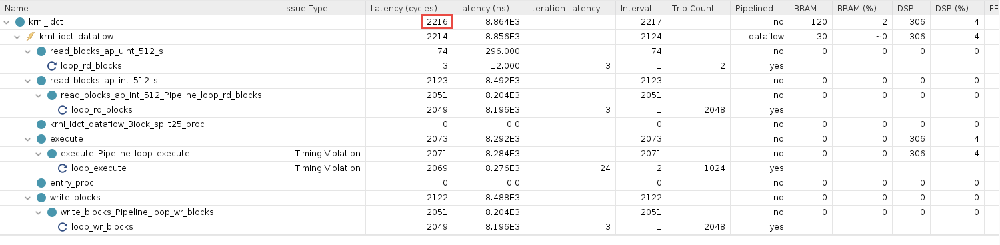

####  Run the Hardware Emulation

1. Run the hardware emulation. Wait for the run to finish with `RUN COMPLETE` message

    Notice the effect of the dataflow optimization in the Vivado simulation waveform view. The read, write and kernel execution overlap and are much closer together.

	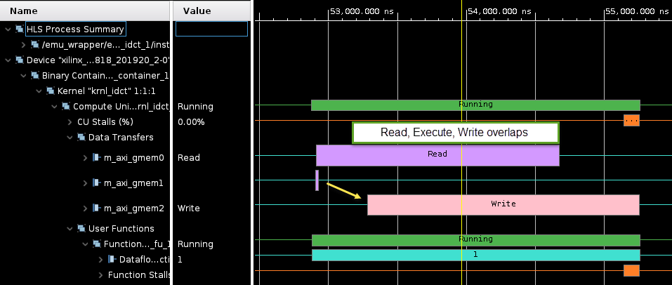

1. Close Vivado

1. In the *Assistant* view, expand *optimization\_lab\_system > optimization\_lab > Emulation-HW > SystemDebugger\_optimization\_lab\_system\_optimization\_lab*  and double-click the **Run Summary (xclbin)**

1. Click on **Profile Summary**

1. Select the **Kernels & Compute Units** tab  
    Compare the **Total Time (ms)** with the results from the un-optimized run (numbers may vary slightly to the results displayed below)

	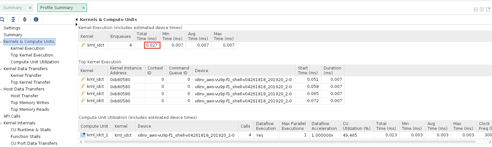

### Analyze the host code

1. Open the **optimization\_lab\_system > optimization\_lab > src > idct.cpp** file from the *Explorer* view

1. Using the *Outline* viewer, navigate to the **runFPGA** function  

    For each block of 8x8 values, the **runFPGA** function writes data to the FPGA, runs the kernel, and reads results back. Communication with the FPGA is handled by the OpenCL API calls made within the `cu.write()`, `cu.run()` and `cu.read()` function calls

    - `clEnqueueMigrateMemObjects()` schedules the transfer of data to or from the FPGA
    - `clEnqueueTask()` schedules the executing of the kernel

    These OpenCL functions use events to signal their completion and synchronize execution  

1. Open the **Timeline Trace** of the *Emulation-HW* run in Vitis Analyzer

    The green segments  indicate when the IDCT kernel is running

    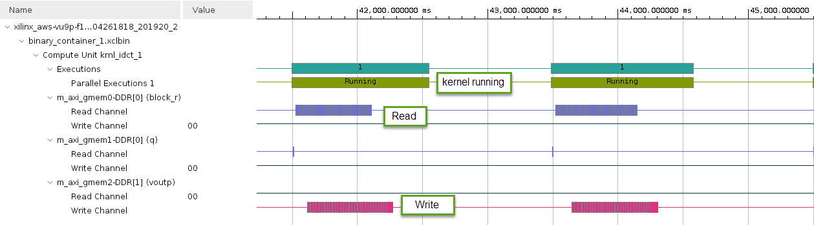

    Notice that there are gaps between each of the green segments indicating that the operations are not overlapping

1. Zoom in by performing a left mouse drag across one of these gaps to get a more detailed view  

    - The two green segments correspond to two consecutive invocations of the IDCT kernel
    - The gap between the two segments is indicative of the kernel idle time between these two invocations
    - The **Data Transfer** section of the timeline shows that **Read** and **Write** operations are happening when the kernel is idle
    - The Read operation is to retrieve the results from the execution which just finished, and the Write operation is to send inputs for the next execution
    - The gap in time between kernel invocations reduces the utilization of the hardware kernel, and the performance of the system

1. Close *Vitis Analyzer*  

1. In the **idct.cpp** file, go to the `oclDct::write()` function (line ~260)

     Notice on line ~274, the function synchronizes on the **outEvVec** event through a call to `clWaitForEvents()`

   ```C
   clWaitForEvents(1, &outEvVec[mCount]);
   ```

    - This event is generated by the completion of the `clEnqueueMigrateMemObjects()` call in the `oclDct::read()` function (line ~346)
    - Effectively the next execution of the `oclDct::write()` function is gated by the completion of the previous `oclDct::read()` function, resulting in the sequential behavior observed in the **Application Timeline**

1. Use the **Outline** viewer to locate the definition of the **NUM\_SCHED** macro in the **idct.cpp** file
    - This macro defines the depth of the event queue
    - The value of 1 explains the observed behavior: new tasks (write, run, read) are only enqueued when the previous has completed effectively synchronizing each loop iteration
    - By increasing the value of the **NUM\_SCHED** macro, we increase the depth of the event queue and enable more blocks to be enqueued for processing, which should result in the *write*, *run* and *read* tasks overlapping, allowing the kernel to execute continuously or at least reducing the delay between invocations

1. Modify line 152 to increase the value of **NUM\_SCHED** to 6 as follows  

   ```C
   #define NUM_SCHED 6
   ```

1. Save the file

#### Run Hardware Emulation

1. Build the application by clicking on the () button

    Since only the idct.cpp file was changed, only the host code is rebuilt. This should be much faster as no recompiling of the hardware kernel is required.

1. Change the run configuration by unchecking the **Use waveform for kernel debugging** option, and enable host tracing by clicking on the **Edit...* button of the *Xilinx Runtime Profiling* and clicking **OpenCL trace** check box for the *Host Trace*, click **Apply**, and then click **Run**

1. In the *Assistant* view, expand *optimization\_lab\_system > optimization\_lab\_kernels > Emulation-HW > SystemDebugger\_optimization\_lab\_system\_optimization\_lab*  and double-click the **Run Summary (xclbin)**

1. On *Vitis Analyzer* window click on **Timeline Trace**

    Observe how **software pipelining** enables overlapping of data transfers and kernel execution.

    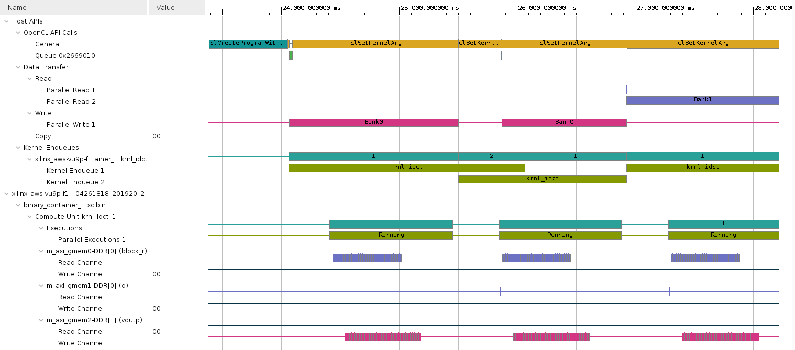

    Note: system tasks might slow down communication between the application and the hardware simulation, impacting on the performance results. The effect of software pipelining is considerably higher when running on the actual hardware.

### Build system hardware with profiling and timing analysis options if are continuing with the lab OTHERWISE skip to [Prebuilt](#run-the-system-in-hardware)

1. Set `Active build configuration:` to `Hardware` on the upper right corner of *Application Project Settings* view

    In order to collect the profiling data and run Timing Analyzer on the application run in hardware, we need to setup some options.

1. Select `optimization_lab_system > optimization_lab_system_hw_link > Hardware > binary_container_1` in *Assistant* view and then click on *Settings*. Click on the *Data Transfer* drop-down button in *binary\_container\_1* row and select **Counters+Trace** option. This should also enable *Execute Profiling* option. If not, then click on the corresponding check box.

1. In the *V++ command line options:* field, enter `--profile.data all` to enable kernel profiling

1. Select *Trace Memory* to be FIFO type and size of 64K. This is the memory where traces will be stored. You also have the option to store this information in DDR (max limit 4 GB) and PLRAM

1. Click **Apply and Close**

1. Build the project by selecting **optimization\_lab\_system** in `Assistant` view and clicking the build button 

    Normally, you would build the hardware, but since it can take approximately two hours you should **NOT BUILD** it now. Instead you can use the precompiled solution. 

1. A `binary_container_1.xclbin` and `optimization_lab` application will be generated in the `optimization_lab/Hardware` directory

1. Register the generated xclbin file to generate binary\_container\_1.awsxclbin by running the shell script. Follow instructions available [here](Creating_AFI_AWSEducate.md)

### Run the system in hardware

1. If you have built the hardware yourself then copy the necessary files using the following commands:

   ```sh
   cp binary_container_1.awsxclbin ~/workspace/optimization_lab/Hardware 
   cp ~/xup_compute_acceleration/sources/xrt.ini ~/workspace/optimization_lab/Hardware/.
   ```

1. If you have not built the hardware yourself then copy the provided prebuilt solution files using the following commands:

   ```sh
   mkdir -p ~/workspace/optimization_lab/Hardware && mkdir -p ~/workspace/optimization_lab_system/Hardware
   cp ~/xup_compute_acceleration/solutions/optimization_lab/* ~/workspace/optimization_lab/Hardware/
   cp ~/xup_compute_acceleration/solutions/optimization_lab/binary_container_1.awsxclbin ~/workspace/optimization_lab_system/Hardware/binary_container_1.xclbin
   chmod +x ~/workspace/optimization_lab/Hardware/optimization_lab
   ```

   Setup the run configuration so you can run the application and then analyze results from GUI

1. Right-click on `optimization_lab_system` in *Assistant* view, select `Run > Run Configurations...`

1. Click on the **Edit...** button of the *Program Arguments*, uncheck *Automatically add binary container(s) to arguments*, then enter **../binary\_container\_1.awsxclbin** after clicking in the *Program Arguments* field. Finally, click **OK**

1. click on the `Edit...` button of the *Xilinx Runtime Profiling* section, select the **OpenCL trace** option and click **OK**

1. Execute the application by clicking **Apply** and then **Run**. The FPGA bitstream will be downloaded and the host application will be executed showing output similar to:

   ```
   FPGA number of 64*int16_t blocks per transfer: 16384
   DEVICE: xilinx_aws-vu9p-f1_dynamic_5_0
   Loading Bitstream: ../binary_container_1.awsxclbin
   INFO: Loaded file
   Create Kernel: krnl_idct
   Create Compute Unit
   Setup complete
   Running CPU version
   Running FPGA version
   Runs complete validating results
   TEST PASSED
   CPU Time:        0.764289 s
   CPU Throughput:  669.904 MB/s
   FPGA Time:       0.116871 s
   FPGA Throughput: 4380.91 MB/s
   FPGA PCIe Throughput: 8761.82 MB/s
   ```

1. In the *Assistant* view, double click `optimization_lab_system > optimization_lab > Hardware > SystemDebugger_optimization_lab_system_optimization_lab > Run Summary (xclbin)` to open Vitis Analyzer

    Click **Timeline Trace**. Zoom in at the end of the timeline and observe the activities in various parts of the system. 

    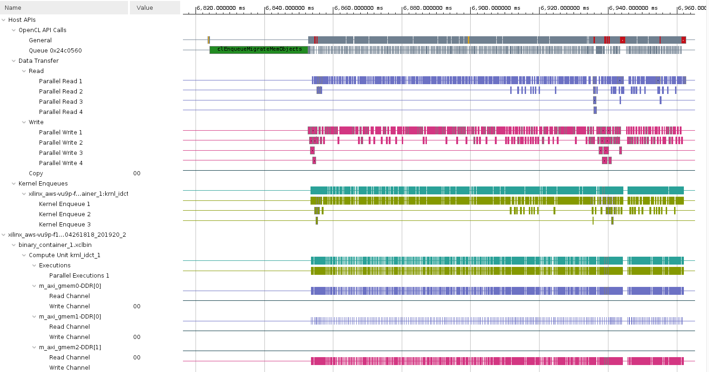

1. Click on the *Profile Summary* entry in the left panel, and observe multi-tab (four tabs) output

    - Kernels & Compute Units

    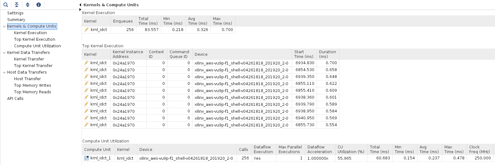

    - Kernel Data Transfers 

    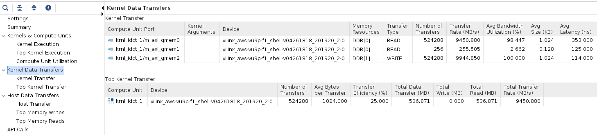

    - Host Data Transfer

    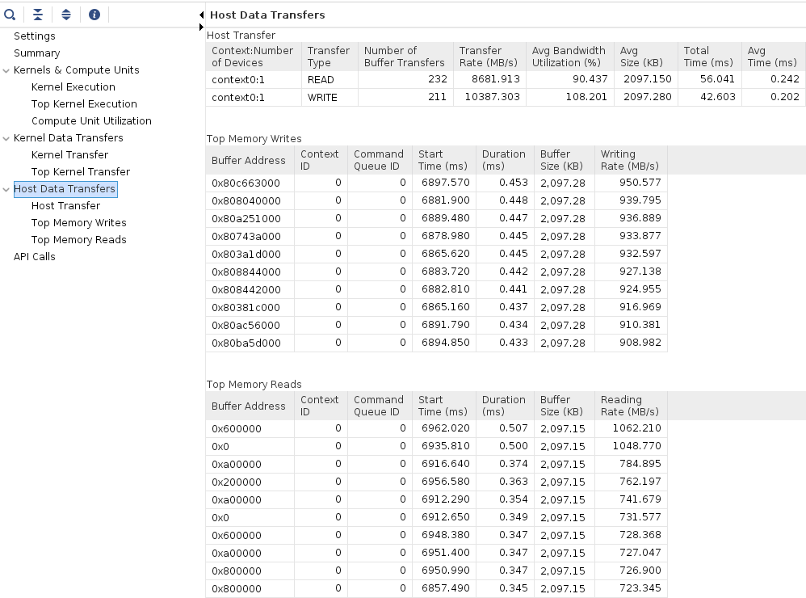


1. When finished, close the analyzer by clicking `File > Exit` and clicking **OK**


## Conclusion

In this lab, you used Vitis to create a project and add a kernel (hardware) function. You performed software and hardware emulation, analyzed the design and the various reports generated by the tools. You then optimized the kernel code using the DATAFLOW pragma, and host code by increasing the number of read, write, and run tasks to improve throughput and data transfer rates. You then validated the functionality in hardware.

Note if you disable the profiling you can get an acceleration of \~6.2x.

---------------------------------------


## Appendix Build Full Hardware

**Set the build configuration to Hardware and build the system (Note that since the building of the project takes over two hours skip this step in the workshop environment).**  

1. Click on the drop-down button of *Active build configuration:* and select **Hardware**

1. Set the [Vitis Kernel Linker flag as before](#configure-the-system-port-in-the-vitis-gui) but for Hardware

1. Either select **Project > Build Project** or click on the () button.    
This will build the project under the **Hardware** directory. The built project will include **optimization\_lab** file along with **binary\_container\_1.xclbin** file. This step takes about two hours  

### AWS-F1

Once the full system is built, you should [create an AWS F1 AFI](Creating_AFI.md) to run this example in AWS-F1.

---------------------------------------
<p align="center">Copyright&copy; 2021 Xilinx</p>