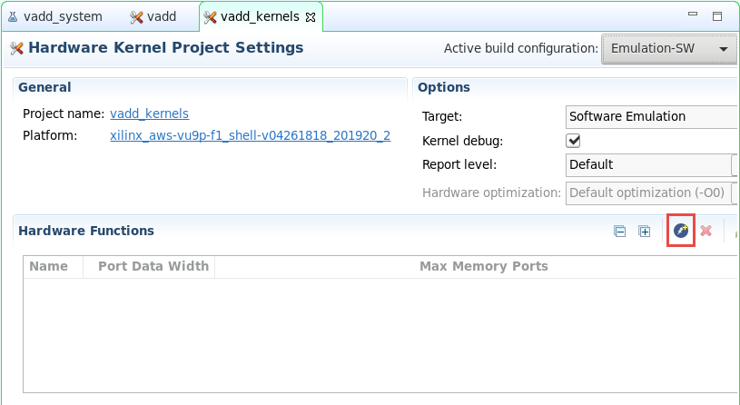
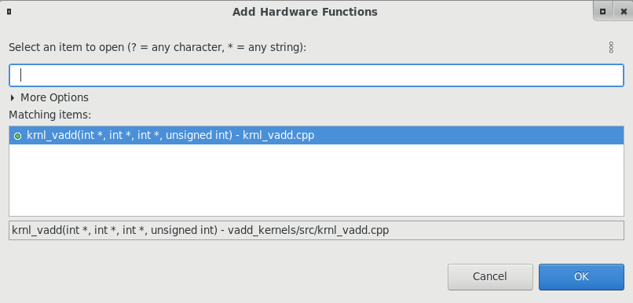
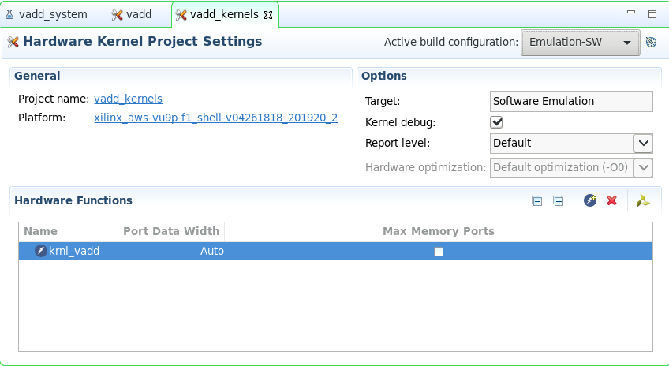
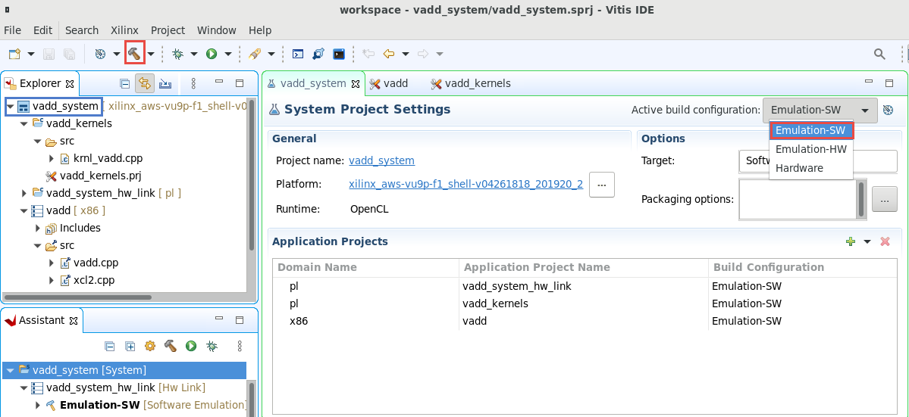

# Introduction to Vitis Part 1

## Introduction

This lab guides you through the steps involved in creating a Vitis project using Graphical User Interface (GUI). After creating the project, you will run software emulation to verify functionality of the design.

Check [Creating a Vitis IDE Project](https://www.xilinx.com/html_docs/xilinx2021_1/vitis_doc/creatingvitisideproject.html#cpe1508968036414) to know more about Vitis IDE.


### Description of example application

This lab uses an example application available in Vitis. It consists of a host application and kernel (written in C++/OpenCL). The kernel is a simple vector addition. The elements of 2 vectors (A & B) are added together, and the result returned in a third array (C). The host application initializes the two input arrays, send data to the kernel, and read back the result.

You will compile and check a software only version of the application. The *vector add* kernel will then be implemented as a hardware kernel. You will first build an emulation version of the design and run a simulation of the hardware kernel. You will then test the application with the kernel running in the FPGA in the next part of the lab.

## Objectives

After completing Introduction to Vitis Part 1 and 2, you will learn to:

* Create a project using the Vitis GUI
- Run Software Emulation to verify the functionality of a design
- Run Hardware Emulation to verify the functionality of the generated hardware
- Build the system and test it in hardware
- Perform profile and application timeline analysis in hardware emulation

## Steps

### Create a Vitis Project

1. Launch Vitis GUI

    Make sure Vitis and XRT environment has been setup. XRT setup is necessary before launching Vitis because building and running acceleration applications requires XRT. To do so, the following commands should return a valid path.

   ```sh
   echo $XILINX_VITIS
   echo $XILINX_XRT
   ```

    If either of the variables above are empty, then execute the following two commands:

   ```sh
   source ~/aws-fpga/vitis_setup.sh
   source ~/aws-fpga/vitis_runtime_setup.sh
   ```

1. Invoke GUI by executing the following command from a terminal window:

   ```sh
   vitis &
   ```
1. Set workspace to any empty folder, such as `~/workspace` and click **Launch**  
   
    Substitute `~` with `/home/ec2-user` (AWSEducate user), `/home/centos` (CentOS based instance user), or `/home/ubuntu` (Ubuntu based instance user)

	

1. The Vitis IDE Welcome page will be displayed

	

1. Create a new application project

    Use `Create Application Project` from Welcome page, or use `File > New > Application Project` to create a new application.

    

1. Click **Next >** in the first window

    

1. Select `xilinx_aws-vu9p-f1_shell-v04261818_201920_2` platform and click **Next >**

    If you do not see this platform, make sure to [set up](setup_xup_aws_workshop.md#lab-setup) `PLATFORM_REPO_PATHS` variable. Or you can include the platform manually by clicking `+` button and browse to `~/aws-fpga/Vitis/aws_platform/` and select `xilinx_aws-vu9p-f1_shell-v04261818_201920_2`

    


1. Name the project `vadd` and click **Next >**

    

1. Select `Empty Application` in the *Templates* window and click **Finish**

    

1. The project is generated.

    Observe the top-level folder is called vadd\_system, under which three sub-folders **(vadd\_kernels, vadd\_system\_hw\_link, and vadd)** are generated. The **vadd\_kernels** folder will hold all the kernels related files, the **vadd\_system\_hw\_link** will hold all linked kernels related files, and the **vadd** folder will hold all the host execution related files


     

    Since the _Empty_ project template was selected, the host code (**vadd**) and the kernels code (**vadd_kernels**) folders will have empty **src** folders

1. In the `Explorer` view, right-click on **vadd\_system > vadd > src** and select **Import Sources...**

    

1. In the *Import Sources* window, click *Browse* and navigate to `~/xup_compute_acceleration/sources/vadd_lab/` and click **OK**. Then select the **vadd.cpp, xcl2.cpp, and xcl2.cpp** files as they will be executed on the host. Finally click *Finish*

    

    Expand the `src` folder in the `Explorer` view to verify that the desired three files were added.

1. Similarly, import the hardware (kernel) function code (**krnl\_vadd.cpp**) under the **vadd\_system > vadd\_kernels > src** folder

1. Double-click on the **vadd\_kernels.prj** under the **vadd\_system > vadd\_kernels** folder in the *Explorer* view to open the corresponding **Hardware Kernel Project Settings** with the **Hardware Functions** panel, so you can identify and add the desired kernels

1. In the `Hardware Kernel Project Settings` view, click `Add Hardware function` button () on the *Hardware Functions* panel's ribbon

    

1. The window *Add Hardware Functions* will pop up, select `krnl_vadd(int *, int *, int *, unsigned int) - krnl_vadd.cpp` and click **OK**

    

1. Verify that *krnl_vadd* is added as a *Hardware Function*

    

### Build and Run Software Emulation

1. Select `vadd_system` tab in the project settings view

1. Set `Active build configuration:` to `Emulation-SW` on the upper right corner of `System Project Settings` view

1. Select `vadd_system` in the *Explore* view and begin build by clicking the hammer button () on top buttons bar, or right click `vadd_system` and select `Build Project`

    

    Click *Continue* when the Unsupported Operating System warning box pops-up (AWSEducate user only). This step compiles each of the kernels, link them, and finally compile the host application

    

1. Run Software Emulation in GUI Mode

    To launch software emulation in GUI mode, make sure to select `vadd_system` either in the **Assistant** view or in the **Explorer** view and then click on the run button 

1. Select the **Launch SW Emulator** option and click **OK**

    

1. Observe the application has run and the output is displayed in the *Console* view

   ```
   Found Platform
   Platform Name: Xilinx
   INFO: Reading /home/ec2-user/workspace/vadd_system/Emulation-SW/binary_container_1.xclbin
   Loading: '/home/ec2-user/workspace/vadd_system/Emulation-SW/binary_container_1.xclbin'
   Trying to program device[0]: xilinx_aws-vu9p-f1_shell-v04261818_201920_2
   Device[0]: program successful!
   Running Vector add with 32768 elements
   Launching Hardware Kernel...
   Getting Hardware Results...
   TEST PASSED
   ```

## Conclusion

In this lab, you used Vitis IDE to create a project using one of the application templates. You then ran the design using the software emulation flows.

---------------------------------------
<p align="center">Copyright&copy; 2021 Xilinx</p>
