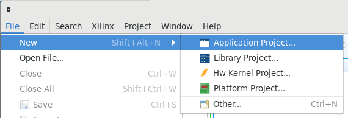
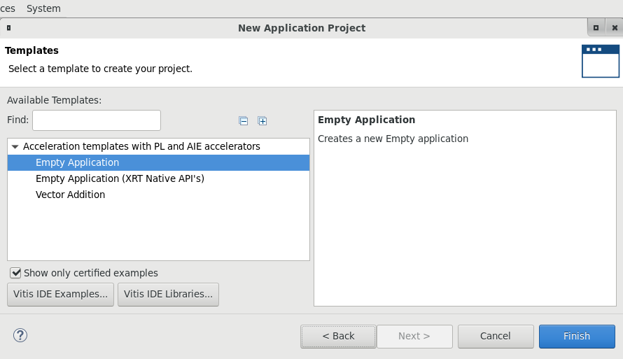

# Introduction to Vitis Part 1

## Introduction

This lab guides you through the steps involved in creating a Vitis project using Graphical User Interface (GUI). After creating the project, you will run software emulation to verify functionality of the design.

Check [Creating a Vitis IDE Project](https://www.xilinx.com/html_docs/xilinx2019_2/vitis_doc/Chunk1843199917.html#cpe1508968036414) to know more about Vitis IDE.


### Description of example application

This lab uses an example application available in Vitis. It consists of a host application and kernel (written in C++/OpenCL). The kernel is a simple vector addition. The elements of 2 vectors (A & B) are added together, and the result returned in a third array (C). The host application initializes the two input arrays, send data to the kernel, and read back the result.

You will compile and check a software only version of the application. The *vector add* kernel will then be implemented as a hardware kernel. You will first build an emulation version of the design and run a simulation of the hardware kernel. You will then test the application with the kernel running in the FPGA in the next part of the lab.

## Objectives

After completing Introduction to Vitis Part 1 and 2, you will learn to:

* Create a project using the Vitis GUI
- Run Software Emulation to verify the functionality of a design
- Run Hardware Emulation to verify the functionality of the generated hardware
- Build the system and test it in hardware
- Perform profile and application timeline analysis in hardware emulation

## Steps

### Create a Vitis Project

1. Launch Vitis GUI

    Make sure Vitis and XRT environment has been setup. XRT setup is necessary before launching Vitis because building and running acceleration applications requires XRT. To do so, the following commands should return a valid path.

    ```sh
    echo $XILINX_VITIS
    echo $XILINX_XRT
    ```

    If either of the variables above are empty, then execute the following two commands:

    ```sh
    source $AWS_FPGA_REPO_DIR/vitis_setup.sh
    source $AWS_FPGA_REPO_DIR/vitis_runtime_setup.sh
    ```

1. Invoke GUI by executing the following command:

    ```sh
    vitis &
    ```
1. Set workspace to any empty folder, such as `~/workspace` and click **Launch**  

	

1. The Vitis IDE Welcome page will be displayed

	

1. Create a new application project

    Use `Create Application Project` from Welcome page, or use `File > New > Application Project` to create a new application.

    

1. Name the project `vadd` and click **Next >**

    

1. Select `xilinx_aws-vu9p-f1_shell-v04261818_201920_2` platform and click **Next >**

    

    If you do not see this platform, make sure to [set up](setup_xup_aws_workshop.md#lab-setup) `PLATFORM_REPO_PATHS` variable. Or you can include the platform manually by clicking `+` button and browse to `/home/centos/src/project_data/aws-fpga/Vitis/aws_platform/` and select `xilinx_aws-vu9p-f1_shell-v04261818_201920_2`

1. Select `Vector Addition` in the *Template* window and click **Finish**

    

1. The project is generated. Notice that the *Hardware Function* in the *Project Editor* view is automatically set up to *krnl_vadd*

    

### Build and Run Software Emulation

1. Set `Active build configuration:` to `Emulation-SW` on the upper right corner of *Project Editor* view

1. Begin build by clicking the hammer icon on top icon bar, or right click `vadd` and select `Build Project`

    

1. Run Software Emulation in GUI Mode

    To launch software emulation in GUI mode, first select the application in *Explorer* view, then click run icon  on icon bar. Or right click on *vadd[x86_0]* in *Explorer* view and select `Run As > 1 OpenCL Application`

    

1. Observe the application has run and the output is displayed in the *Console* view

    ```
    Loading: '../binary_container_1.xclbin'
    TEST PASSED
    ```

## Conclusion

In this lab, you used Vitis IDE to create a project using one of the application templates. You then ran the design using the software emulation flows.

---------------------------------------
Copyright&copy; 2020 Xilinx