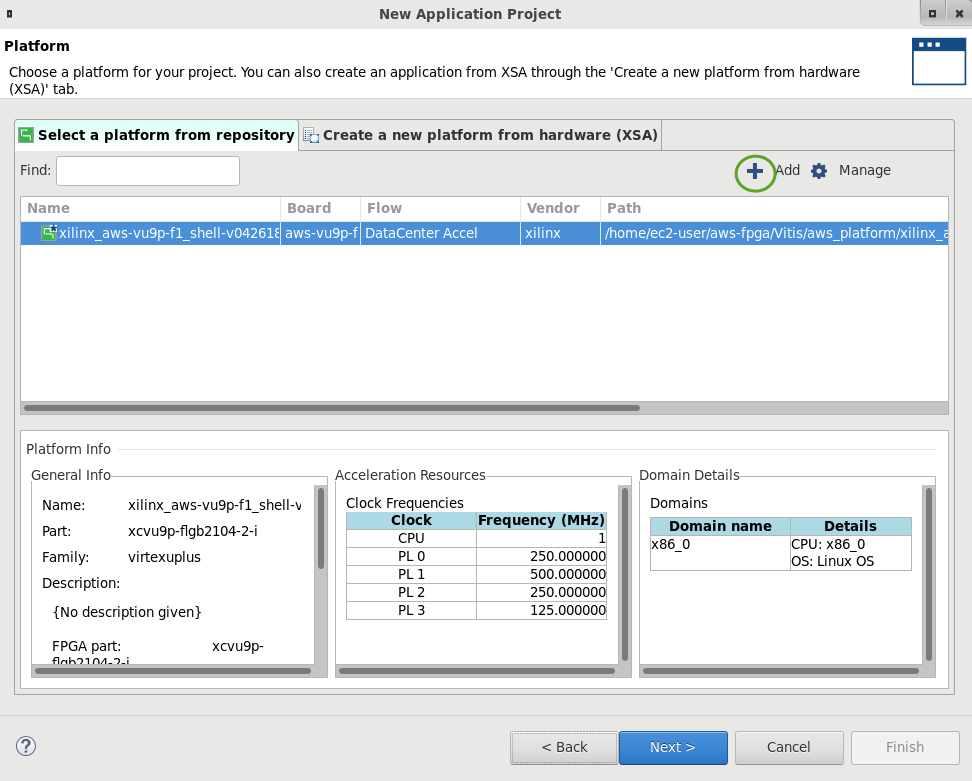
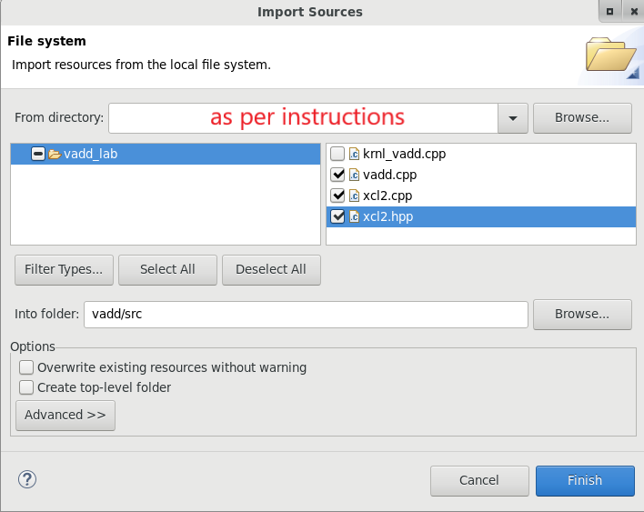

# Introduction to Vitis Part 1

## Introduction

This lab guides you through the steps involved in creating a Vitis project using Graphical User Interface (GUI). After creating the project, you will run software emulation to verify the functionality of the design.

### References

For more details on the Vitis IDE see the Vitis documentation for [Creating a Vitis IDE Project](https://www.xilinx.com/html_docs/xilinx2021_1/vitis_doc/creatingvitisideproject.html#cpe1508968036414).


### Description of example application

This lab uses an example application available in Vitis. It consists of a host application and kernel (written in C++/OpenCL). The kernel is a simple vector addition. The elements of 2 vectors (A & B) are added together, and the result returned in a third array (C). The host application initializes the two input arrays, send data to the kernel, and reads back the result.

You will compile and test a software only version of the application. The *vector add* kernel will then be implemented as a hardware kernel. You will first build and run a *Software Emulation* version of the design, followed by a *Hardware Emulation* version which will run a simulation of the hardware model of the kernel along with the host application. You will then test the design with the hardware kernel running in the FPGA in the next part of the lab.

## Objectives

After completing this lab (part 1 and part 2), you will learn how to:

* Create a project using the Vitis GUI
- Run *Software Emulation* to verify the functionality of a design
- Run Hardware Emulation to verify the functionality of the generated hardware design
- Build the system and test it in hardware
- Perform profile and application timeline analysis in hardware emulation

## Steps

### Create a Vitis Project

1. If you have not run [lab setup](setup_xup_aws_workshop.md#lab-setup), run it now

1. In a terminal, start the Vitis GUI by running

   ```sh
   vitis
   ```
1. Set the Vitis *workspace* to a new empty folder, such as `/home/<user>/workspace` and click **Launch**
   
   

1. The Vitis IDE Welcome page will be displayed

   

1. Create a new application project

   Click **Create Application Project** from Welcome page, or **File > New > Application Project** to create a new application

   

1. Click **Next >** in the first window

   

1. Select `xilinx_aws-vu9p-f1_shell-v04261818_201920_2` platform and click **Next >**

   If you do not see this platform, check you followed the [lab set up instructions](setup_xup_aws_workshop.md#lab-setup) to set the `PLATFORM_REPO_PATHS` variable. You can select the platform by clickingthe  `+` button and browsing to `~/aws-fpga/Vitis/aws_platform/` and selecting `xilinx_aws-vu9p-f1_shell-v04261818_201920_2`

   

1. Name the project `vadd` and click **Next >**

   

1. Select `Empty Application` in the *Templates* window and click **Finish**

   

   The project is generated. Observe the top-level folder is called vadd\_system, under which three sub-folders **(vadd\_kernels, vadd\_system\_hw\_link, vadd)** are generated. The **vadd\_kernels** folder will hold all the kernel related files, the **vadd\_system\_hw\_link** will hold all linked kernel related files, and the **vadd** folder will hold all the host application related files.

   

   Since the _Empty_ project template was selected, the **vadd** and **vadd_kernels** will have empty **src** folders

1. In the `Explorer` view, expand and right-click on **vadd\_system > vadd > src** and select **Import Sources...**

   

1. In the *Import Sources* window, click *Browse* and navigate to `~/xup_compute_acceleration/sources/vadd_lab/` and click **Open**

1. Select the **vadd.cpp, xcl2.cpp, and xcl2.hpp** files as they are part of the host code and click **Finish**

   

   Expand the `src` folder in the `Explorer` view to verify that the three files were added.

1. Similarly, import the hardware kernel code (**krnl\_vadd.cpp**) under the **vadd\_system > vadd\_kernels > src** folder

1. In the *Explorer* view, double-click on the **vadd\_kernels.prj** under the **vadd\_system > vadd\_kernels** folder to open the corresponding *Hardware Kernel Project Settings* 

   

1. Click the **Add Hardware function** button () on the *Hardware Functions* panel's ribbon

   

1. Select **krnl_vadd(int \*, int \*, int \*, unsigned int) - krnl_vadd.cpp**  in the *Add Hardware Functions* window and click **OK**

   

1. Verify that *krnl_vadd* is added as a *Hardware Function*

   

### Build and Run Software Emulation

1. Select the  **vadd_system** tab in the project settings view

1. Check the *Active build configuration* is set to **Emulation-SW** on the upper right corner of *System Project Settings* view

1. In the *Explore* view, select **vadd_system** and build the design by clicking the hammer button () on top buttons bar, or right click `vadd_system` and select **Build Project**

   

   This step compiles each of the kernels, links them, and compiles the host application

   Click *Continue* if you see an *Unsupported Operating System* warning

1. Run Software Emulation

   To launch software emulation, select `vadd_system` either in the **Assistant** view or in the **Explorer** view and then click on the run button 

1. Select the **Launch SW Emulator** option and click **OK**

   Observe the application has run and the output is displayed in the *Console* view

   ```console
   Found Platform
   Platform Name: Xilinx
   INFO: Reading /home/centos/workspace/vadd_system/Emulation-SW/binary_container_1.xclbin
   Loading: '/home/centos/workspace/vadd_system/Emulation-SW/binary_container_1.xclbin'
   Trying to program device[0]: xilinx_aws-vu9p-f1_shell-v04261818_201920_2
   Device[0]: program successful!
   Running Vector add with 32768 elements
   Launching Hardware Kernel...
   Getting Hardware Results...
   TEST PASSED
   ```

You can leave the project open as you will continue from this step in the second part of this lab

## Conclusion

In this lab, you used Vitis to create a vector add project using the provided source code. You then ran the design using the software emulation flow.

---------------------------------------
<p align="center">Copyright&copy; 2021 Xilinx</p>
