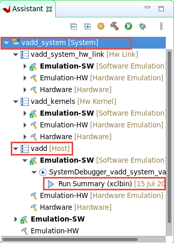
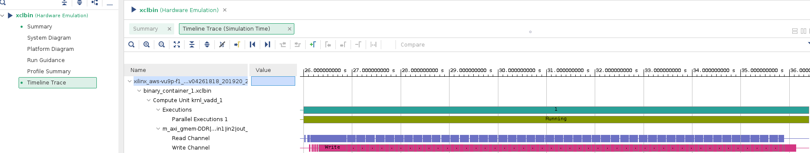
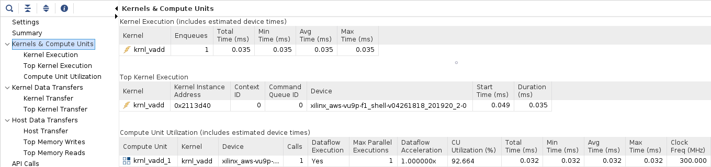
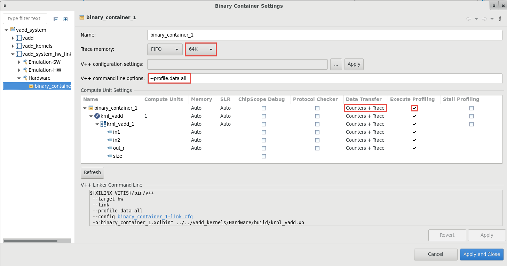
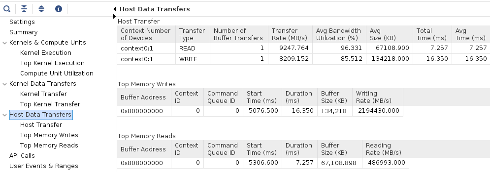

# Introduction to Vitis Part 2

This lab is a continuation of previous *Introduction to Vitis* lab. You ended the previous lab by running a software emulation of the vector addition kernel. In this lab you will profile both software and hardware emulation and you will run the design in hardware.

## Steps

### View Emulation Timeline
1. Make sure you ran the [software emulation](Vitis_intro-1.md#build-and-run-software-emulation)

1. In the *Assistant* view, double click `Emulation-SW -> vadd-Default -> Run Summary (xclbin)` to open Vitis Analyzer

    

1. Vitis Analyzer shows **Profile Summary** and **Application Timeline** tabs on the left-hand side. Click **Application Timeline**
1. Scroll right, click on the graph at around 75 ms (you may see different timeline depending on what else was executed earlier), then using the mouse cursor, select an area of interest

    Observe the various events at different time intervals  

    

1. When finished, close the analyzer by clicking `File > Exit` and clicking **OK**

### Build and run hardware emulation

1. Set `Active build configuration:` to `Emulation-HW` on the upper right corner of *Application Project Settings* view

    

1. Build the project. This may take about 10 minutes

1. Run Hardware Emulation in GUI mode

    To launch hardware emulation in GUI mode, first select the application in *Explorer* view, then click run button on icon bar, or select *Emulation-HW* in *Assistant* view and click on the Run button and select **vadd-Default (OpenCL Application)**

    

1. Observe the application has run, and the output is displayed in the *Console* view. Compared to software emulation, the output also shows data transfer information. Notice the data transfer between kernel and global memory is 16 KB on each port

    

1. View Emulation Timeline

    In the *Assistant* view, double-click `Emulation-HW > vadd-Default > Run Summary (xclbin)` to open Vitis Analyzer

    Vitis Analyzer shows **System Diagram**, **Platform Diagram**, **Run Guidance**, **Profile Summary** and **Application Timeline** tabs on the left-hand side. Click **Application Timeline**. Zoom in between the 16 and 30 second area and observe the events that occurred. Note that data is processed in smaller chunks in the kernel and in a sequential manner.

    

1. Click on the **Profile Summary** entry in the left panel, and observe the four tabs, each containing reports on various performance metrics:
    - **Top Operations** : Shows the *top operations* related to memory transfer between the host and kernel to global memory, and kernel execution. This allows you to identify throughput bottlenecks when transferring data. Efficient transfer of data to the kernel/host allows for faster execution times
    - **Kernels &amp; Compute Units** : Shows the number of times the kernel was executed. Includes the total, minimum, average, and maximum run times. If the design has multiple compute units, it will show each compute unit's utilization. When accelerating an algorithm, the faster the kernel executes, the higher the throughput which can be achieved.
    - **Data Transfers** : This tab has no bearing in software emulation as no actual data transfers are emulated across the host to the platform. In hardware emulation, this shows the emulated throughput and bandwidth of the read/writes to the global memory that the host and kernel share
    - **OpenCL APIs** : Shows all the OpenCL API command executions, how many times each was executed, and how long they take to execute

1. Click on each of tabs and review the report:  

    - Top Operations

    

    - Kernels & Compute Units

    

    - Data Transfers

    

    - OpenCL APIs

    


1. When finished, close the analyzer by clicking `File -> Exit` and clicking **OK**

### Build System hardware with profiling and timing analysis options

1. Set `Active build configuration:` to `Hardware` on the upper right corner of *Application Project Settings* view

    

    In order to collect the profiling data and run Timing Analyzer on the application run in hardware, we need to setup some options.

1. Right-click on Hardware in *Assistant* view and then click on *Settings*

    

1. Expand Hardware in the left panel to see *binary_container* and *krnl_vadd* entries. Select *krnl_vadd* on the left-hand side, click on the *Data Transfer* drop-down button in krnl_vadd row and select *Counters+Trace* option. Notice the same monitoring options will be applied to all items in the hierarchy under the top level selection. Similarly, click on *Execute Profiling* check-box in krnl_vadd row.

    At this point the settings should look like shown below

    

1. Click on *binary_container* on the left-hand side and select *Trace Memory* to be FIFO type and size of 64K. This is the memory where traces will be stored. You also have the option to store this information in DDR (max limit 2 GB) and PLRAM

1. Click **Apply and Close**

    

    Normally, you would build the hardware, but since it can take approximately two hours you should **NOT BUILD** it now. Instead you can use the precompiled solution. If you wish to rebuild the hardware later, see the [Appendix](#appendix-build-full-hardware) below for instructions on how to do this.


### Run the Design in target hardware and analyze output

Since the Hardware build and AFI availability for AWS takes a considerable amount of time, a precompiled and preregistered AWS version is provided for you. Use the precompiled solution directory to verify the functionality

1. Copy the `binary_container_1.xclbin` and `vadd` files into `~/workspace/vadd/Hardware` folder. Also, make sure `vadd` has executable permissions. Use the following commands:

    ```sh
    cp ~/xup_compute_acceleration/solutions/vitis_intro_lab/* ~/workspace/vadd/Hardware/
    chmod +x ~/workspace/vadd/Hardware/vadd
    ```

1. Setup the run configuration so you can run the application and then analyze results from GUI

1. Right-click on Hardware in *Assistant* view, select `Run > Run Configurations...`

    Change Generate timeline trace report option from *Default* to *Yes* using the drop-down button in the Main tab.

    

1. Click on *Arguments* tab, make sure *Automatically add binary container(s) to arguments* is checked.

    Note that for AWS F1 `binary_container_1.xclbin` is not an FPGA binary, but an AFI

    

1. Execute the application by clicking **Apply** and then **Run**. The FPGA bitstream will be downloaded and the host application will be executed showing output similar to:

    

### Analyze hardware application timeline and profile summary

1. In the *Assistant* view, double click `Hardware > vadd-Default > Run Summary (xclbin)` to open Vitis Analyzer

    Vitis Analyzer shows **Run Guidance**, **Profile Summary** and **Application Timeline** panels on the left-hand side. Click **Application Timeline**. Zoom in between 185,800,000 and 186,800,000 microsecond area (note for your output the range may differ depending on what else was executed on the instance) and observe the activities in various parts of the system. Note that the kernel processes data in one shot

    

1. Click on the *Profile Summary* entry in the left panel, and observe multi-tab (four tabs) output

    - Top Operations

    

    - Kernels & Compute Units

    

    - Data Transfers

    

    - OpenCL APIs

    

1. When finished, close the analyzer by clicking `File > Exit` and clicking **OK**

1. Review `xrt.ini` file in `Hardware` folder within *Explorer* view

    Earlier, when you set kernel profiling and trace settings, `xrt.ini` file gets updated. During the execution, this updated file is used to generate the profile and application timeline data which are seen using Vitis Analyzer.

    


## Conclusion

In this lab you used the Vitis IDE to create a new project. You then ran the design using the software and hardware emulation flows, and reviewed the reports. You used a precompiled solution to download the application and kernel on the F1 instance and validated the functionality in hardware. You also analyzed profile and application timeline reports generated during running the application in actual hardware.

---------------------------------------

## Appendix: Build Full Hardware

Note that building the project can take around two hours. Skip this step in a tutorial environment.

1. After setting up the project as described above, you can build the system

1. Click on the () button or select **Project > Build Project**

  This will build the project under the **Hardware** directory. The built project will include **vadd** (executable) file along with **binary\_container\_1.xclbin** file

#### Test on AWS (create AFI)

Before the design can be run on AWS an AFI (Amazon FPGA Image) is required

Once the full system is built, you can create an AFI by following the steps listed in [create an AFI](Creating_AFI.md)

---------------------------------------
Copyright&copy; 2020 Xilinx