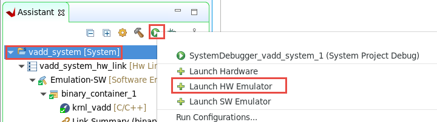
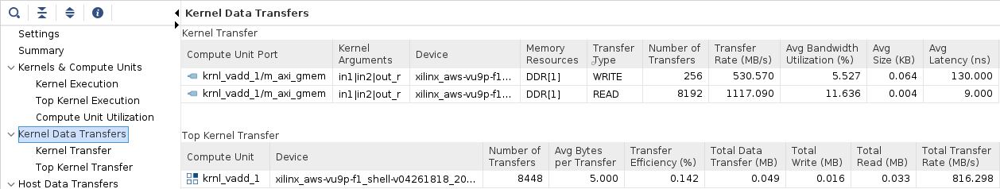
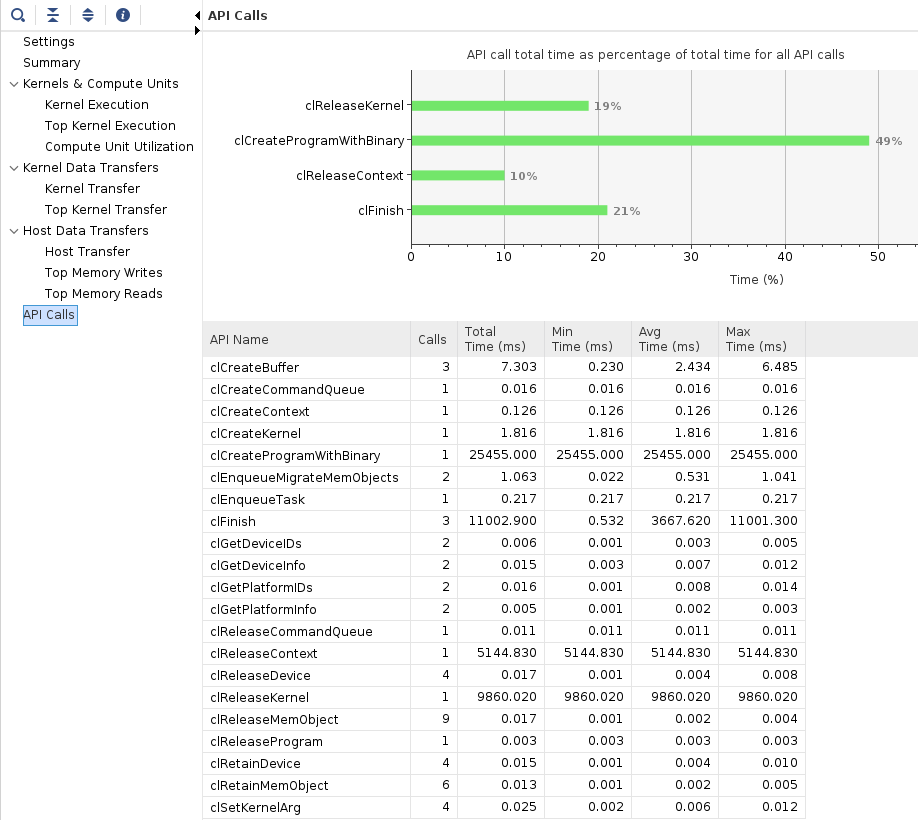
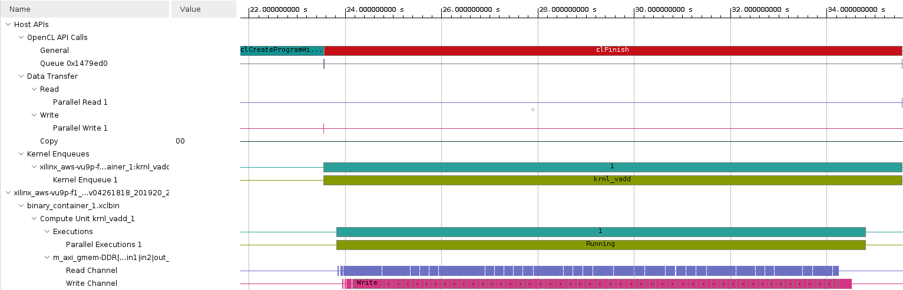
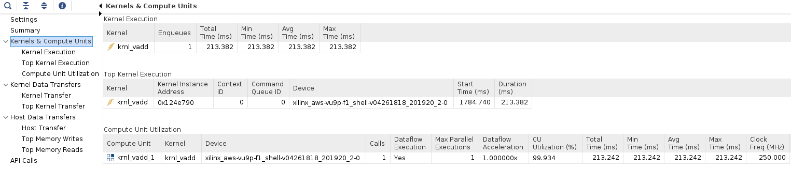
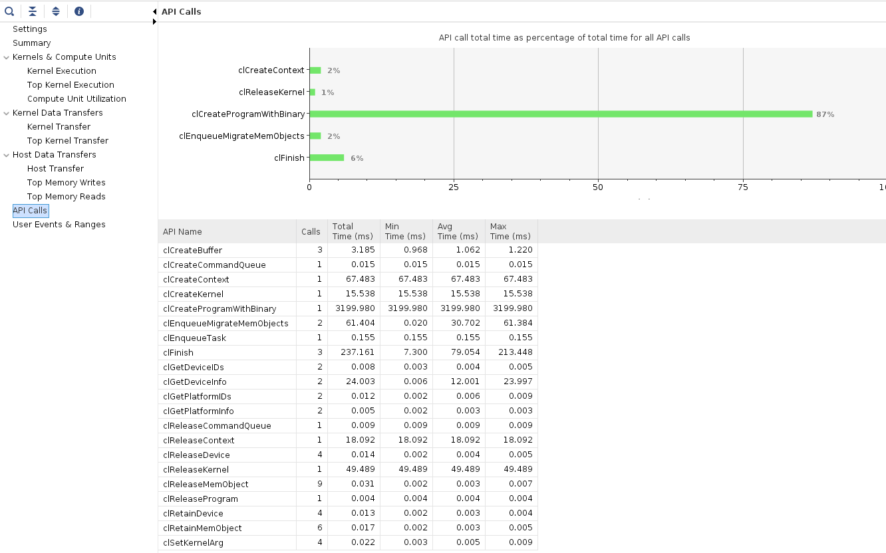

# Introduction to Vitis Part 2

This lab is a continuation of the previous *Introduction to Vitis* lab. You ended the previous lab by running a software emulation of the vector addition kernel. In this lab you will profile both software and hardware emulation and run the design in hardware.

## Steps

### View Emulation Timeline

1. Make sure you competed [software emulation](Vitis_intro-1.md#build-and-run-software-emulation) in the previous part of the lab

1. In the *Assistant* view, expand the following if necessary, and double-click `vadd_system > vadd > Emulation-SW > SystemDebugger_vadd_system_vadd > Run Summary (xclbin)` to open Vitis Analyzer

   

1. Vitis Analyzer shows **Summary**, **Run Guidance** and **Profile Summary** tabs on the left-hand side. 

1. Select **Profile Summary** and then select **Kernels & Compute Units** to see *kernel and compute units* execution times. Notice the reported times. 

   

1. Click **Host Data Transfer** to see *read and write buffer sizes*, *buffer addresses*, and the related execution parameters

   

1. Select **File > Exit** to close the Analyzer

### Timeline trace

In order to see a *Timeline Trace*, you need to enable it in the *Run configuration* settings. 

1. In the *Assistant* view, right click on **vadd\_system** and select **Run > Run configurations...**

2. Under the *Xilinx Runtime Profiling* section, click the *Configuration* **Edit...** button   

   

3. Select the **OpenCL trace** option,  click **OK** to save the change and click **Run** 

   

1. Open the Vitis Analyzer again (**vadd_system > vadd > Emulation-SW > SystemDebugger_vadd_system_vadd > Run Summary (xclbin)**) and select the **Timeline Trace**

1. Scroll and zoom if necessary to view application events. You can select an area of interest with the mouse cursor. This is a software emulation so the absolute numbers for your timeline may vary compared to the image below

   Observe the various events at different times in the trace.

   

1. You can close close the Vitis Analyzer when you are finished. 

## Build and run Hardware Emulation

1. In the *vadd_system* panel, set the *Active build configuration* to **Emulation-HW**:

   

1. Build the project by selecting *vadd\_system* in `Assistant` view and clicking the *build* button. This may take 10 minutes

### Run Hardware Emulation

1. In the *Assistant* view, select **vadd_system**, then click run the button on the icon bar and select **Launch HW Emulator**

   

1. Observe the application has run, and the output is displayed in the *Console* view. Compared to software emulation, the output also shows data transfer information. Notice the data transfer between kernel and global memory is 32KB read (16KB each for A and B) and 16 KB write (C)

   ```console
   Found Platform
   Platform Name: Xilinx
   INFO: Reading /home/ec2-user/workspace/vadd_system/Emulation-HW//binary_container_1.xclbin
   Loading: '/home/ec2-user/workspace/vadd_system/Emulation-HW//binary_container_1.xclbin'
   Trying to program device[0]: xilinx_aws-vu9p-f1_shell-v04261818_201920_2
   INFO: [HW-EM 01] Hardware emulation runs simulation underneath. Using a large data set will result in ...
   Device[0]: program successful!
   Running Vector add with 4096 elements
   Launching Hardware Kernel...
   Getting Hardware Results...
   TEST PASSED
   INFO::[ Vitis-EM 22 ] [Time elapsed: 0 minute(s) 30 seconds, Emulation time: 0.137666 ms]
   Data transfer between kernel(s) and global memory(s)
   krnl_vadd_1:m_axi_gmem-DDR[1]          RD = 32.000 KB              WR = 16.000 KB       
   
   INFO: [HW-EM 06-0] Waiting for the simulator process to exit
   INFO: [HW-EM 06-1] All the simulator processes exited successfully
   ```

### View the Timeline Trace

1. In the *Assistant* view, double-click `vadd_system > vadd > Emulation-HW > SystemDebugger_vadd_system_vadd > Run Summary (xclbin)` to open Vitis Analyzer

1. Click on the **Timeline Trace**

   Scroll and Zoom (25-35 seconds in the image below) and observe the events that occurred. Note that data is processed in smaller chunks in the kernel and in a sequential manner. Notice the Only events related to the FPGA hardware are shown. No host events are visible in this view

   

1. Click on **Profile Summary** entry in the left panel, and observe different entries, each containing reports on various performance metrics, we will focus on four of them

   

   - **Kernels &amp; Compute Units** : Shows the number of times the kernel was executed. Includes the total, minimum, average, and maximum run times. If the design has multiple compute units, it will show each compute unit's utilization. When accelerating an algorithm, the faster the kernel executes, the higher the throughput which can be achieved.
   - **Kernel Data Transfers** : This report has no bearing in software emulation as no actual data transfers are emulated across the host to the platform. In hardware emulation, this shows the emulated throughput and bandwidth of the read/writes to the global memory that the host and kernel share
   - **Host Data Transfer** : Shows the *top operations* related to memory transfer between the host and kernel to global memory, and kernel execution. This allows you to identify throughput bottlenecks when transferring data. Efficient transfer of data to the kernel/host allows for faster execution times
   - **API Calls** : Shows all the OpenCL API command executions, how many times each was executed, and how long they take to execute

1. Click on each of tabs and review the report

   - Kernels & Compute Units

   

   - Kernel Data Transfers

   

     Notice that the number of transfers is 256 in the write channel, this is because Vitis is optimizing the write channel applying bursts to move 16 elements for each transfer with a single request. Transferring data in bursts hides the memory access latency and improves bandwidth usage and efficiency of the memory controller. This optimization cannot be applied to the read channel because of a memory bank limitation, as you will see in the next lab.

   - Host Data Transfer

   

   - OpenCL APIs

   

1. Close the analyzer when you are finished

### Host profiling

1. In order to see host events, enable OpenCL trace again for a HW emulation run. In the *Assistant* view, right click on **vadd\_system**  select **Run > Run Configurations...**. Notice a new configuration is created for the HW emulation

1. In the *Xilinx Runtime Profiling* section, click on the `Edit...` button, then select the **OpenCL trace** option and click **OK**

1. Rerun and double-click `vadd_system > vadd > Emulation-HW > SystemDebugger_vadd_system_vadd > Run Summary (xclbin)` to open Vitis Analyzer. Select the `Timeline Trace` panel on the left

   Observe the various events occurring in various parts (host, kernels) of the system at different time intervals

   

## Run the system in hardware

Building the hardware can take 1-2 hours. You will test the design in hardware using a prebuilt binary. You will also setup the run configuration so you can run the application and then analyze results from GUI.

If you wish to rebuild the hardware later, see the [Appendix](#appendix-build-full-hardware) below for instructions on how to do this.

1. Copy the prebuilt solution files into the project with the following commands:

   ```sh
   mkdir -p ~/workspace/vadd/Hardware && mkdir -p  ~/workspace/vadd_system/Hardware
   cp ~/xup_compute_acceleration/solutions/vitis_intro_lab/* ~/workspace/vadd/Hardware/
   cp ~/xup_compute_acceleration/solutions/vitis_intro_lab/binary_container_1.awsxclbin ~/workspace/vadd_system/Hardware/binary_container_1.xclbin
   ```

1. Set `Active build configuration:` to `Hardware` on the upper right corner of *Application Project Settings* view

   

1. In the Explorer view, right click on *vadd* and select **Build Project** to rebuild the host application only.

   

1. In the *Assistant* view, right-click on `vadd_system` and select **Run > Run Configurations...**

1. Click on the **Edit...** button of the *Program Arguments*, uncheck *Automatically add binary container(s) to arguments*, then enter **../binary\_container\_1.awsxclbin** after clicking in the *Program Arguments* field. Finally, click **OK**

   

1. Click on the `Edit...` button of the *Xilinx Runtime Profiling* section, select the **OpenCL trace** option and click **OK**

1. Execute the application by clicking **Apply** and then **Run**. The FPGA bitstream will be downloaded and the host application will be executed showing an output similar to:

   ```
   Loading: '/home/centos/workspace/vadd_system/Hardware/binary_container_1.awsxclbin'
   Trying to program device[0]: xilinx_aws-vu9p-f1_shell-v04261818_201920_2
   Device[0]: program successful!
   Running Vector add with 16777216 elements
   Launching Hardware Kernel...
   Getting Hardware Results...
   TEST PASSED
   ```

1. In the *Assistant* view, double click `vadd_system > vadd > Hardware > SystemDebugger_vadd_system_vadd > Run Summary (xclbin)` to open the Vitis Analyzer

1. Click **Timeline Trace**. 

   Zoom in at the end of the timeline and observe the activities in various parts of the system. Note that the kernel processes data in one shot

   

1. Click on the *Profile Summary* entry in the left panel, and check information reported in each of the four sections:

   - Kernels & Compute Units

   

   - Kernel Data Transfers

   

   - Host Data Transfer

   

   - OpenCL APIs

   


1. Close the Analyzer when finished

1. In the *Explorer* view, review the `xrt.ini` file within the `vadd_system > vadd [x86] > Hardware` folder

   Earlier, when you set kernel profiling and trace settings, the `xrt.ini` file is automatically generated. During the execution, this file is used to generate the profile and application timeline data which are seen using Vitis Analyzer. Find our more about this file [here](https://www.xilinx.com/html_docs/xilinx2021_1/vitis_doc/profilingapplication.html#ariaid-title3).

   ```
   [Debug]
   opencl_summary=true
   power_profile=false
   opencl_trace=true
   lop_trace=false
   xrt_trace=false
   data_transfer_trace=coarse
   stall_trace=off
   app_debug=true
   ```

## Conclusion

In this lab you ran the vector add kernel using the hardware emulation flow, and reviewed the reports. Then, you used a precompiled solution to download the application and kernel onto the AWS F1 instance and validated the functionality in hardware. You also analyzed profile and application timeline reports generated when running the application in actual hardware.

---------------------------------------

## Appendix: Build Full Hardware

Note that building the project can take around two hours. Skip this step in a tutorial environment.

1. Set `Active build configuration:` to `Hardware` on the upper right corner of *Application Project Settings* view

   

   In order to collect the profiling data and run Timing Analyzer on the application run in hardware, we need to setup some options.

1. Select `vadd_system > vadd_system_hw_link > Hardware > binary_container_1` in *Assistant* view and then click on *Settings*. Click on the *Data Transfer* drop-down button in *binary\_container\_1* row and select **Counters+Trace** option. This should also enable *Execute Profiling* option. If not, then click on the corresponding check box.

1. In the *V++ command line options:* field, enter `--profile.data all` to enable kernel profiling

1. Select *Trace Memory* to be FIFO type and size of 64K. This is the memory where traces will be stored. You also have the option to store this information in DDR (max limit 4 GB) and PLRAM

   At this point the settings should look like shown below

   

1. Click **Apply and Close**

1. Build the project by selecting **vadd\_system** in *Assistant* view and clicking the build button ()

   This will build the project under the **Hardware** directory. The built project will include **vadd** (executable) file along with the **binary\_container\_1.xclbin** file

1. A `binary_container_1.xclbin` and `vadd` application will be generated in the `vadd/Hardware` directory

### Test on AWS (create AFI)

Before the design can be run on AWS F1 an AFI (Amazon FPGA Image) is required

Once the full system is built, you can create an AFI by following the steps listed in [create an AFI](Creating_AFI.md)

---------------------------------------
<p align="center">Copyright&copy; 2021 Xilinx</p>
