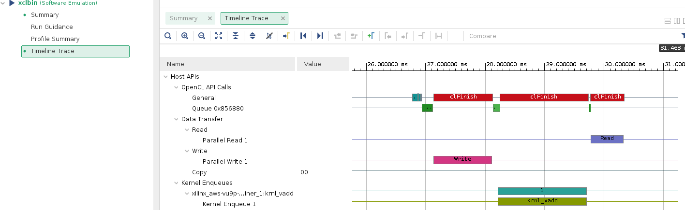
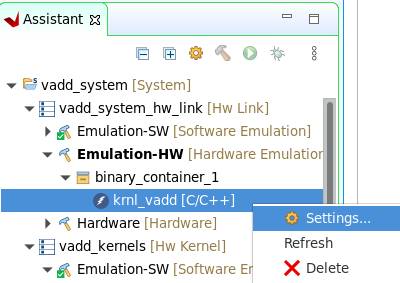
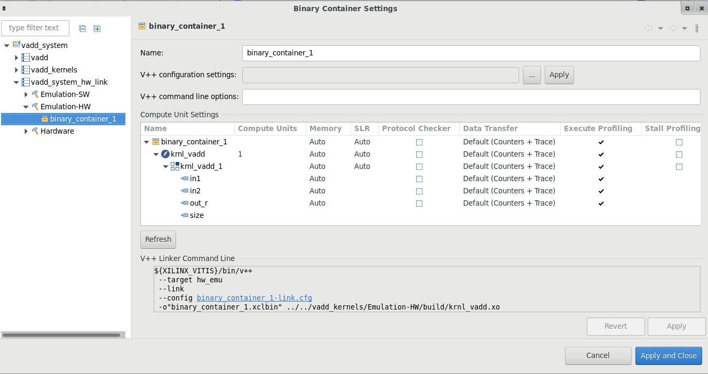
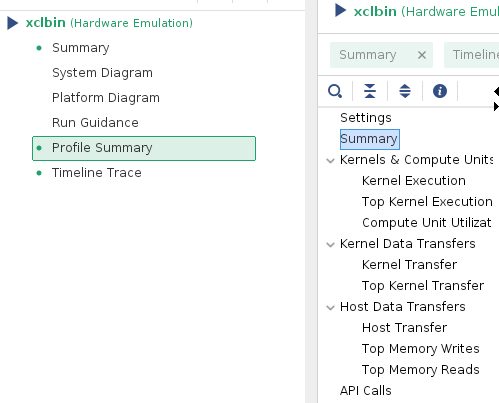
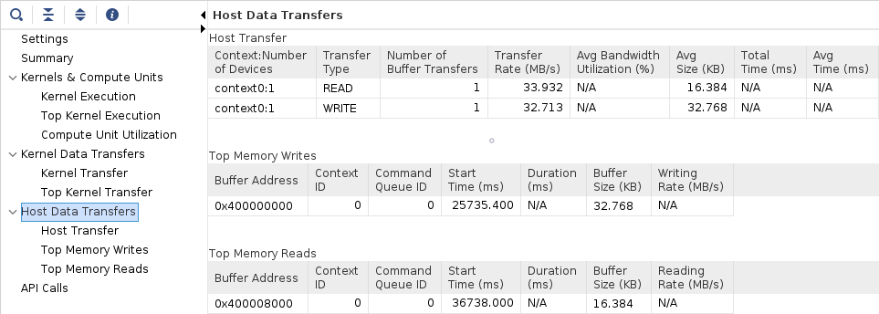
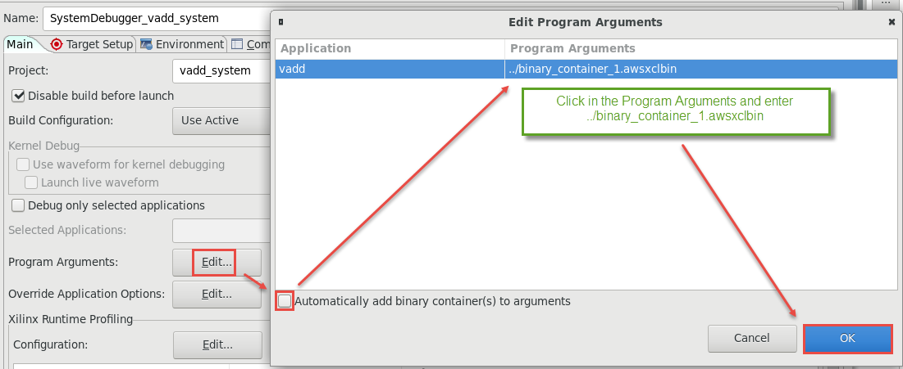
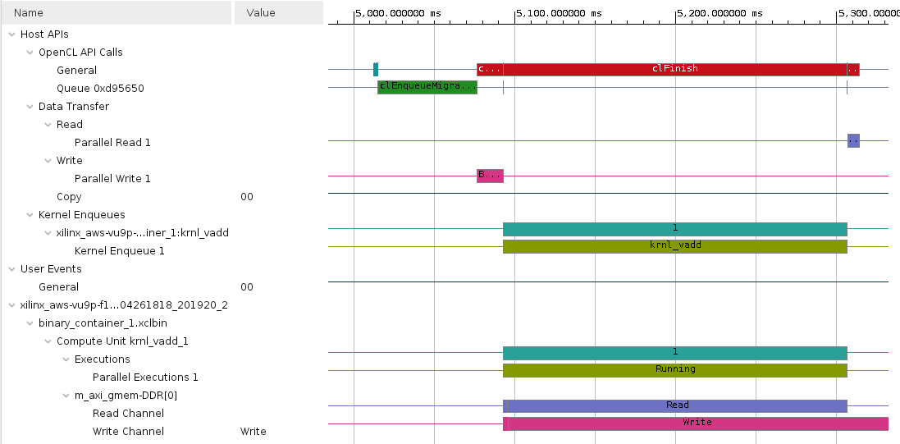
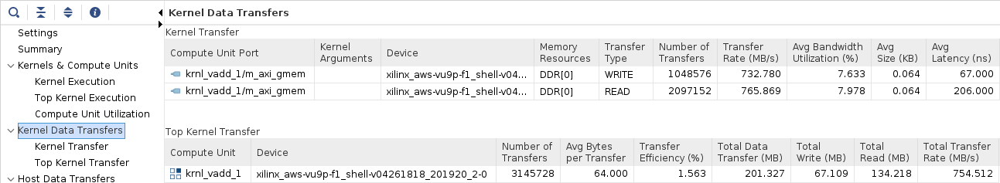

# Introduction to Vitis Part 2

This lab is a continuation of previous *Introduction to Vitis* lab. You ended the previous lab by running a software emulation of the vector addition kernel. In this lab you will profile both software and hardware emulation and you will run the design in hardware.

## Steps

### View Emulation Timeline
1. Make sure you ran the [software emulation](Vitis_intro-1.md#build-and-run-software-emulation)

1. In the *Assistant* view, double-click `vadd_system > vadd > Emulation-SW > SystemDebugger_vadd_system_vadd > Run Summary (xclbin)` to open Vitis Analyzer

    

1. Vitis Analyzer shows **Summary**, **Run Guidance** and **Profile Summary** tabs on the left-hand side. Notice that the **Timeline Trace** is not available as by default it is turned-off for the software emulation. Click **Profile Summary**

1. Click **Kernels & Compute Units** on the right to see kernel and compute units execution times

    

1. Click **Host Data Transfer** on the right to see read and write buffer sizes, buffer addresses, and the related execution parameters

    

1. Select **File > Exit** to close the Analyzer

1. In order to see the **Timeline Trace**, you need to enable it in the **Run configuration** settings. Right click on **vadd\_system** in the *Assistant* view, select **Run configuration**

1. Click on the `Edit...` button of the **Xilinx Runtime Profiling** section

    

1. Select the *OpenCL trace* option and click **OK**

    

1. Re-run and double-click `vadd_system > vadd > Emulation-SW > Run Summary (xclbin)` to open Vitis Analyzer. Select the `Timeline Trace` panel on the left

1. Scroll right, click on the graph at around 26 ms (you may see different timeline depending on what else was executed earlier), then using the mouse cursor, select an area of interest

    Observe the various events at different time intervals  

    

1. When finished, close the Vitis Analyzer by clicking `File > Exit` and clicking **OK**

### Build and run hardware emulation

1. Set `Active build configuration:` to `Emulation-HW` on the upper right corner of *System Project Settings* view of the *vadd_system* tab

    

    In order to collect the profiling data and run Timing Analyzer on the application run in hardware, we need to setup some options

1. Right-click on `vadd_system > vadd_system_hw_link > Emulation-HW > binary_container_1 > krnl_vadd` in *Assistant* view and then click on *Settings*

    

1. Select *krnl\_vadd* on the right-hand side, make sure that the *Data Transfer* shows *Counters+Trace* and Execute Profiling is checked. If not, then click on the *Data Transfer* drop-down button in *krnl\_vadd* row and select *Counters+Trace* option. Notice the same monitoring options will be applied to all items in the hierarchy under the top level selection. Click **Apply and Close**

    At this point the settings should look like shown below

    

1. Build the project by selecting **vadd_system"" in `Assistant` view and clicking the build button. This may take about 10 minutes

1. Run Hardware Emulation in GUI mode

    To launch hardware emulation in GUI mode, first select **vadd_system** in the *Assistant* view, then click run button on icon bar and select **Launch HW Emulator**

    

1. Observe the application has run, and the output is displayed in the *Console* view. Compared to software emulation, the output also shows data transfer information. Notice the data transfer between kernel and global memory is 16 KB on each port

   ```
   Found Platform
   Platform Name: Xilinx
   INFO: Reading /home/ec2-user/workspace/vadd_system/Emulation-HW//binary_container_1.xclbin
   Loading: '/home/ec2-user/workspace/vadd_system/Emulation-HW//binary_container_1.xclbin'
   Trying to program device[0]: xilinx_aws-vu9p-f1_shell-v04261818_201920_2
   INFO: [HW-EM 01] Hardware emulation runs simulation underneath. Using a large data set will result in ...
   Device[0]: program successful!
   Running Vector add with 4096 elements
   Launching Hardware Kernel...
   Getting Hardware Results...
   TEST PASSED
   INFO::[ Vitis-EM 22 ] [Time elapsed: 0 minute(s) 30 seconds, Emulation time: 0.137666 ms]
   Data transfer between kernel(s) and global memory(s)
   krnl_vadd_1:m_axi_gmem-DDR[1]          RD = 32.000 KB              WR = 16.000 KB       

   INFO: [HW-EM 06-0] Waiting for the simulator process to exit
   INFO: [HW-EM 06-1] All the simulator processes exited successfully
   ```    

1. View Timeline Trace

    In the *Assistant* view, double-click `vadd_system > vadd > Emulation-HW > SystemDebugger_vadd_system_vadd > Run Summary (xclbin)` to open Vitis Analyzer

    Vitis Analyzer shows **Summary**, **System Diagram**, **Platform Diagram**, **Run Guidance**, **Profile Summary**, and **Timeline Trace** tabs on the left-hand side. Click **Timeline Trace**. Zoom in between the 20 and 40 second area and observe the events that occurred. Note that data is processed in smaller chunks in the kernel and in a sequential manner. Only activities occurring in the FPGA is shown. No host activities are displayed. 

    

1. Click on the **Profile Summary** entry in the left panel, and observe different entries, each containing reports on various performance metrics, we will focus on four of them

    

    - **Kernels &amp; Compute Units** : Shows the number of times the kernel was executed. Includes the total, minimum, average, and maximum run times. If the design has multiple compute units, it will show each compute unit's utilization. When accelerating an algorithm, the faster the kernel executes, the higher the throughput which can be achieved.
    - **Kernel Data Transfers** : This report has no bearing in software emulation as no actual data transfers are emulated across the host to the platform. In hardware emulation, this shows the emulated throughput and bandwidth of the read/writes to the global memory that the host and kernel share
    - **Host Data Transfer** : Shows the *top operations* related to memory transfer between the host and kernel to global memory, and kernel execution. This allows you to identify throughput bottlenecks when transferring data. Efficient transfer of data to the kernel/host allows for faster execution times
    - **API Calls** : Shows all the OpenCL API command executions, how many times each was executed, and how long they take to execute

1. Click on each of tabs and review the report:  

    - Kernels & Compute Units

    

    - Kernel Data Transfers

    

    - Host Data Transfer

    

    - OpenCL APIs

    


1. When finished, close the analyzer by clicking `File > Exit` and clicking **OK**

1. In order to see host activities also, right click on **vadd\_system** in the *Assistant* view, select **Run configuration**, click on the `Edit...` button of the *Xilinx Runtime Profiling* section, select the **OpenCL trace** option and click **OK**

1. Rerun and double-click `vadd_system > vadd > Emulation-HW > SystemDebugger_vadd_system_vadd > Run Summary (xclbin)` to open Vitis Analyzer. Select the `Timeline Trace` panel on the left

    Observe the various events occurring in various parts (host, kernels) of the system at different time intervals  

    

### Build system hardware with profiling and timing analysis options if are continuing with the lab OTHERWISE skip to [Prebuilt](#run-the-system-in-hardware)

1. Set `Active build configuration:` to `Hardware` on the upper right corner of *Application Project Settings* view

    

    In order to collect the profiling data and run Timing Analyzer on the application run in hardware, we need to setup some options.

1. Select `vadd_system > vadd_system_hw_link > Hardware > binary_container_1` in *Assistant* view and then click on *Settings*. Click on the *Data Transfer* drop-down button in *binary\_container\_1* row and select **Counters+Trace** option. This should also enable *Execute Profiling* option. If not, then click on the corresponding check box.

1. In the *V++ command line options:* field, enter `--profile.data all` to enable kernel profiling

1. Select *Trace Memory* to be FIFO type and size of 64K. This is the memory where traces will be stored. You also have the option to store this information in DDR (max limit 4 GB) and PLRAM

    At this point the settings should look like shown below

    

1. Click **Apply and Close**

1. Build the project by selecting **vadd\_system** in `Assistant` view and clicking the build button 

    Normally, you would build the hardware, but since it can take approximately two hours you should **NOT BUILD** it now. Instead you can use the precompiled solution. If you wish to rebuild the hardware later, see the [Appendix](#appendix-build-full-hardware) below for instructions on how to do this.

1. A `binary_container_1.xclbin` and `vadd` application will be generated in the `vadd/Hardware` directory

1. Register the generated xclbin file to generate binary\_container\_1.awsxclbin by running the shell script. Follow instructions available [here](Creating_AFI_AWSEducate.md)

### Run the system in hardware

1. If you have built the hardware yourself then copy the necessary files using the following commands:

   ```sh
   cp binary_container_1.awsxclbin ~/workspace/vadd/Hardware 
   cp ~/xup_compute_acceleration/sources/xrt.ini ~/workspace/vadd/Hardware/
   ```

1. If you have not built the hardware yourself then copy the provided prebuilt solution files using the following commands:

   ```sh
   mkdir ~/workspace/vadd/Hardware
   mkdir ~/workspace/vadd_system/Hardware
   cp ~/xup_compute_acceleration/solutions/vitis_intro_lab/* ~/workspace/vadd/Hardware/
   cp ~/xup_compute_acceleration/solutions/vitis_intro_lab/binary_container_1.awsxclbin ~/workspace/vadd_system/Hardware/binary_container_1.xclbin
   chmod +x ~/workspace/vadd/Hardware/vadd
   ```

   Setup the run configuration so you can run the application and then analyze results from GUI

1. Right-click on `vadd_system` in *Assistant* view, select `Run > Run Configurations...`

1. Click on the **Edit...** button of the *Program Arguments*, uncheck *Automatically add binary container(s) to arguments*, then enter **../binary\_container\_1.awsxclbin** after clicking in the *Program Arguments* field. Finally, click **OK**

    

1. click on the `Edit...` button of the *Xilinx Runtime Profiling* section, select the **OpenCL trace** option and click **OK**

1. Execute the application by clicking **Apply** and then **Run**. The FPGA bitstream will be downloaded and the host application will be executed showing output similar to:

   ```
   Loading: '/home/ec2-user/workspace/vadd_system/Hardware/binary_container_1.awsxclbin'
   Trying to program device[0]: xilinx_aws-vu9p-f1_shell-v04261818_201920_2
   Device[0]: program successful!
   Running Vector add with 16777216 elements
   Launching Hardware Kernel...
   Getting Hardware Results...
   TEST PASSED
   ```

1. In the *Assistant* view, double click `vadd_system > vadd > Hardware > SystemDebugger_vadd_system_vadd > Run Summary (xclbin)` to open Vitis Analyzer

    Click **Timeline Trace**. Zoom in at the end of the timeline and observe the activities in various parts of the system. Note that the kernel processes data in one shot

    

1. Click on the *Profile Summary* entry in the left panel, and observe multi-tab (four tabs) output

    - Kernels & Compute Units

    

    - Kernel Data Transfers 

    

    - Host Data Transfer

    

    - OpenCL APIs

    


1. When finished, close the analyzer by clicking `File > Exit` and clicking **OK**

1. Review `xrt.ini` file in `Hardware` folder within *Explorer* view

    Earlier, when you set kernel profiling and trace settings, `xrt.ini` file gets updated. During the execution, this updated file is used to generate the profile and application timeline data which are seen using Vitis Analyzer.

   ```
   [Debug]
   opencl_summary=true
   power_profile=false
   opencl_trace=true
   lop_trace=false
   xrt_trace=false
   data_transfer_trace=coarse
   stall_trace=off
   app_debug=true
   ```

## Conclusion

In this lab you used the Vitis IDE to create a new project. You then ran the design using the software and hardware emulation flows, and reviewed the reports. You used a precompiled solution to download the application and kernel on the F1 instance and validated the functionality in hardware. You also analyzed profile and application timeline reports generated during running the application in actual hardware.

---------------------------------------

## Appendix: Build Full Hardware

Note that building the project can take around two hours. Skip this step in a tutorial environment.

1. After setting up the project as described above, you can build the system

1. Click on the () button or select **Project > Build Project**

  This will build the project under the **Hardware** directory. The built project will include **vadd** (executable) file along with **binary\_container\_1.xclbin** file

#### Test on AWS (create AFI)

Before the design can be run on AWS an AFI (Amazon FPGA Image) is required

Once the full system is built, you can create an AFI by following the steps listed in [create an AFI](Creating_AFI.md)

---------------------------------------
<p align="center">Copyright&copy; 2021 Xilinx</p>
