# Hardware/Software Debugging

## Introduction

This lab is a continuation of the previous [RTL Kernel Wizard Lab](rtl_kernel_lab.md) lab. You will use ChipScope to monitor signals at the kernel interface level and perform software debugging using Vitis.

## Objectives

After completing this lab, you will be able to:

* Add ChipScope cores to a design created using Vitis
* Use ChipScope to monitor signals at the kernel interface
* Debug a software application in Vitis

## Steps

### Open Vitis and import the project

To save time on compilation, a precompiled project will be provided with the Chipscope debug cores already included in the design.  See [Appendix](#steps-to-add-chipscope-debug-core-and-build-the-design) to learn how to add ChipScope debug cores

**Note: If you are doing this lab in a new workspace, you must add the targeted platform first after opening Vitis**

1. Continue with the same workspace `~/workspace`
1. Click **File > Import...**
1. In the *Import Projects* window, select **Vitis project exported zip file** and click **Next**
1. Click on **Browse...** and select **debug\_system.ide.zip** from `~/xup_compute_acceleration/solutions/debug_lab` and click **OK**. Make sure that the three hierarchical options are checked
1. Click **Finish**

### Hardware Debugging

#### Build Hardware

Review the [Appendix](#steps-to-add-chipscope-debug-core-and-build-the-design) to understand how to add the ChipScope Debug bridge core and build the project. As this steps takes around two hours. A precompiled solution with the debug core is provided

#### Run the application

1. In *Assistant* view, right click on **debug\_system** and select **Run > Run Configurations...**
1. Double-click on *System Project Debug* in the left panel to create a new run configuration
1. Click on the **Edit...** button of the *Program Arguments*, uncheck *Automatically add binary container(s) to arguments*, then enter **../binary\_container\_1.awsxclbin** after clicking in the *Program Arguments* field. Finally, click **OK**
1. Execute the application by clicking **Apply** and then **Run**

    The host application will start executing, load the bitstream, and wait for user input (press any key to continue)

    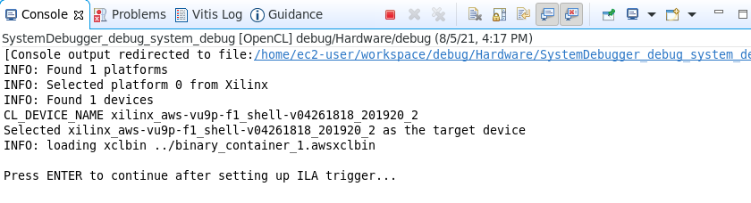

### Set up the Xilinx Virtual Cable (XVC)

The Xilinx Virtual Cable (XVC) is a virtual device that gives you JTAG debug capabilities over PCIe to the target device. XVC will be used to debug the design.


#### XVC for AWS
Open a new terminal window and run the following script which will manage setup of the XVC:

```sh
sudo fpga-start-virtual-jtag -P 10200 -S 0
```
The output should look like:

```
Starting Virtual JTAG XVC Server for FPGA slot id 0, listening to TCP port 10200.
Press CTRL-C to stop the service.
```

Skip the next section and continue with [Connecting Vivado to the XVC](#connecting-vivado-to-xvc)

#### XVC for Alveo U200

For an Alveo board, you need to determine the XVC device in your system. XVC is installed as part of the Vitis and XRT installation.

```sh
ls /dev/xfpga/xvc_pub*
```

This will report something similar to the output below:

```sh
/dev/xfpga/xvc_pub.u513
```

Each computer may have a different value for *xvc_pub.\** so you will need to check the name for your computer.

* In a terminal window, start a virtual jtag connection

    Run the following command (where *u513* should be the value your obtained from the previous command):

   ```sh
   debug_hw --xvc_pcie /dev/xfpga/xvc_pub.u513 --hw_server
   ```

   The Virtual JTAG XVC Server will start listening to TCP port **10200** in this case. This is the port you will need to [connect to from Vivado   (#connecting-vivado-to-xvc). Note the *hw_server* is listening to TCP port 3121. See example output below

   ```sh
   launching xvc_pcie...
   xvc_pcie -d /dev/xfpga/xvc_pub.u513 -s TCP::10200
   launching hw_server...
   hw_server -sTCP::3121

   ****************************
   *** Press Ctrl-C to exit ***
   ****************************
   ```

### Connecting Vivado to XVC

1. Start Vivado from another terminal

   ```sh
   vivado
   ```

1. Click on **Open Hardware Manager >**
1. Click **Open target > Auto Connect**

    

1. Right click on *localhost (0)* and select **Add Xilinx Virtual Cable (XVC)...**

    

1. Enter **localhost** as the *host name*, and **10200** as the port (or the *port number* for your machine obtained previously) and click **OK**

    

1. Right click on the *debug_bridge* and select **Refresh Device**.

    The Vivado Hardware Manager should update showing _Hardware_, _Waveform_, _Settings-hw_, _Trigger-Setup_ windows. The _Hardware_ window also shows the detected ILA cores (*hw_ila_\**), inserted in the design. The Alveo design will have one ILA, whereas, the AWS design will have two ILAs, one monitoring the AWS shell interface (*hw_ila_2*) and other the *KVAdd* kernel (*hw_ila_1*)

    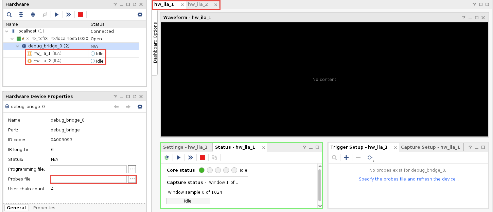

1. Select the *debug_bridge* in the Hardware panel
1. In the *Hardware Device Properties* view, click on the browse button (...) beside **Probes file**
1. Browse to the project's **~/workspace/debug\_system\_hw\_link/Hardware** folder, select the **binary\_container\_1.ltx** file and click **OK**  
1. Select the *hw_ila_1* tab, and notice four (Slot_0 to Slot_3) probes are filled in the Waveform window
1. Click on the **Run Trigger immediate** button and observe the waveform window is fills with data showing that the four channels were _Inactive_ for the duration of the signal capture

    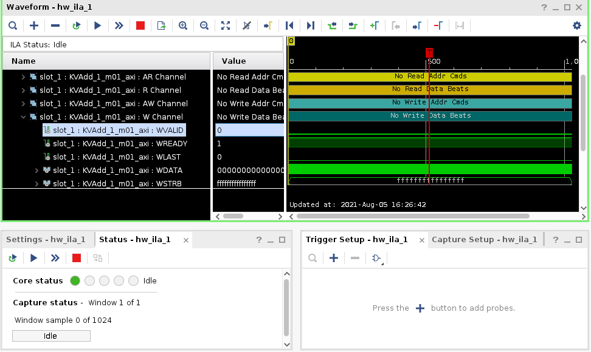

1. Expand **slot\_1 : KVAdd\_1\_m01\_axi : Interface** , then find and expand  **slot\_1 : KVAdd\_1\_m01\_axi : W Channel** in the Waveform window
1. Select the **WVALID** signal and drag it to the Trigger Setup - hw window

    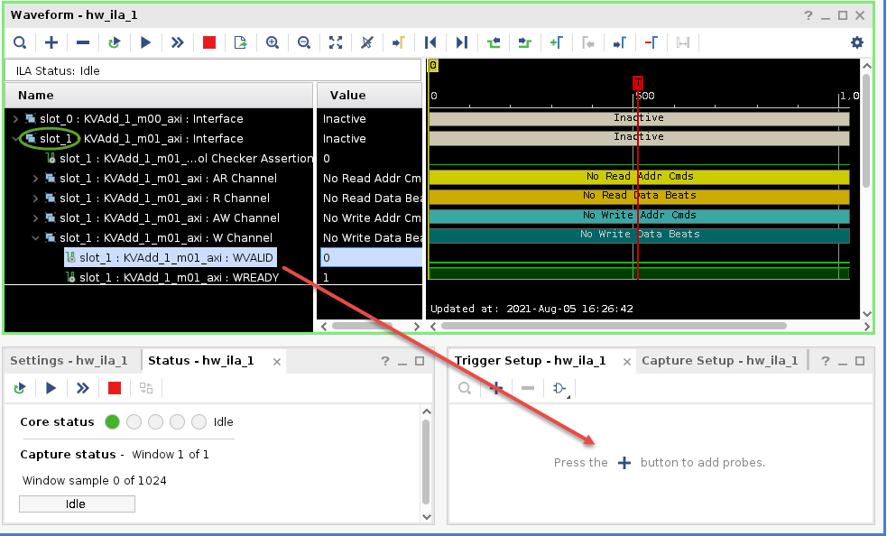

1. Click on drop-down button of the Value field and select trigger condition value as **1**

    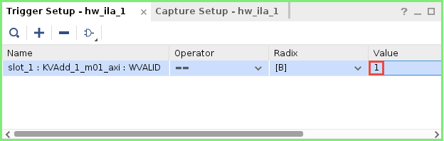

1. Click on the *Run trigger* button  and observe the _hw_ila_1_ probe is waiting for the trigger condition to occur

    

1. Switch to the Vitis GUI, and select *Console* view and press the **Enter key** to allow the program to continue executing

    Observe that the program completes displaying **INFO: Test completed successfully** in the Console window

1. Switch back to Vivado and notice that because the trigger condition was met, the waveform window has been populated with new captured data

    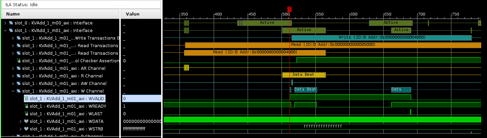

1. Expand **Slot_0, slot_1,** and **slot_2** groups, zoom in to the region around samples *450 to 1000*, and observe the data transfers taking place on each channels. Also note the addresses from where data are read and where the results are written to

    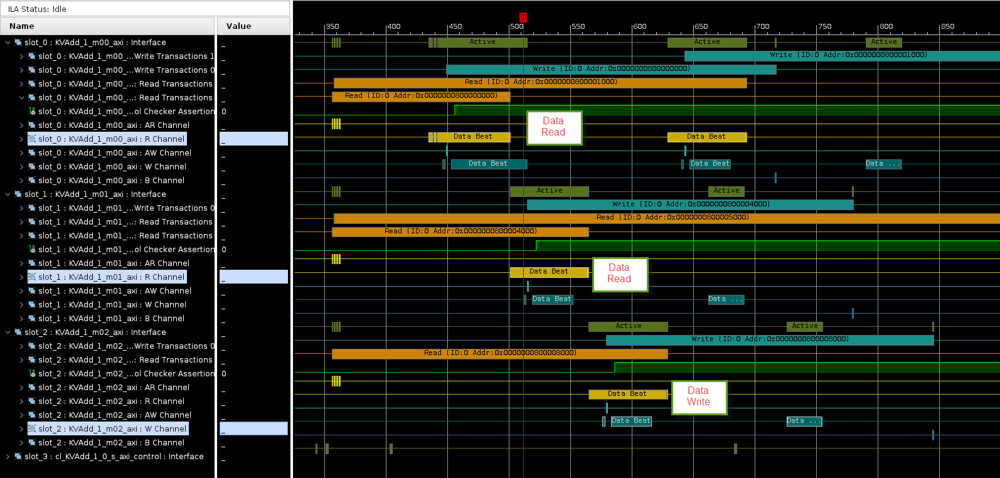

1. Zoom in on one of the transactions and hover your mouse at each successive sample and notice the data content changing
1. When you are finished, close Vivado Manager by selecting **File > Exit**
1. Close the jtag probe by switching to its terminal window and pressing *Ctrl-C*

### Perform Software Debugging

1. Switch to the Vitis GUI

1. From *Explorer* view, Open `debug_system > debug > src > host_example.cpp` 

1. Comment out lines 248-249 and save the file

1. In *Assistant* view, select on `debug_system > debug` and build the application since we changed it

1. In *Assistant* view, right click on **debug\_system** and select **Debug > Debug Configurations...**

1. Make sure that the **Program Arguments** is set to **../binary\_container\_1.awsxclbin**

1. Click **Apply**, if needed, and then click **Debug**

1. Click **Yes**, if prompted to switch to the *Debug perspective*

    The bitstream will be downloaded to the FPGA and the host application will start executing, halting at **main()** entry point

1. In *host_example.cpp* view scroll down to line ~278 and double-click on the left border to set a breakpoint.  At this point, three buffers would have been created

    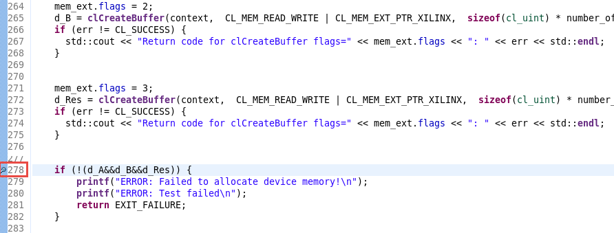

1. Click on the **Resume** button or press **F8**

    The program will resume executing and stop when it reaches the breakpoint.
    At this point you can click on the various monitoring tabs (*Variables, Command Queue, Memory Buffers* etc.) and see the contents currently in scope. If you don't see them, then select **Windows > Show view...** and then select the missing views

    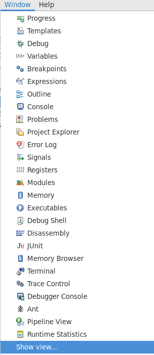

    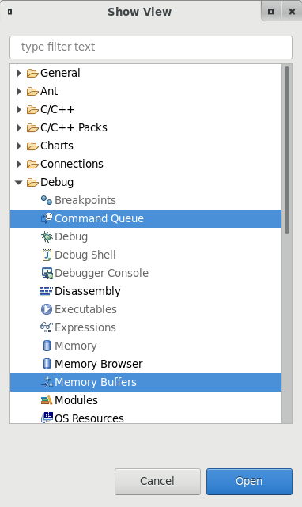

    Vitis debug allows command queues and memory buffers to be examined as the program execution progresses

1. Set a breakpoint at line 343 and press **F8** or **Resume** button

    The execution will progress and stop at line 343 

1. Select the **Memory Buffers** tab

    Notice that three buffers are allocated, their IDs, DDR memory address, and sizes are shown. The *Mem* member may be different in your execution, but *Device Memory Address* member should be identical for each of the three buffers

    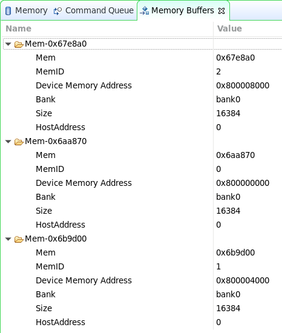

1. Select the **Command Queue** tab and notice that there no commands enqueued.

    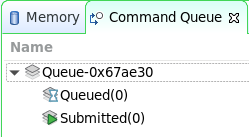

    Lines ~346-350 creates commands to read the data and results

   ```C
   err |= clEnqueueReadBuffer( ... );
   ```

1. Set a breakpoint on line 348 and press **F8** or **Resume** button to execute to the first `clEnqueueReadBuffer()` to create a read buffer command for reading operand *d_A*

    Notice the Command Queue tab shows one command submitted

    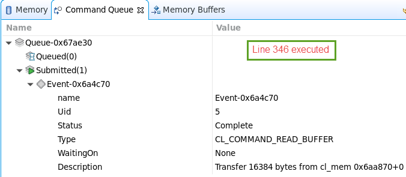

1. Press **F6** to execute the next `clEnqueueReadBuffer()` for *d_B*

    Notice the Command Queue tab shows two commands submitted

    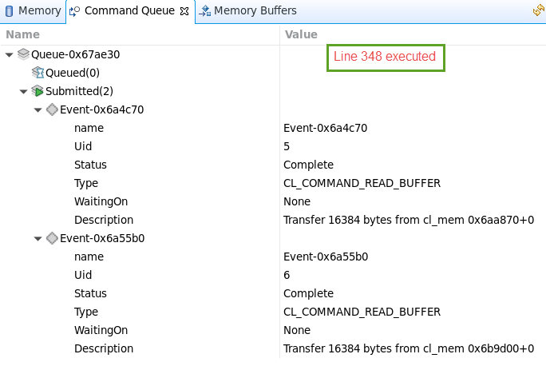

1. Set a breakpoint at line ~404 (`clReleaseKernel()`) and press **F8** to resume the execution  

    Notice that the Command Queue tab still shows entries

1. Press **F6** to execute `clReleaseKernel()`

    Notice the Memory Buffers tab is empty as all memories are released. Note: Since there is a bug in the IDE, this step may or may not work properly. Click the disconnect button if it fails and skip next step

1. Click **F8** to complete the execution

1. To change perspective, click on *Design* in the top right corner of Vitis GUI

## Conclusion

In this lab, you used the ChipScope Debug bridge and cores to perform hardware debugging. You also performed software debugging using the Vitis GUI.

---------------------------------------

## Appendix-I

### Steps to Add ChipScope Debug core and build the design

1. Set target to *Active build configuration:* to **Hardware** in *Hardware Kernel Project Settings* view
1. In the *Assistant* view, expand **debug\_system > debug\_system\_hw\_link > Hardware**
1. Select **binary\_container\_1**, right-click and select **Settings...**
1. In the **binary\_container\_1** window, enter the following text  of the **V++ command line options:** to enable ChipScope code insertion
   ```
   -g --debug.chipscope KVAdd_1
   ```

1. Click **OK** and the string will appear as shown in marked 2

    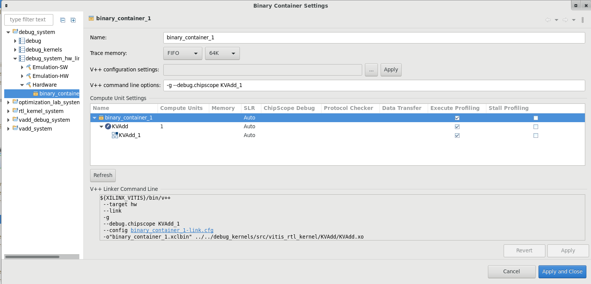

1. Click **Apply and close**
1. In the *Explorer* view, expand **debug\_system > debug > src** and make sure that the host_example.cpp is present. If not then import it from **debug\_system > debug\_kernels > src > vitis\_rtl\_kernel > KVAdd**
1. Double-click on the **host\_example.cpp** from **debug\_system > debug > src** to open it in the editor window
1. Around line 248 (after the *clCreateKernel* section) enter the following lines of code and save the file. This will pause the host software execution after creating kernel but before allocating buffer

   ```C
   printf("\nPress ENTER to continue after setting up ILA trigger...");
   getc(stdin);
   ```
    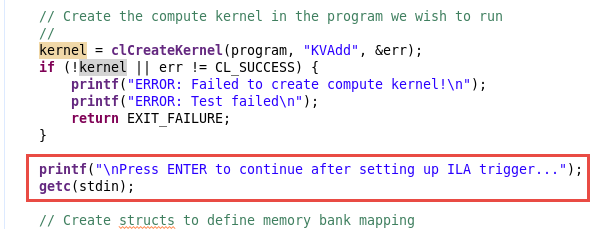

1. Build the design

-------------------------------------------------
<p align="center">Copyright&copy; 2021 Xilinx</p>
