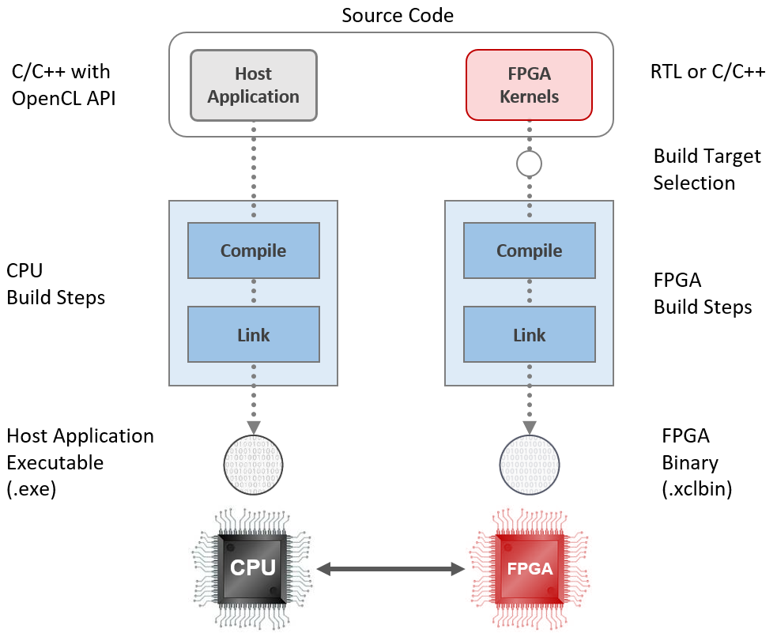

# Presentations

## Vitis

| Title | YouTube Link | PDF Link |
| --- | --- | ---- |
| Xilinx Platforms Introduction | [ Xilinx Platforms Introduction](https://youtu.be/sb9qcgOcTDY) |  |
| Intro to Vitis for Acceleration Platforms | [ Intro to Vitis for Acceleration Platforms](https://youtu.be/t6CvKG0NzcM) |  |
| Vitis Tool Flow | [ Vitis Tool Flow](https://youtu.be/ObfOSltWWEM) |  |
| Open CL Execution Model | [ Open CL Execution Model](https://youtu.be/z1Yk6jctJeY) |  |
| Vitis Design Analysis | [ Vitis Design Analysis](https://youtu.be/N941PGe9q_c) |  |
| Vitis Design Methodology | [ Vitis Design Methodology](https://youtu.be/W-O66ASW_ls) |  |
| Host Code Optimization | [ Host Code Optimization](https://youtu.be/6SqQ-tgMREg) |  |
| Kernel Optimization | [ Kernel Optimization](https://youtu.be/BD7nXF0umpo) |  |
| Vitis Accelerated Libraries | [ Vitis Accelerated Libraries](https://youtu.be/bqttBaih_Ao) |  |
| Vitis hardware debug |   | |
| Vitis RTL kernels Accelerated Libraries  |   |  |

# PYNQ

PYNQ introduction, and short lab companion videos that cover topics that are not addressed in the main presentation. We recommend watching the lab while doing the PYNQ labs.

| Title | YouTube Link |
| --- | --- |
| PYNQ for Compute Acceleration | [ PYNQ for Compute Acceleration](https://youtu.be/WgA_FgO_rAo) |
| Lab: Using Multiple Devices | [ Lab: Using Multiple Devices](https://youtu.be/tk2XDW-Hpco)|
| Lab: Hardware Emulation | [ Lab: Hardware Emulation](https://youtu.be/ylVEo0d83iM)|
| Lab: Packaging Your Designs | [ Lab: Packaging Your Designs](https://youtu.be/S2oSliWHpsA)|

## Overview of the Vitis flow

1. Vitis is the development environment used to create host applications and hardware accelerators. It includes host CPU and FPGA compilers as well as profiling and debugging tools
2. In Vitis, the host application can be written in C or C++ and uses the OpenCL API or the [XRT](https://github.com/Xilinx/XRT) (Xilinx Runtime Library) to interact with the accelerated hardware functions running on the FPGA. The accelerated hardware functions (also referred to as 'hardware kernels', or just 'kernels') can be written in C, C++, OpenCL or RTL

---------------------------------------

Copyright&copy; 2021 Xilinx
