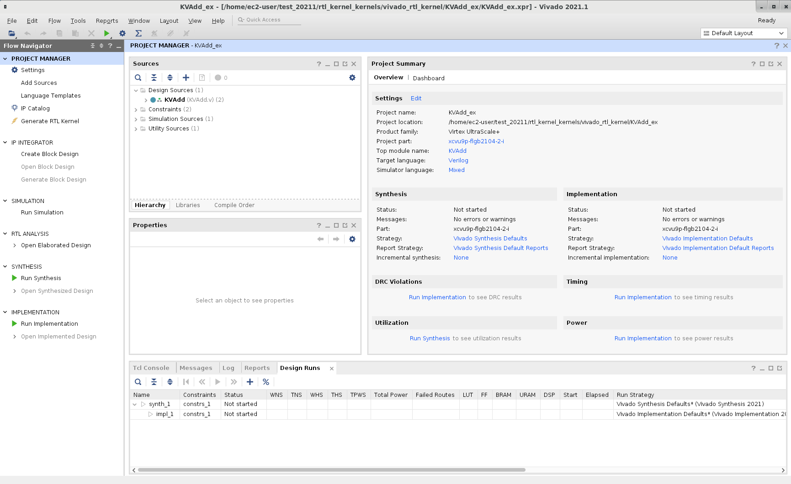
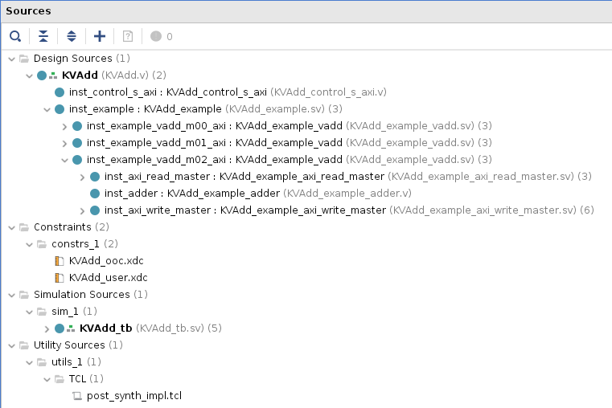
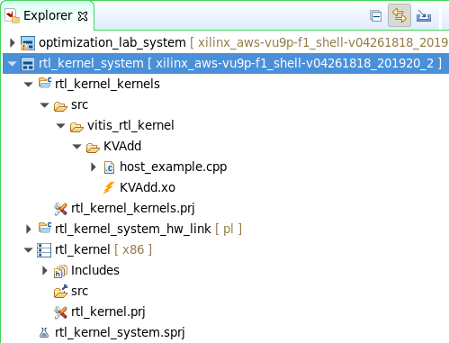
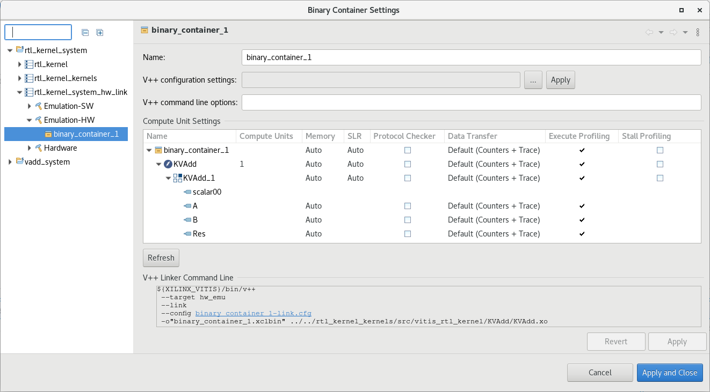
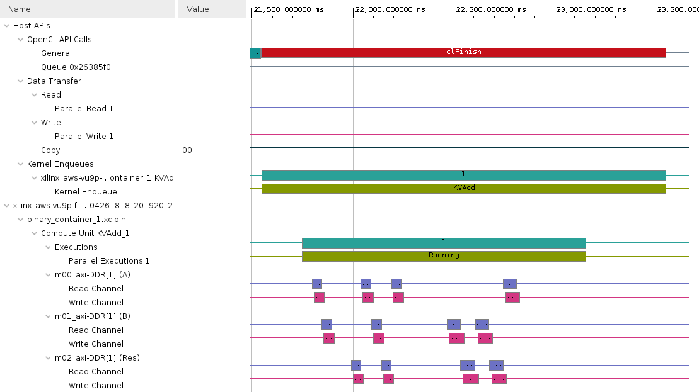
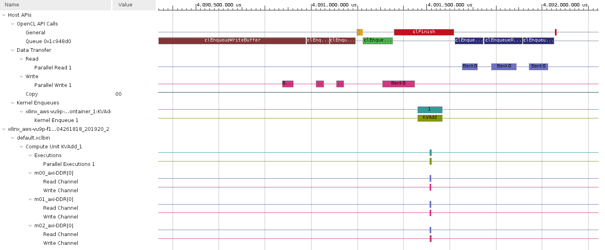
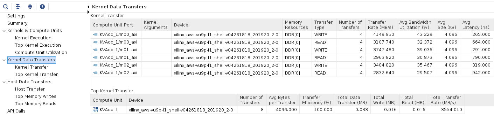
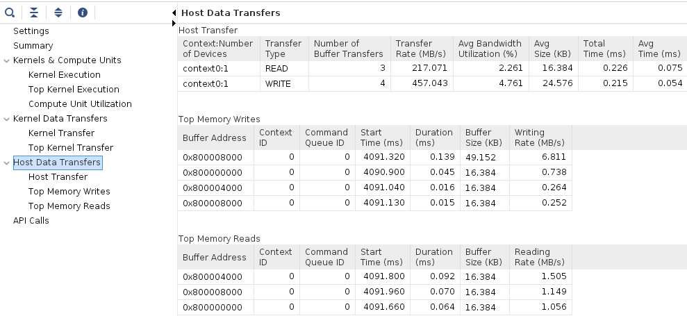

# Using the RTL Kernel Wizard

## Introduction

This lab guides you through the steps involved in using the Vitis RTL Kernel wizard. This allows RTL code to be used in a Vitis design. To do so, it uses a vector addition kernel written in Verilog.

## Objectives

After completing this lab, you will be able to:

- Understand how to use the RTL Kernel wizard available in Vitis
- Create a new RTL based IP
- Add the new IP to an application
- Verify the functionality of the design in hardware

## Steps

### Create a Vitis Project

1. Start Vitis and select the default workspace (or continue with the workspace from the previous lab)

1. Create a new application project

     Use `Create Application Project` from Welcome page, or use `File > New > Application Project` to create a new application

1. Select your target platform and click **Next >**

    If you don't see your target platform, then click on '+' button, browse to directory where platform is located and click **OK**

1. In the *Application Project Details* page enter **rtl\_kernel** in the *Application Project name:* field and click **Next >**

1. Select **Empty Application** and click **Finish**

### Create RTL\_Kernel Project using RTL Kernel Wizard      

1. Make sure the **rtl\_kernel.prj** under **rtl\_kernel\_system > _rtl\_kernel_** in the *Explorer* view is selected

1. In the menu bar on top click **Xilinx > Launch RTL Kernel Wizard > rtl\_kernel\_kernels**

    Wizard will be opened showing welcome package

    

1. In the Welcome page click **Next >**

1. Change `Kernel` name to **KVAdd**, (for Kernel Vector Addition), `Kernel vendor` to **xilinx.com** leaving the `Kernel library`, `Kernel type`, `Kernel control interface`, `Number of clocks` and `Has reset` to the default values. Then click **Next >**

    

1. Leave `Number of scalar kernel input arguments` set to the default value of **1**, `Argument Name` set to the default value of **scalar00** and the `Argument type` as **uint**, and click **Next >**

    

1. We will have three arguments to the kernel (2 inputs and 1 output) which will be passed through Global Memory. Set `Number of AXI master interfaces` to be **3**

    Keep the width of each AXI master data width to **64** (note this is specified in bytes so this will give a width of 512 bits for each interface). Update the arguments name: **A** for *m00\_axi*, **B** for *m01\_axi*, and **Res** for *m02\_axi*

    

1. Click **Next >** and *Stream Interface* page will be displayed. Notice: this example does not use AXI4-Stream interfaces. Therefore, make sure that `Number of AXI4-Stream interfaces` is set to 0

    

1. Click **Next >** and the the *Summary* page will be displayed showing a function prototype and register map for the kernel.  

    Note the control register and the scalar operand are accessed via the S\_AXI\_CONTROL interface. The control register is at offset 0x0 and the scalar operand is at offset 0x10

    

1. Click **OK** to close the wizard  

    Notice that a Vivado Project will be created and opened after few seconds

	

### Analyze the design created by the RTL Kernel wizard

1. Expand the hierarchy of the *Design Sources* in the Sources window and notice all the design sources, constraint file, and the basic testbench generated by the wizard

    

    There is one module to handle the control signals (ap\_start, ap\_done, and ap\_idle) and three master AXI channels to read source operands from, and write the result to DDR. The expanded m02\_axi module shows *read*, *adder*, *write* instances

1. Expand **Flow Navigator > RTL ANALYSIS > Open Elaborated Design** and click on **Schematic**. Then, click **OK**

    

1. You should see two top-level blocks: example and control as seen below

    

    Notice the AXI Master interfaces are 64 bytes (or 512 bits) wide as specified earlier

1. Double-click on the example block and observe the three hierarchical Master AXI blocks

    

1. Zoom in into the top section and see the control logic, the wizard has generated the ap\_start, ap\_idle, and ap\_done control signals

    

1. Traverse through one of the AXI interface blocks (e.g. m02) and observe that the design consists of a Read Master, Write Master, and an Adder. (Click on the image to download an enlarged version if necessary)

    

1. Close the elaborated view by selecting **File > Close Elaborated Design**

1. Click **OK**

### Generate the RTL Kernel

1. Select **Flow > Generate RTL Kernel...** or click **Generate RTL Kernel** in the left-hand side pane

1. Click **OK** using the default option (**Sources-only kernel**)  

    The packager will be run, generating the xo file which will be used in the design

1. Click **OK**, then **Yes** to exit Vivado

1. Click **OK** on the message box indicating that the *RTL Kernel has been imported* and return to Vitis

### Analyze the RTL kernel added to the Vitis project

1. Expand the *src* folder under the **rtl\_kernel\_system > rtl\_kernel\_kernels**

    Notice that the *vitis\_rtl\_kernel* folder  has been added to the project. Expanding this folder (*KVAdd*) shows the kernel (.xo) and a C++ file which have been automatically included

    

1. Double-click on the **host_example.cpp** to open it   
  * The *main* function is defined around line 67. The number of words it transfers is 4,096
  * Notice around line 96 the source operands and expected results are initialized
  * Around line 214 (from the `clCreateProgramWithBinary()` function) shows the loading of the xclbin and creating the OpenCL kernel (`clCreateKernel()`)
  * The following lines (~255) show how the buffers are created in the device memory and enqueued (`clCreateBuffer()`, `clEnqueueWriteBuffer()`)
  * Around lines 310, the arguments to the kernel are set (`clSetKernelArg()`), and the kernel is enqueued to be executed (`clEnqueueTask()`)
  * Around line 343 results are read back (`clEnqueueReadBuffer()`) and compared to the expected results.
  * The *Shutdown and cleanup section* shows releasing of the memory, program, and kernel

1. If you are using a platform that is not AWS F1, make the following changes in the *host\_example.cpp* code

   - Replace line 84 `char target_device_name[1001] = TARGET_DEVICE;` with the following

     ```C
     char target_device_name[1001] = TARGET_DEVICE; target_device_name[23] = '\0';
     ```

   - Replace line 163  `if(strcmp(cl_device_name, target_device_name) == 0) {` with the following

     ```C
     if(strstr(cl_device_name, target_device_name) != NULL){
     ```

### Define a hardware kernel, and build the project

1. Import the *host\_example.cpp* file from **rtl\_kernel\_system > rtl\_kernel\_kernels > src > vitis\_rtl\_kernel > KVAdd** into the **rtl\_kernel\_system > rtl\_kernel > src** folder

    This is necessary as the host compiler expects the application source(s) in this folder

1. Select **rtl\_kernel\_kernels.prj** in the *Explorer* view to see the project settings page

1. Click on the **Add Hardware Function button** () and select *KVAdd*

1. Select **Emulation-HW** on the drop-down button of *Active build configuration:*

    

1. In the Assistant View, expand *rtl\_kernel\_system > rtl\_kernel\_system\_hw\_link > Emulation-HW > binary\_container\_1* and right-click KVAdd [RTL KO] and select Refresh

    

1. In the *Assistant* view right click on *rtl\_kernel\_system > rtl\_kernel\_system\_hw\_link > Emulation-HW > binary\_container\_1* and select *Settings...*

    Make sure the binary\_container\_1 is configured as shown in the image below

    

1. Select `rtl_kernel_system` in the *Assistant* view and build the project by clicking on the () button  

    This will build the project including *rtl\_kernel* executable file under the Emulation-HW directory. It may take about 10 minutes to build

1. Select *rtl\_kernel\_system* in the *Assistant* view and select  **Run > Run Configurations…** to open the configurations window

1. Make sure to check the **OpenCL trace** option of the *Host trace* by clicking the **Edit...** button of the *Xilinx Runtime Profiling*

    

1. Click **Apply**, and then click **Run** to run the application

1. The Console tab shows that the test was completed successfully along with the data transfer rate

   Note that three memory controllers are used, all of which targeting to the same DDR

   ```
   INFO: Found 1 platforms
   INFO: Selected platform 0 from Xilinx
   INFO: Found 1 devices
   CL_DEVICE_NAME xilinx_aws-vu9p-f1_shell-v04261818_201920_2
   Selected xilinx_aws-vu9p-f1_shell-v04261818_201920_2 as the target device
   INFO: loading xclbin ../binary_container_1.xclbin
   INFO: [HW-EM 01] Hardware emulation runs simulation underneath....
   INFO: Test completed successfully.
   INFO::[ Vitis-EM 22 ] [Time elapsed: 0 minute(s) 30 seconds, Emulation time: 0.151515 ms]
   Data transfer between kernel(s) and global memory(s)
   KVAdd_1:m00_axi-DDR[1]          RD = 16.000 KB              WR = 16.000 KB
   KVAdd_1:m01_axi-DDR[1]          RD = 16.000 KB              WR = 16.000 KB
   KVAdd_1:m02_axi-DDR[1]          RD = 16.000 KB              WR = 16.000 KB
   ```

1. In the *Assistant* view, expand **rtl\_kernel\_system > rtl\_kernel > Emulation-HW > SystemDebugger\_rtl\_kernel\_system\_rtl\_kernel**, and double-click on **Run Summary (xclbin)**

1. The *Vitis Analyzer* window will open. Click on **Timeline Trace** entry, expand all entries in the timeline graph, zoom appropriately and observe the transactions

	


### Build system hardware with profiling and timing analysis options if are continuing with the lab OTHERWISE skip to [Prebuilt](#run-the-system-in-hardware)

1. Set `Active build configuration:` to `Hardware` on the upper right corner of *Application Project Settings* view

    In order to collect the profiling data and run Timing Analyzer on the application run in hardware, we need to setup some options.

1. Select `rtl_kernel_system > rtl_kernel_system_hw_link > Hardware > binary_container_1` in *Assistant* view and then click on *Settings*. Notice that the settings from the *Emulation-HW* run have propagated to the *Hardware* configuration.

1. Select *Trace Memory* to be FIFO type and size of 64K

1. Click **Apply and Close**

1. Build the project by selecting **rtl\_kernel\_system** in `Assistant` view and clicking the build button 

1. A `binary_container_1.xclbin` and `optimization_lab` application will be generated in the `rtl_kernel/Hardware` directory

1. Register the generated xclbin file to generate binary\_container\_1.awsxclbin by running the shell script. Follow instructions available [here](Creating_AFI_AWSEducate.md)

### Run the system in hardware

1. If you have built the hardware yourself then copy the necessary files using the following commands:

   ```sh
   cp binary_container_1.awsxclbin ~/workspace/rtl_kernel/Hardware 
   cp ~/xup_compute_acceleration/sources/xrt.ini ~/workspace/rtl_kernel/Hardware/.
   ```

1. If you have not built the hardware yourself then copy the provided prebuilt solution files using the following commands:

   ```sh
   mkdir ~/workspace/rtl_kernel/Hardware
   mkdir ~/workspace/rtl_kernel_system/Hardware
   cp ~/xup_compute_acceleration/solutions/rtlkernel_lab/* ~/workspace/rtl_kernel/Hardware/
   cp ~/xup_compute_acceleration/solutions/rtlkernel_lab/binary_container_1.awsxclbin ~/workspace/rtl_kernel_system/Hardware/binary_container_1.xclbin
   chmod +x ~/workspace/rtl_kernel/Hardware/rtl_kernel
   ```

1. Execute precompiled hardware solution

   ```sh
   cd ~/workspace/rtl_kernel/Hardware/
   ./rtl_kernel binary_container_1.awsxclbin
   ```

   The FPGA bitstream will be downloaded and the host application will be executed showing output similar to:

   ```
   INFO: Found 1 platforms
   INFO: Selected platform 0 from Xilinx
   INFO: Found 1 devices
   CL_DEVICE_NAME xilinx_aws-vu9p-f1_shell-v04261818_201920_2
   Selected xilinx_aws-vu9p-f1_shell-v04261818_201920_2 as the target device
   INFO: loading xclbin binary_container_1.awsxclbin
   INFO: Test completed successfully.
   ```

### Analyze hardware application timeline and profile summary

1. Execute the following command to open Vitis Analyzer and click *Application Timeline*

   ```sh
   vitis_analyzer xclbin.run_summary
   ```

1. Zoom in into the tail end of the execution and see various activities

    

1. Now click on *Profile Summary*

    - Kernels & Compute Units

    

    - Kernel Data Transfers

    

    - Host Data Transfer

    

1. When finished, close the analyzer by clicking `File > Exit` and clicking **OK**

## Conclusion

In this lab, you used the RTL Kernel wizard to create an example RTL adder kernel. You configured the template and saw the example code that was automatically generated. You performed HW emulation and analyzed the application timeline.

---------------------------------------
<p align="center">Copyright&copy; 2021 Xilinx</p>
