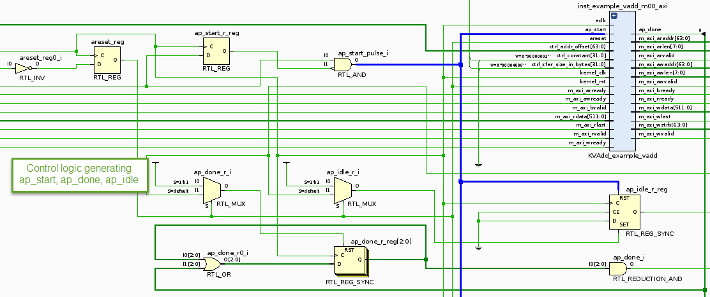
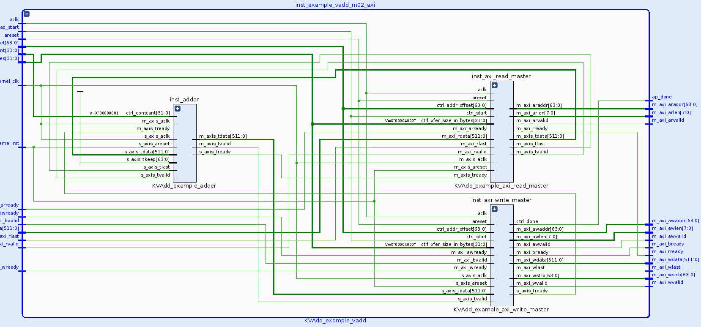
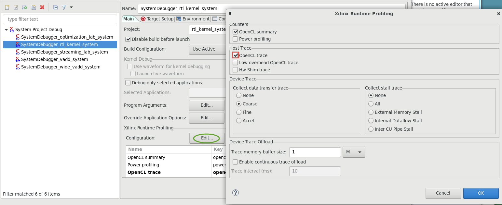
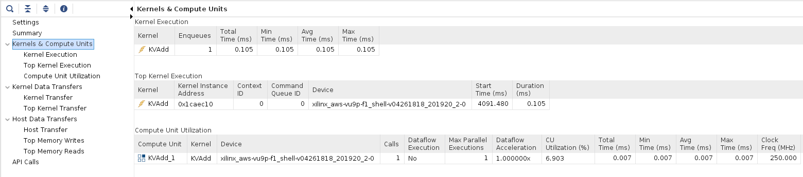

# Using the RTL Kernel Wizard

## Introduction

This lab guides you through the steps involved in using the Vitis RTL Kernel wizard. This allows RTL code to be used in a Vitis design. To do so, it uses a vector addition kernel written in Verilog.

## Objectives

After completing this lab, you will be able to:

- Understand how to use the RTL Kernel wizard available in Vitis
- Create a new RTL based IP
- Add the new IP to an application
- Verify the functionality of the design in hardware

## Steps

### Create a Vitis Project

1. Start Vitis and select the default workspace (or continue with the workspace from the previous lab)

1. Create a new application project

     Use `Create Application Project` from Welcome page, or use `File > New > Application Project` to create a new application

1. In the *New Project's* page enter **rtl\_kernel** in the *Project name:* field and click **Next >**

1. Select your target platform and click **Next >**

    If you don't see your target platform, then click on '+' button, browse to directory where platform is located and click **OK**

1. Select **Empty Application** and click **Finish**

### Create RTL\_Kernel Project using RTL Kernel Wizard      

1. Make sure the **rtl\_kernel.prj** under _rtl\_kernel\_example_ in the *Explorer* view is selected

1. Select **Xilinx > RTL Kernel Wizard…**  

    

1. In the Welcome page click **Next >**

1. Change `Kernel` name to **KVAdd**, (for Kernel Vector Addition), `Kernel vendor` to **xilinx.com** leaving the `Kernel library`, `Kernel type`, `Kernel control interface`, `Number of clocks` and `Has reset` to the default values. Then click **Next >**

    

1. Leave `Number of scalar kernel input arguments` set to the default value of **1**, `Argument Name` set to the default value of **scalar00** and the `Argument type` as **uint**, and click **Next >**

    

1. We will have three arguments to the kernel (2 inputs and 1 output) which will be passed through Global Memory. Set `Number of AXI master interfaces` to be **3**

    Keep the width of each AXI master data width to **64** (note this is specified in bytes so this will give a width of 512 bits for each interface), name **A** as the argument name for *m00\_axi*, **B** for *m01\_axi*, and **Res** for *m02\_axi*

    

1. Click **Next >** and Stream Interface page will be displayed. Notice: this example does not use AXI4-Stream interfaces. Therefore, make sure that `Number of AXI4-Stream interfaces` is set to 0

    

1. Click **Next >** and the the summary page will be displayed showing a function prototype and register map for the kernel.  

    Note the control register and the scalar operand are accessed via the S\_AXI\_CONTROL interface. The control register is at offset 0x0 and the scalar operand is at offset 0x10

    

1. Click **OK** to close the wizard  

    Notice that a Vivado Project will be created and opened after few seconds

	

### Analyze the design created by the RTL Kernel wizard

1. Expand the hierarchy of the *Design Sources* in the Sources window and notice all the design sources, constraint file, and the basic testbench generated by the wizard

    

    There is one module to handle the control signals (ap_start, ap_done, and ap_idle) and three master AXI channels to read source operands from, and write the result to DDR. The expanded m02_axi module shows *read*, *adder*, *write* instances

1. Expand **Flow Navigator > RTL ANALYSIS > Open Elaborated Design** and click on **Schematic**. Then, click **OK**

    

1. You should see two top-level blocks: example and control as seen below

    

    Notice the AXI Master interfaces are 64 bytes (or 512 bits) wide as specified earlier

1. Double-click on the example block and observe the three hierarchical Master AXI blocks

    

1. Zoom in into the top section and see the control logic, the wizard has generated the ap_start, ap_idle, and ap_done control signals

    

1. Traverse through one of the AXI interface blocks (e.g. m02) and observe that the design consists of a Read Master, Write Master, and an Adder. (Click on the image to download an enlarged version if necessary)

    

1. Close the elaborated view by selecting **File > Close Elaborated Design**

1. Click **OK**

### Generate the RTL Kernel

1. Select **Flow > Generate RTL Kernel...** or click **Generate RTL Kernel** in the left-hand side pane

1. Click **OK** using the default option (**Sources-only kernel**)  

    The packager will be run, generating the xo file which will be used in the design

1. Click **OK**, then **Yes** to exit Vivado

1. Click **OK** on the message box indicating that the *RTL Kernel has been imported* and return to Vitis

### Analyze the RTL kernel added to the Vitis project

1. Expand the *src* folder under the **rtl\_kernel**  

    Notice that the *vitis\_rtl\_kernel* folder  has been added to the project. Expanding this folder (*KVAdd*) shows the kernel (.xo) and a C++ file which have been automatically included

    

1. Double-click on the **host_example.cpp** to open it   
  * The *main* function is defined around line 62. The number of words it transfers is 4,096
  * Notice around line 96 the source operands and expected results are initialized
  * Around line 209 (from the `clCreateProgramWithBinary()` function) shows the loading of the xclbin and creating the OpenCL kernel (`clCreateKernel()`)
  * The following lines (~250) show how the buffers are created in the device memory and enqueued (`clCreateBuffer()`, `clEnqueueWriteBuffer()`)
  * Around lines 305, the arguments to the kernel are set (`clSetKernelArg()`), and the kernel is enqueued to be executed (`clEnqueueTask()`)
  * Around line 338 results are read back (`clEnqueueReadBuffer()`) and compared to the expected results.
  * The *Shutdown and cleanup section* shows releasing of the memory, program, and kernel

### Define a hardware kernel, and build the project

1. Select **rtl_kernel.prj** in the *Explorer* view to see the project settings page

1. Click on the **Add Hardware Function button** () and select *KVAdd*

1. Select **Emulation-HW** on the drop-down button of *Active build configuration:*

    

1. Build the project by clicking on the () button  

    This will build the project including *rtl\_kernel* executable file under the Emulation-HW directory. It may take about 10 minutes to build

1. Select **Run > Run Configurations…** to open the configurations window

1. Click on the **Arguments** tab, and then select **Automatically add binary container(s) to arguments**

    

1. Click **Apply**, and then click **Run** to run the application

1. The Console tab shows that the test was completed successfully along with the data transfer rate

    Note that three memory controllers are used, all of which targeting to the same DDR

    

1. In the *Assistant* view, expand **Emulation-HW > rtl\_kernel\_example-Default**, and double-click on **Run Summary (xclbin)**

1. The *Vitis Analyzer* window will open. Click on **xlcbin (Hardware Emulation) > Application Timeline** entry, expand all entries in the timeline graph, zoom appropriately and observe the transactions

	

###  Run the Application in hardware

Since building the FPGA hardware takes some time, a precompiled solution is provided.

**Note:** There is a mismatch between the TARGET_DEVICE named in shell and what wizard based host code is expecting. So before generating the bitstream it is necessary to add one line in the host code and re-compile host application by clicking **Project > Build Project**. Add the following code after line 37 in `host_example.cpp`

```C
#define TARGET_DEVICE "xilinx_aws-vu9p-f1_dynamic_5_0"
```


1. Execute precompiled hardware solution

    ```sh
    cd ~/xup_compute_acceleration/solutions/rtlkernel_lab
    chmod +x rtl_kernel
    ./rtl_kernel binary_container_1.awsxclbin
    ```

    The FPGA bitstream will be downloaded and the host application will be executed showing output similar to:

    

### Analyze hardware application timeline and profile summary

1. Execute the following command to see the application timeline

    ```sh
    vitis_analyzer timeline_trace.csv
    ```

1. Zoom in into the tail end of the execution and see various activities

    

1. When finished, close the analyzer by clicking `File > Exit` and clicking **OK**

1. Execute the following command to see the profile summary

    ```sh
    vitis_analyzer profile_summary.csv
    ```

    - Top Operations

    

    - Kernels & Compute Units

    

    - Data Transfers

    

1. When finished, close the analyzer by clicking `File > Exit` and clicking **OK**

## Conclusion

In this lab, you used the RTL Kernel wizard to create an example RTL adder application. You configured the template and saw the example code that was automatically generated. You performed HW emulation and analyzed the application timeline.

---------------------------------------
Copyright&copy; 2020 Xilinx