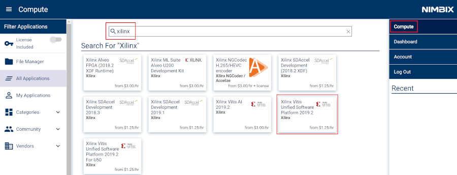
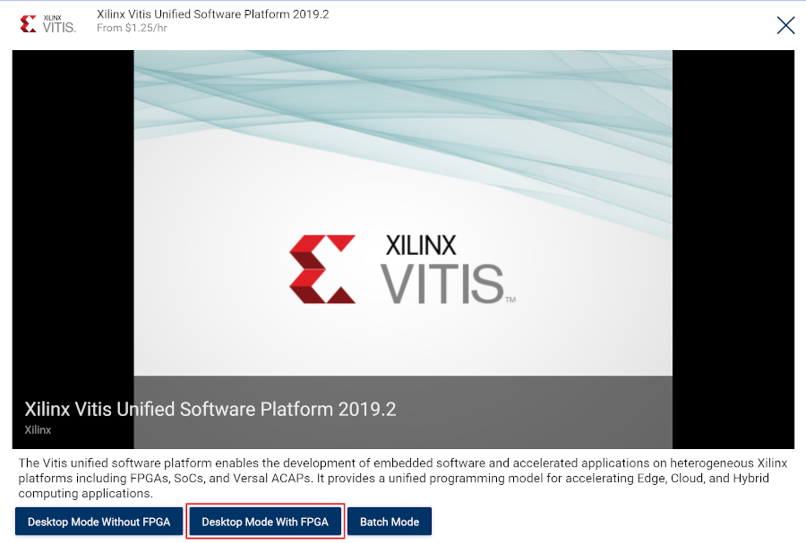
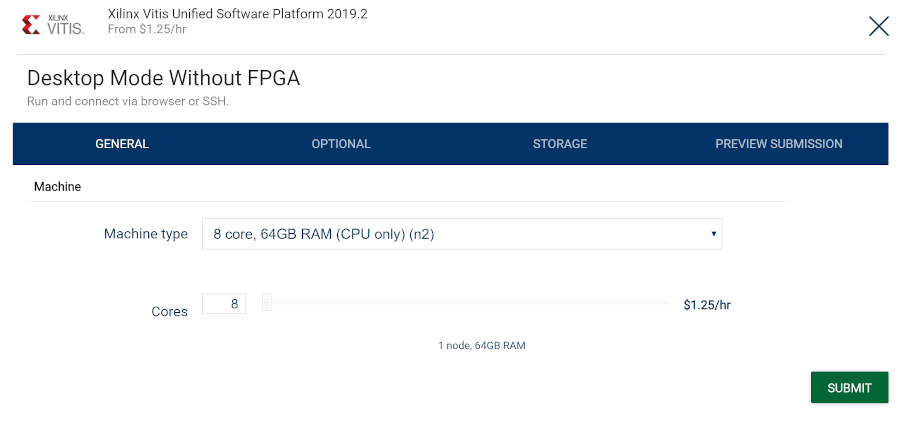
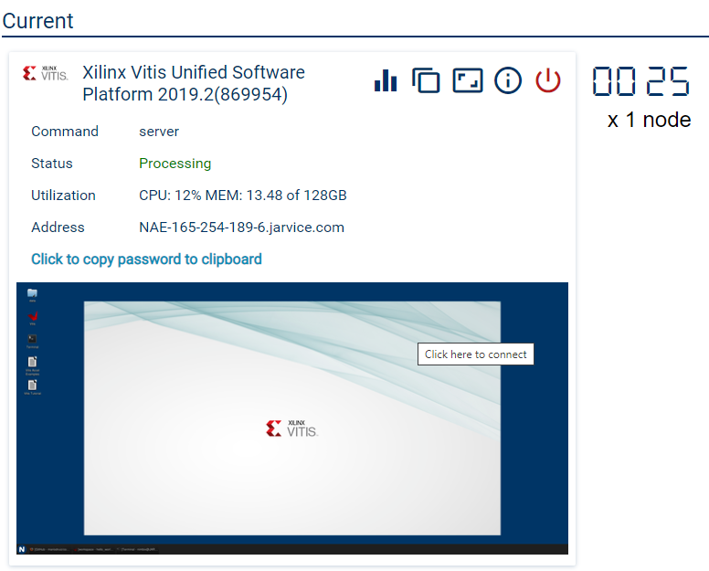
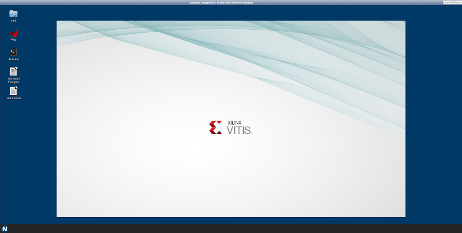

# Connecting to Nimbix

* Log in to Nimbix: [https://platform.jarvice.com/](https://platform.jarvice.com/)

* Click Compute in the top left menu to select a compute instance

* Type Xilinx to filter the list of instances

* Select the *Xilinx Vitis Unified Software Platform 2019.2* instance

* Click on Desktop mode with FPGA

* Select the instance you prefer.

The smallest instance can be used for the labs. For the first part of the labs, you don't need to select an instance with Alveo hardware.

> Note that only  `/data/` folder is persistent storage, everything outside of this folder will be lost after powering-off the instance

When the instance is ready, you will see the option to *Click here to connect*.

* Click on the desktop preview to connect.

A Linux desktop will open in a new tab in your browser.

# Enroll to an Alveo trial

Nimbix provides up to 100 hours of free time on the Nimbix Cloud using Xilinx Tools and Accelerators.

* Request an [Alveo trial](https://www.nimbix.net/alveotrial)

* Fill in the form and make sure you select U200 Alveo board.

* Shortly after you will get an email with a coupon number and instructions to continue the process.

* You will be asked to fill in billing information for non-alveo use.

* After that, you will get another email to complete the registration.

* Finally, you can log in https://platform.jarvice.com/

---------------------------------------
Copyright&copy; 2020 Xilinx