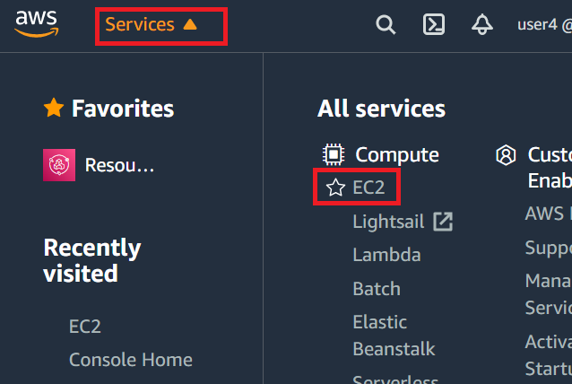

# Instructor-led XUP tutorial: Connecting to AWS

The following instructions are for live, instructor-led XUP tutorials where AWS F1 instances have been set by Xilinx and login details have been provided to attendees. You can check the [XUP workshop schedule](https://www.xilinx.com/support/university/workshops/schedule.html) for upcoming training. Ask your instructor if you do not have your login details. If you are **not** attending a live XUP tutorial, go back to the [Quick Start](README.md) page and follow one of the other options to work through these labs.

## Introduction

This lab will show you how to start, stop, and connect to a preconfigured AWS EC2 F1 instance. 

## Objectives

After completing this lab, you will be able to:

- Connect to an AWS EC2 F1 instance using the provided credentials
- Start the instance
- Connect to the instance using remote desktop 
- Stop the instance
- Run the [pre lab setup](#lab-setup) to configure *AWS-FPGA* and *XRT* for the instance

## Steps
Each registered participant to Xilinx tutorial has been allocated a pre-configured EC2 F1 instance. You should have received an email with the following details:  

- Account ID
- IAM username
- Link to access a pre-configured EC2 F1 instance

### Login into the AWS and starting an F1 instance

1. Follow the link provided by your instructor, or go to [https://console.aws.amazon.com/ec2](https://console.aws.amazon.com/ec2). 

    If you see the login page for *Root user*, click the link to sign in to a different account. 

1. Select **IAM user** and use the account ID provided by your instructor (E.g. `xilinx-aws-f1-developer-labs`) in *Account ID (12 digits) or account alias*. 

    

1. Use the username and password provided by your instructor

1. In the top right corner make sure to select the AWS region specified by your instructor (E.g. N. Virginia).

    

    If the wrong region is selected you will not be able to see your instance.

1. Click on the **Services** in the menu bar at the top of the screen and click on **EC2** to see the available instances.


    
    
    You can also click on the **Instances** link on the left panel
    
    
    
    You may see several instances.

1. Find the instance that matches your username. If you need to check your username, the account you are logged in as is visible in the menu bar at the top of the screen. 

    You can enter your *username* in the *Filter instances* box to filter the list 

    

1. Select your instance (tick the checkbox) and click on **Instance state > Start** 

    

1. Click on the refresh button to check the status of the instance. It will take about a few seconds before the instance is ready. 

    

    Keep refreshing the status until you see the *Instance state* update to **Running**. This means the instance is now ready for you to connect to it.  

    

1. With your instance selected, view the instance *Details* in the bottom part of the page. You can resize the page to make this section easier to view. Find the *Public IPv4 address* and copy it. Notice the copy button that will automatically copy the IP address to your clipboard. 

    This address will be used by to access the remote instance.

    

## Connect to your remote instance

Your instance has been preconfigured to allow you to connect to a remote desktop for your instance using NICE DCV or RDP. 

You can also ssh to AWS instances (E.g. using PuTTY) if you only need a terminal. See [Appendix: ssh using PuTTY](#ssh-using-putty) for details.

### Connect using NICE DCV

NICE DCV is recommended by Amazon for use with AWS instances. This is also the recommended way to connect to your instance for this tutorial.

* Download and install [NICE DCV client](https://download.nice-dcv.com) (Windows|Mac|Linux)

The NICE DCV session has already been started on the pre-configured instance. See the [Appendix](#set-up-the-nice-dcv-session) for details on how to setup a NICE DCV session - for example if you wanted to set up your own AWS instance after this tutorial.

1. Open the NICE DCV application on your computer, enter the *IPv4 Public IP* from the Amazon console and click **Open**

    

1. The first time a certificate warning will be displayed. Click **Trust** to continue

1. When prompted, enter the **Instance ssh\RDP credentials:** username and password provided by your instructor  (E.g. username: **centos**). Note that this is different to the username that you used to log in to AWS. 

    

1. Continue to [Lab setup](#lab-setup)

<!---
### Connect using noVNC

[noVNC](https://github.com/novnc/noVNC) allows you to connect to your instance using a browser. You do not need to install anything.

1. Open a new tab in your Internet browser

1. Browse to `<IPv4 Public IP>:6080/vnc.html`

1. Click Connect

    

1. Enter the provided password

1. To copy from/to the remote instance you need to use the Clipboard option on the left sidebar

1. Continue to [Lab setup](#lab-setup)

    

1. You can scale the resolution by clicking Setting on the left sidebar and changing *Scaling Mode:* to Remote Resizing


Known issues:

  - Remote Resizing does not work
  - Keyboard shortcuts only works in full screen mode
-->
### Connect using RDP

The following instructions are for Windows *Remote Desktop Connection* (pre-installed on Windows 10 and recent versions). For Mac VNC is recommended (see the next section). For Linux you can use *Remmina* or *Vinagre* (search for instructions on how to install this for your OS). Detailed instructions are not provided for Linux. You can follow the steps below and carry out the corresponding actions in your Linux RDP client.  

1. Search for Remote Desktop Connection in the windows start menu, and open it to start a session

1. Enter the *IPv4 Public IP* address for your instance

1. Click on the **Show Options**

    

1. Select the **Display** tab and select *True Color (24 bit)* and click **Connect**

    

1. A certificate warning will be displayed. Click **Yes** to open the RDP session

1. Enter the **RDP credentials** you were provided with and click **OK**

  

1. Continue to [Lab setup](#lab-setup)

Known issues:

  - If the color depth is not set to True Color(24 bit) some programs are not displayed properly


### Connect using VNC (Suggested for Mac users)

1. Install [RealVNC](https://www.realvnc.com/en/connect/download/vnc/macos/) client for Mac

    Other alternatives for Linux-based OS are [Remmina](https://remmina.org/) or [Vinagre](https://wiki.gnome.org/Apps/Vinagre)

1. Open the RealVNC client

1. Enter *IPv4 Public IP*:01 and then hit the enter key

    

1. You will be informed that the connection is Unencrypted, click *Continue*

1. Enter the provided **RDP credentials** password and click **OK**

1. Continue to [Lab setup](#lab-setup)

## Lab setup

1. In your remote desktop session, right click on the desktop and select **Open Terminal** 

1. Copy and paste the following commands to your terminal (make sure to hit enter to run the last command):

   ```sh
   cd ~
   git clone https://github.com/aws/aws-fpga -b v1.4.21
   echo "export PLATFORM_REPO_PATHS=~/aws-fpga/Vitis/aws_platform/xilinx_aws-vu9p-f1_shell-v04261818_201920_2/" >> ~/.bashrc
   echo "source /opt/xilinx/xrt/setup.sh" >> ~/.bashrc
   echo "source $XILINX_VITIS/settings64.sh" >> ~/.bashrc
   git clone https://github.com/Xilinx/xup_compute_acceleration.git
   source ~/.bashrc
   source ~/aws-fpga/vitis_setup.sh
   source ~/aws-fpga/vitis_runtime_setup.sh
   ```

   This will 

   * Clone the *aws-fpga* repository to your home area. `aws-fpga` includes the AWS F1 tools, Hardware Development Kit (HDK) and documentation.

   * Setup the *AWS platform* path, and add XRT and Vitis setup scripts to your .bashrc file. This means they will be available in every new terminal session you open. 

    - Clone this repository to get source code for the labs
    - Source ~/bashrc to refresh this terminal session 
    - Source AWS Vitis setup scripts. This are setup scripts that need to be run once to configure the aws-fpga and Vitis tools. 

You will see a lot of messages in the terminal. The last line should read:

```bash
INFO: Vitis runtime check PASSED
```

You can now proceed to [Lab 1: Introduction to Vitis Part 1](https://xilinx.github.io/xup_compute_acceleration/Vitis_intro-1.html).

If you are using the AWSEducate instances then execute the following to clone the *xup\_compute\_acceleration* repository. No additional variables need to be set as the provided AMI has all necessary files including `aws-fpga` repository cloning, the AWS F1 tools, Hardware Development Kit (HDK) and documentation

```sh
git clone https://github.com/Xilinx/xup_compute_acceleration.git
```

The previous command will:

- Clone this repository to get source code and solutions

  For more details visit: [aws-fpga/Vitis/README.md](https://github.com/aws/aws-fpga/blob/master/Vitis/README.md)

---------------------------------------

## Appendix

### SSH using PuTTY

1. Start **PuTTY** or your preferred SSH client

1. Enter *centos@<IPv4\_Public\_IP>* in the **Host Name** field and **22** in the *Port* field  
    Make sure that SSH is selected as the Connection type

    

1. Click **Open** and then **Yes** when PuTTY Security Alert is shown

    The PuTTY window will open. It will ask for the password (in case of the workshop). Enter the provided password

    

1. Enter **exit** to close the session

### Set up the NICE DCV session

1. Open PuTTY, and ssh to your instance as described on [SSH using PuTTY](#ssh-using-putty)

1. On the terminal, enter the following command to start the DCV server:

   ```sh
   dcv create-session --user centos centos
   ```
   By default NICE DCV runs in the TCP port `8443`

1. Verify dcv session

   If the output of `dcv list-sessions` should look like:

   ```sh
   Session: 'centos' (owner: centos)
   ```


1. Stop the firewall

   ```sh
   sudo systemctl disable firewalld
   sudo systemctl stop firewalld
   ```
---------------------------------------
<p align="center">Copyright&copy; 2021 Xilinx</p>
