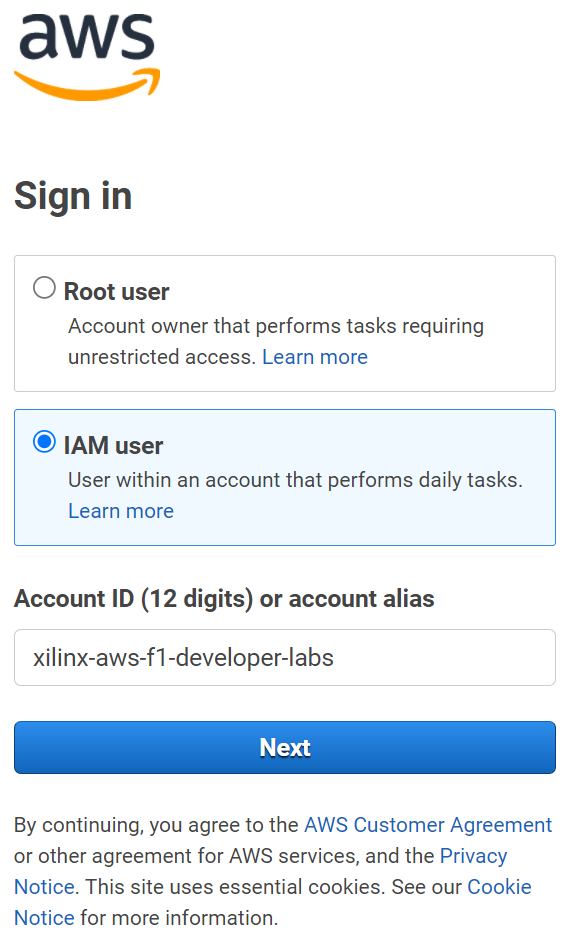

# Connecting to AWS

## Introduction

The following instructions are for attendees for whom an AWS F1 instance has been set by Xilinx, and have been provided with log-in details. If you are not intended to use F1 instance provided by Xilinx, go back to the [Quick Start](README.md) page and follow one of the other options to work through these labs.

This lab will guide you through the steps involved in connecting to a Xilinx provided AWS EC2 F1 instance, and starting and stopping the instance.

## Objectives

After completing this lab, you will be able to:

- Connect to an AWS EC2 F1 instance using the provided credentials
- Start an instance
- Connect to a remote desktop using one of the different options (NICE DCV, noVNC or RDP)
- Stop the instance
- [Pre lab setup](#lab-setup), make AWS-FPGA and XRT available in the instance

## Steps
Each registered participant to Xilinx workshop/webinar has been allocated a pre-configured EC2 F1 instance and should have received an email with the following details:  

- Account ID
- IAM username
- Link to access a pre-configured EC2 F1 instance

### Login into the AWS and starting an F1 instance

1. Follow the link provided by your instructor, or go to [https://console.aws.amazon.com/ec2](https://console.aws.amazon.com/ec2) to open a login page (select **IAM user**). Use `xilinx-aws-f1-developer-labs` in *Account ID (12 digits) or account alias*. If you had used the link, then you should see a login page similar to shown here:

    

1. Use the log in details provided to you

1. On the top right corner, using the drop-down button, make sure to select a region for F1 instances indicated by your instructor

    

    If you select the wrong region you may not see your instance

1. Click on the **EC2** link on the dashboard or if not visible, then click on the _Services_ drop-down button and then click on **EC2**

    
    

1. Click on the **Instances** link on the left panel

    

    You may see several instances

1. Enter your username in the filter field just below the **Launch Instance** and select **Name:**\<username\> button and hit enter

    

1. Make sure that your instance is selected, click on the **Instance state > Start**

    

1. Wait for about 30 seconds and then click on the refresh button to see the updated status to *running*. This status update is not automatic, therefore the refresh button must be clicked.

    

1. Select your instance again and copy the IPv4 Public IP which will be used by to access the remote instance.

    

    **At this point you have three options to connect to AWS instance: NICE DCV, noVNC or RDP for desktop like interface, which have already been setup**

    You can also ssh to the instance using PuTTY for instance, see [appendix](#ssh-using-putty)

### Connect using NICE DCV

NICE DCV is recommended by Amazon and will be the primary option to remote desktop to the instance.

* Download and install the appropriate NICE DCV client if necessary from [here](https://download.nice-dcv.com). Make sure you have the latest version.

The NICE DCV session has already been started on the pre-configured instance. See the [Appendix](#set-up-the-nice-dcv-session) for details on how to setup a session.

1. Open the NICE DCV application on your computer, enter the *IPv4 Public IP* from the Amazon console and click **Open**

    

1. The first time a certificate warning will be displayed. Click **Trust** to continue

1. When prompted, enter the username and password provided by your instructor to connect to the instance.

    

1. Continue to [Lab setup](#lab-setup)

### Connect using noVNC

[noVNC](https://github.com/novnc/noVNC) runs in any modern browser and it is both a VNC client JavaScript library as well as an application built on top of that library. Therefore, you do not need to install any application.

1. Open a new tab in your Internet browser

1. Browse to `<IPv4 Public IP>:6080/vnc.html`

1. Click Connect

    

1. Enter provided password

1. To copy from/to the remote instance you need to use the Clipboard option on the left sidebar

1. Continue to [Lab setup](#lab-setup)

<!---
1. You can scale the resolution by clicking Setting on the left sidebar and changing *Scaling Mode:* to Remote Resizing

    
-->

Known issues:

  - Remote Resizing does not work
  - Keyboard shortcuts only works in full screen mode

### Connect using RDP

1. On your computer, start a Remote Desktop Connection session
    * For MAC users should install *Microsoft Remote Desktop*
    * For Linux *Remmina* or *Vinagre*

1. Enter the *IPv4 Public IP* address

1. Click on the **Show Options**

    

1. Select the **Display** tab and select *True Color (24 bit)* and click **Connect**

    

1. A certificate warning will be displayed. Click **Yes** to open the RDP session

1. Enter provided credentials and click **OK**

  

1. Continue to [Lab setup](#lab-setup)

Known issues:

  - If the color depth is not set to True Color(24 bit) some programs are not displayed properly


### Connect using VNC (Suggested for Mac users)

1. We suggest to install [RealVNC](https://www.realvnc.com/en/connect/download/vnc/macos/) client

    Other alternatives for Linux-based OS are [Remmina](https://remmina.org/) or [Vinagre](https://wiki.gnome.org/Apps/Vinagre)

1. Open the RealVNC client

1. Enter *IPv4 Public IP*:01 and then hit the enter key

    

1. You will be informed that the connection is Unencrypted, click *Continue*

1. Enter the provided password and click **OK**

1. Continue to [Lab setup](#lab-setup)

## Lab setup

1. Execute the following to clone the *aws-fpga* repository and setup the Xilinx tools. `aws-fpga` includes the AWS F1 tools, Hardware Development Kit (HDK) and documentation

    ```sh
    git clone https://github.com/aws/aws-fpga $AWS_FPGA_REPO_DIR -b v1.4.16
    echo "export PLATFORM_REPO_PATHS=$AWS_FPGA_REPO_DIR/Vitis/aws_platform/xilinx_aws-vu9p-f1_shell-v04261818_201920_2/" >> ~/.bashrc
    echo "source /opt/xilinx/xrt/setup.sh" >> ~/.bashrc
    git clone https://github.com/Xilinx/xup_compute_acceleration.git
    source ~/.bashrc
    source $AWS_FPGA_REPO_DIR/vitis_setup.sh
    source $AWS_FPGA_REPO_DIR/vitis_runtime_setup.sh
    ```

    The previous commands will:
    - Clone the AWS F1 tools
    - Setup the platform directory
    - Clone this repository to get source code
    - Source XRT
    - Source AWS F1 tools

    For more details visit: [aws-fpga/Vitis/README.md](https://github.com/aws/aws-fpga/blob/master/Vitis/README.md)

---------------------------------------

## Appendix

### SSH using PuTTY

1. Start **PuTTY** or your preferred SSH client

1. Enter *centos@<IPv4\_Public\_IP>* in the **Host Name** field and **22** in the *Port* field  
    Make sure that SSH is selected as the Connection type

    

1. Click **Open** and then **Yes** when PuTTY Security Alert is shown

    The PuTTY window will open. It will ask for the password (in case of the workshop). Enter the provided password

    

1. Enter **exit** to close the session

### Set up the NICE DCV session

1. Open PuTTY, and ssh to your instance as described on [SSH using PuTTY](#ssh-using-putty)

1. On the terminal, enter the following command to start the DCV server:

    ```sh
    dcv create-session --user centos centos
    ```
    By default NICE DCV runs in the TCP port `8443`

1. Verify dcv session

    If the output of `dcv list-sessions` should look like:

    ```sh
    Session: 'centos' (owner: centos)
    ```


1. Stop the firewall

    ```sh
    sudo systemctl disable firewalld
    sudo systemctl stop firewalld
    ```
---------------------------------------
<p align="center">Copyright&copy; 2021 Xilinx</p>
