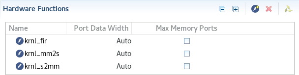
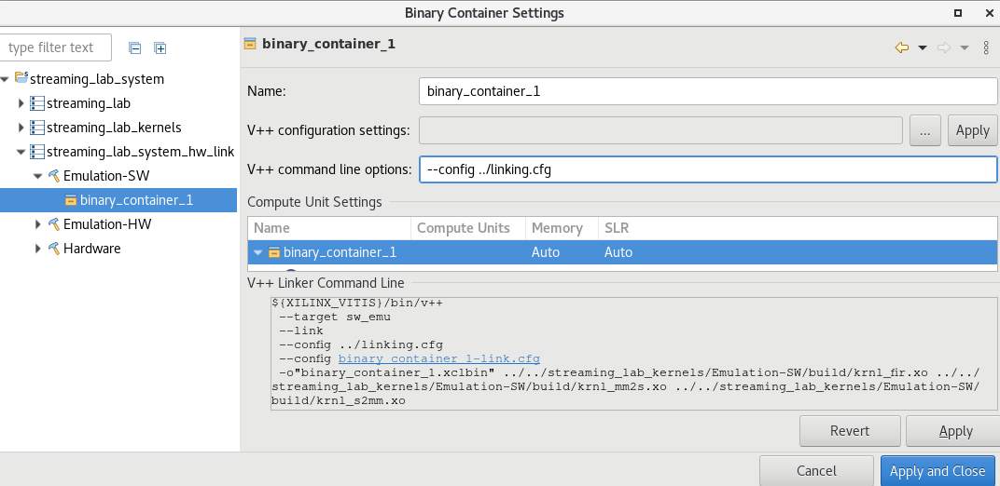
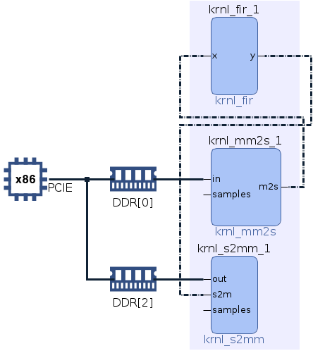
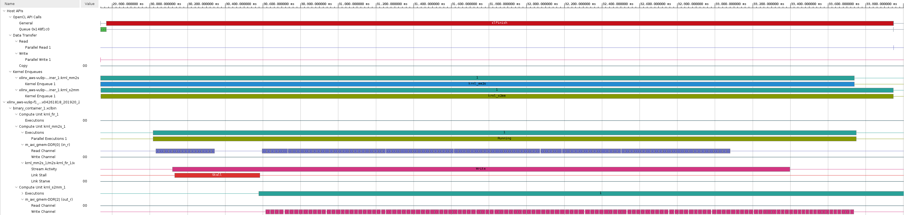

# Streaming Lab


## Introduction

In this lab you will create an streaming kernel which implements a Finite Impulse Response (FIR) filter of 73 taps. However, most of the Alveo/AWS F1 shells do not support direct streaming connection between the host and kernels. [QDMA shells](https://forums.xilinx.com/t5/Adaptable-Advantage-Blog/Improve-Your-Data-Center-Performance-With-The-New-QDMA-Shell/ba-p/990371), unlike XDMA, support direct streaming connections. In order to support the streaming kernel, you will include datamovers kernels which will translate from memory mapped to stream and vice versa.

The following image depicts the three kernels that will be use and how they are connected together.


This labs guides you through the steps to:

* Add the host and kernel code to Vitis
* Define the kernels that will be implemented on hardware
* Specify the streaming connection with a configuration file
* Run the application


This lab has been verified in the following platforms (platform containing the string 2018 are not supported)

* xilinx_aws-vu9p-f1_shell-v04261818\_201920\_2
* xilinx\_u280\_xdma\_201920\_2
* xilinx\_u250\_qdma\_201920\_1


## FIR

A FIR filter is one of the two primary digital filters. A FIR has a finite response to an impulse.

The following figure shows the conventional discrete tapped delay line filter representation. As you can see the output, *y(n)*, is the weighted sum of the *n* previous samples. The weight vector, *a(n)*, is also called coefficients and vary deepening on the filter type, sampling frequency and other parameters.


However, in this lab we will use the transposed direct version, which is an improved version of the filter that yields to better performance and does not diverge significantly from the standard version. There are much more efficient implementations, but these will not be cover here.


## Steps

### Create Vitis project


1. If you have a previous Vitis session open, close it
1. In the terminal run

   ```sh
   export LIBRARY_PATH=$LIBRARY_PATH:/usr/lib/x86_64-linux-gnu
   ```
1. Launch Vitis
1. Create a new *Application Project*
1. In the *Platform* window select AWS F1 platform
1. In the *Application Project Details* type *streaming_lab*
1. Finally, select *Empty Application*

### Add source code and hardware functions

1. In the *Explore* view, right-click on `streaming_lab_system > streaming_lab > src` and select `Import Sources...`
1. Browse to `~/xup_compute_acceleration/sources/streaming_lab` and add `host.cpp, xcl2.cpp, and xcl2.hpp` files
1. In the *Explore* view, right-click on `streaming_lab_system > streaming_lab_kernels > src` and select `Import Sources...`
1. Browse to `~/xup_compute_acceleration/sources/streaming_lab` and add `krnl_fir.cpp, krnl_mm2s.cpp, and krnl_s2mm.hpp` files
1. Double-click on `streaming_lab_system > streaming_lab_kernels > streaming_lab_kernels.prj`
1. In the `Hardware Functions` view, click the *Add Hardware Function* button icon ()
1. Select `krnl_fir`, `krnl_mm2s` and `krnl_s2mm` and click **OK**
1. Check that the kernels are included within the *Hardware Functions* panel

    

1. In the *Assistant* view, right-click on `streaming_lab_system > streaming_lab_system_hw_link > Emulation-SW > binary_container_1` and select `Settings...`
1. In the *V++ linker options:* field type `--config ~/xup_compute_acceleration/sources/streaming_lab/linking.cfg -j 8` and click *Apply and Close*

    

    The linker option will take effect for all configurations.

1. Open and analyze the source code of the kernels and host application

    - `krnl_mm2s.cpp`: reads data from global memory and generates an stream
    - `krnl_s2mm.cpp`: reads data from an stream and stores the data in global memory
    - `krnl_fir.cpp`: implements a digital bandpass FIR filter using the transposed form. There are 73 coefficients that are static
    - `host.cpp`: creates the test vector, instantiates and run the FIR filter

1. Open and analyze `linking.cfg` file.

    This file provides information to the tool on how to connect the streaming connections as well as the memory interfaces

### Run software emulation

1. In the **Assistant** view, select *streaming\_lab\_system* and build the application by clicking hammer
1. Run the Emulation-SW: in the *Explorer* view right-click on *streaming\_lab* and select `Run As > Run Configurations...`
1. In the *Arguments* tab make sure *Automatically add binary container(s) to arguments* is selected.
1. Click *Apply* and then *Run*
1. The console output will report

   ```console
   Found Platform
   Platform Name: Xilinx
   INFO: Reading ../binary_container_1.xclbin
   Loading: '../binary_container_1.xclbin'
   Trying to program device[0]: xilinx_aws-vu9p-f1_shell-v04261818_201920_2
   Device[0]: program successful!
   Running FIR filter with 128 samples, each sample is a 32-bit signed element
   Launching Hardware Kernels...
   Getting Hardware Results...
   Computing Software results...
   TEST PASSED
   ```
1. Set the program arguments, setting the number of samples to 16 and enabling debug through the Run Configuration. Invoke the Run Configuration, click **Edit...** button of the *Program Arguments*, double-click the current entry and enter `../binary_container_1.xclbin 16 debug`
1. Click **OK** to set the arguments, click **OK** again,  click **Apply**, and then click **Run**

    Notice that this time the results are shown with sample number, sw and hw computed values

### Run hardware emulation

1. Select or open the `Hardware Kernel Project Settings` view and change *Active build* configuration to: **Emulation-HW**
1. In the **Assistant** view, select *streaming\_lab\_system* and build the application by clicking 
1. Once compiled, Run the Emulation-HW, only specify the binary container as argument
1. The console output will report

   ```console
   Found Platform
   Platform Name: Xilinx
   INFO: Reading ../binary_container_1.xclbin
   Loading: '../binary_container_1.xclbin'
   Trying to program device[0]: xilinx_aws-vu9p-f1_shell-v04261818_201920_2
   INFO: [HW-EM 01] Hardware emulation runs simulation underneath. Using a large data set will result .............
   Device[0]: program successful!
   Running FIR filter with 2048 samples, each sample is a 32-bit signed element
   Launching Kernel...
   Getting Results...
   TEST PASSED
   INFO::[ Vitis-EM 22 ] [Time elapsed: 0 minute(s) 39 seconds, Emulation time: 0.145998 ms]
   Data transfer between kernel(s) and global memory(s)
   krnl_mm2s_1:m_axi_gmem-DDR[0]          RD = 8.000 KB               WR = 0.000 KB        
   krnl_s2mm_1:m_axi_gmem-DDR[2]          RD = 0.000 KB               WR = 8.000 KB        

   Data transfer on stream interfaces
   krnl_fir_1:y-->krnl_s2mm_1:s2m               8.000 KB        
   krnl_mm2s_1:m2s-->krnl_fir_1:x               8.000 KB   
   ```

    Notice that not only the data memory mapped data transfer is reported, but also, the streaming data transfer. Once again, you can rerun the application with different arguments.

1. In the `Assistant` view expand *streaming\_lab\_system > streaming\_lab > Emulation-HW -> SystemDebugger\_streaming\_lab\_system\_streaming\_lab* and double click `Run Summary (xclbin)`

1. In Vitis Analyzer, click `System Diagram` and notice the memory mapped and streaming connection (dotted lines)

    

1. Open `Timeline Trace` and explore the host and kernel timeline. If you don't see host activity then go to Run Configurations and change runtime configuration to enable Host Code tracing

    

    Note that when the FIR filter starts producing data it never starves. This is because the design uses two different memory banks. You can explore how the memory bank assignation impacts the performance by editing the `linking.cfg` file, re building and rerunning the application.

### Analysis

Note that for a linear phase response FIR filter, the coefficients are symmetric around the center value. Vitis HLS realizes and halves the number of multiplications. What is more, Vitis HLS analyzes the coefficients and does not implement a multiplications for those coefficients that are a power of 2, or can be conformed as the sum of power of two, e.g, 384 (256 + 128). Vitis HLS analyzes the cost of implementing the multiplication as an addition of power of 2 or implementing using a multiplier. Consequently, out of the 36 symmetric multiplications one has a coefficient 0, and the other four are implemented as sum. That leaves the designing with only 32 multiplications. Since each multiplication is `32-bit x 16-bit` and the [DSP48e2](https://www.xilinx.com/support/documentation/user_guides/ug579-ultrascale-dsp.pdf), harden multipliers, can handle multiplication of `27-bit x 18-bit` each multiplication needs two DSP48e2. Vitis HLS is able to perform these types of optimizations because the coefficients are static, for dynamic coefficients Vitis cannot make any assumption and will implement 73 multiplications.

Here is the list of the coefficients that are optimized.

| Index | Coefficient | Composition |
|-------|-------------|-------------|
|    4  | 384         | 256 , 128   |
|    8  | -15         | -16 , 1     |
|   14  | 20          | 16 , 4      |
|   27  | -6          | -8 , 2      |

### Run hardware

Since the Hardware build and AFI availability for AWS takes a considerable amount of time, a precompiled and preregistered AWS version is provided for you. Use the precompiled solution directory to verify the functionality

1. Create a solution testing directory, if not yet created, called `sol-test` in the home directory, and copy the files from the provided solution director using the following commands:

   ```sh
   mkdir ~/sol-test
   mkdir ~/sol-test/streaming_lab
   cp ~/xup_compute_acceleration/solutions/streaming_lab/* ~/sol-test/streaming_lab/.
   chmod +x ~/sol-test/streaming_lab/streaming_lab
   ```

1. Run the application and analyze the output using the following commands:

   ```sh
   cd ~/sol-test/streaming_lab
   ./streaming_lab binary_container_1.awsxclbin
   ```

1. The FPGA bitstream will be downloaded and the host application will be executed showing output similar to:

   ```console
   Found Platform
   Platform Name: Xilinx
   INFO: Reading binary_container_1.awsxclbin
   Loading: 'binary_container_1.awsxclbin'
   Trying to program device[0]: xilinx_aws-vu9p-f1_dynamic_5_0
   Device[0]: program successful!
   Running FIR filter with 4194304 samples, each sample is a 32-bit signed element
   Launching Hardware Kernels...
   Getting Hardware Results...
   Computing Software results...
   TEST PASSED
   ```

---------------------------------------
<p align="center">Copyright&copy; 2021 Xilinx</p>
